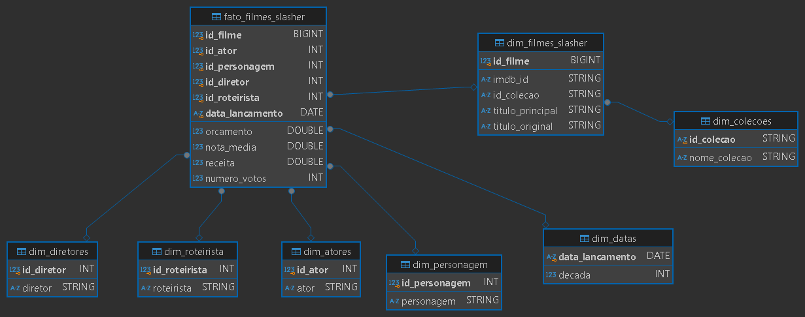
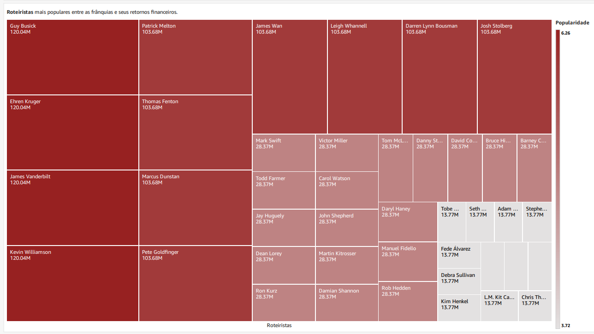

# **Resolução do Desafio: Sprint 10**  

## **Entendimento sobre o Desafio Final - Entrega Final**  

A Entrega Final consiste na criação de um *dashboard* que possua um *storytelling* eficaz, permitindo que, apenas por meio de gráficos, o usuário consiga extrair ***informações*** e ***insights*** sobre o tema analisado.  

O tema escolhido pela minha squad é ***Terror/Mistério***, portanto, analisei os arquivos fornecidos com esse foco e elaborei as seguintes métricas para guiar a análise:  

## **Perguntas para realização do Desafio Final:**  

As perguntas serão baseadas em alguns dos principais filmes de terror do gênero *slasher*. Os filmes selecionados são: **Sexta-Feira 13**, **Massacre da Serra Elétrica**, **Pânico** e **Jogos Mortais**.  

Esses filmes foram escolhidos porque a trajetória do gênero *slasher* é particularmente interessante, apresentando um grande sucesso a partir da década de 70, seguido por um declínio. No entanto, algumas dessas franquias estão retornando atualmente, o que pode abrir portas para o ressurgimento de outras.  

### **1 - Qual foi o sucesso dos filmes de slasher em diferentes décadas e como isso se relaciona com o desempenho do gênero ao longo do tempo?**  
- Analisar as principais décadas para o gênero *slasher*.  
- Observar tendências de popularidade e possíveis ressurgimentos.  

### **2 - Em relação aos *assassinos* de cada uma das franquias, qual é o principal deles? E quais são os filmes mais populares? O número de filmes afeta na popularidade?**  
- Usar a nota média dos filmes como métrica de comparação.  
- Identificar qual vilão tem o maior impacto na percepção do público.  
- Analisar quais filmes são mais populares em termos de avaliação e receita.  
- Verificar se franquias com mais filmes tendem a ter maior ou menor popularidade.   

### **3 - A mudança na produção das franquias afetou sua bilheteira? E a nota do público? Sua *popularidade* no geral.**  
- Analisar alterações relacionadas a **Diretores** e **Roteiristas**.  
- Verificar se essas mudanças impactaram a receita e as avaliações.  

---

**Errata:** 

Antes de explicar como foi criado o *dashboard* das questões citadas acima, houve um pequeno erro na modelagem de dados da *Sprint 09*.  

Eu utilizei um `id_data` como uma espécie de chave de ligação da `fato_filmes` com a `dim_datas`, sendo que, nesse caso, não seria necessário, uma vez que nenhum dos filmes escolhidos foi lançado no mesmo dia.  

Eu havia deixado campos como *dia*, *mês* e *ano*, mas não iria utilizá-los. Então, apenas mantive o intervalo de tempo necessário, no caso, as décadas em que os filmes foram lançados (1970 a 2020).  

**Modelagem Dimensional Reajustada:**

---

### **Carregando Datasets no QuickSight:**

Foram caregadas as tabelas criadas no ***Amazon Athena*** da *Sprint 09*, com elas carregadas eu às associei para que todos os dados estivessem juntos para a análise.

### **Associação das Tabelas:** 

Por meio do ***Left Join*** eu fiz as conexões das dimensões com a fato.

**# id_filme**

`fato_filmes_slasher` -> `dim_filmes_slasher`

**# id_colecao**

`dim_filmes_slasher` -> `dim_colecoes`

**# data_lancamento**

`fato_filmes_slasher` -> `dim_datas`

**# id_personagem**

`fato_filmes_slasher` -> `dim_personagens`

**# id_roteirista**

`fato_filmes_slasher` -> `dim_roteirista`

**# id_diretor**

`fato_filmes_slasher` -> `dim_diretores`

**# id_ator**

`fato_filmes_slasher` -> `dim_atores`

### **Análise de Popularidade e Desempenho de Franquias de Filmes de Terror Slasher:**

O [***dashboard***](./Dashboard.pdf) completo irá fazer a *Análise de Popularidade e Desempenho de Franquias de Filmes de Terror Slasher*, focando especificamente nos filmes **Sexta-Feira 13**, **Massacre da Serra Elétrica**, **Pânico** e **Jogos Mortais**, como discutido anteriormente.

Para tornar mais claros os ***insights*** e ***informações*** que podem ser extraídos dos gráficos, irei explicar individualmente cada um deles.

#### **Popularidade dos filmes em relação ao assassino da produção**

- **Leatherface** tem avaliações gerais menores que os outros, com apenas 1 nota acima de 6 e 3 abaixo de 5. Isso sugere que o personagem foi muito valorizado em sua primeira aparição, em que o filme obteve uma nota de 7.4. No entanto, as sequências parecem não ter correspondido às expectativas, possivelmente devido a problemas como roteiros mal elaborados, direções fracas ou outras falhas na execução.  

- **Jason Voorhees** e **Jigsaw** mantêm-se como os mesmos personagens ao longo de suas respectivas franquias, o que pode ter contribuído para avaliações positivas nos filmes iniciais, já que o público teve a oportunidade de se apegar ao *conceito* desses vilões. No entanto, observa-se uma queda nas notas com o passar do tempo, o que pode indicar saturação do público, previsibilidade nas tramas ou outros fatores de desgaste.  

- **Ghostface**, apesar de ser um personagem diferente em cada filme da saga *Pânico*, apresenta uma consistência maior nas avaliações em comparação com **Jason** e **Leatherface**. Isso sugere que a troca de identidade pode ter sido uma escolha acertada, desde que bem executada, mantendo o interesse do público e evitando previsibilidade.  

**Métricas:**

#### **Popularidade das frânquias:**

- **Menos é Mais?**  

    A coleção de filmes de *Pânico*, apesar de ter apenas 4 filmes analisados, apresenta uma soma total de popularidade pouco abaixo da de *Massacre da Serra Elétrica*, que possui um número significativamente maior de produções.  

    Além disso, ao comparar individualmente, observa-se que apenas um filme de *Massacre da Serra Elétrica* tem uma média de popularidade superior à média dos filmes de *Pânico*.  

    Uma análise similar pode ser feita com os filmes da saga *Sexta-Feira 13*, que, apesar de possuir quase o triplo de filmes em relação a *Pânico*, conta com apenas um filme com média de popularidade acima de 6.  

    *Jogos Mortais* também pode ser considerado nessa equação, mas se destaca com um desempenho melhor do que *Massacre da Serra Elétrica* e *Sexta-Feira 13*, mantendo uma popularidade mais consistente.  

**Métricas:**

#### **Popularidade dos filmes (Década):**

- Na década de 70, há um dado muito interessante: as notas dos filmes eram significativamente altas em comparação com as outras décadas. Apesar de os lucros não serem tão expressivos quanto os das décadas de 2000 e 2010, os valores arrecadados foram altíssimos em relação ao orçamento inicial, indicando um excelente retorno sobre investimento.  

- Nas décadas de 2000 e 2010, nota-se que o mercado de entretenimento estava consolidado, com orçamentos muito maiores e lucros colossais. Isso reflete a evolução da indústria cinematográfica, que passou a investir pesado em produções do gênero *slasher*.  

- Após 20 anos de filmes *slasher*, observa-se uma queda nas bilheteiras e nas avaliações na década de 90, em comparação com as décadas de 70 e 80. Isso pode ser atribuído à saturação do gênero na época. No entanto, houve um ressurgimento nos anos 2000, impulsionado pelo lançamento de novas franquias, como *Jogos Mortais* e *Pânico*, que trouxeram frescor e inovação ao gênero.  

**Métricas:**

#### **Popularidade e valorização dos Diretores e Roteiristas:**

- **Equipes Enxutas?**  

    Os produtores dos filmes *Pânico* e *Jogos Mortais* se destacam por um fator muito interessante: suas equipes são menores em comparação com as de *Sexta-Feira 13* e *Massacre da Serra Elétrica*.  

    Isso pode indicar que equipes mais enxutas em produções criativas ajudam a manter o foco e a coesão da obra, evitando possíveis divergências de visão. Além disso, a troca constante de pessoas envolvidas na criação pode afetar a **identidade** da franquia, resultando em uma descaracterização ao longo do tempo.  

    Um exemplo claro disso é visto em *Jason X* e *Freddy vs. Jason*, que são filmes significativamente diferentes da proposta original de *Sexta-Feira 13*, o que pode ter sido influenciado pela rotatividade na equipe criativa.  

    O que é diretamente ligado a receita líquida gerada por essas equipes, assim consolidando o conceito de popularidade em valores ecônomicos, que é o que realmente importa quando trata-se de uma grande produção de filme.

**Métricas:**

