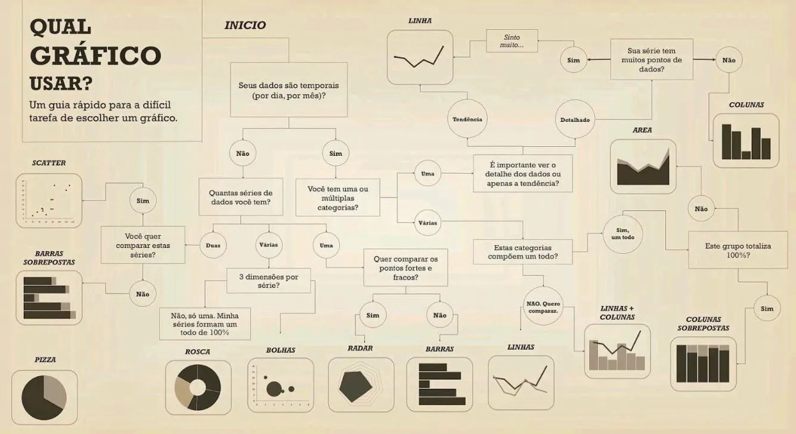

# **Resumo**

### **Fundamentos de Visualização de Dados**

**Storytelling:**

Esta palavra tem por definição a habilidade de contar histórias com uma narrativa envolvente para transmitir uma mensagem e criar conexões. Ou seja, trata-se de aproveitar as histórias para envolver seu público ou esclarecer **qualquer coisa**. 

No contexto de dados não é diferente, são usadas ferramentas para a construção da história através de gráficos e tabelas. A visualização de dados começa muito antes do desenvolvimento de um dashboard. 

- **Análise exploratória:** É realizada pelo profissional responsável pela análise, é realizado uma *garimpagem* nos dados gerados para descobrir o que realmente é interessante e aproveitável.

- **Análise explanatório:** É comunicar apenas o que é realmente importante na análise. É sobre falar sobre *as pérolas, não sobre as ostras*.

**Conheça o público e idenfique seu objetivo:** 

Para ajudar a conhecer o seu cliente e seu objetivo, uma boa prática é antes de montar a visualização final, criar um **esboço** do resultado esperado. Para direcionar o desenho, é necessário algumas perguntas, como o **KPIs** (Key Performace Indicator), o usuário tem a tendência a ler um dashboard no em *zigzag*, por conta disso as informações devem ser dispostas dessa forma.

Escolha de gráficos é **importante**, pois é um facilitador do acesso à informação, a escolha equivocada de um gráfico pode gerar um interpretação equivocada. Porém outro ponto que deve ser levado em consideração é o **contexto**. Os números não mentem, mas eles não se sustentam sozinhos.

**AWS QuickSight:** 

É um serviço gerenciado de BI que permite a criação e compartilhamento de análises de dados afim de obter insights de inteligência de negócios de forma rápida e fácil. Permite conectar com diversas fontes de dados para extrair informações de interesse, através da criação de painéis interativos que podem ser compartilhados e acessados com facilidade de qualquer dispositivo. 

**Gráficos do QuickSight:**

- **Gráficos de Barra**

- **Gráficos de Linha**

- **Gráfico BoxPlot**

- **Gráficos de LINHAS e COLUNAS** 

- **Gráficos Donut**

- **Gráfico Heat Maps**

- **Histogramas**

- **Gráficos de Mapa**

**Tabelas do QuickSight:**

- **Tabelas**

- **Tabelas Dinâmicas** 

**Cartões de KPI:**

É um tipo de objeto visual que permite comparar uma métrica em relação ao seu valor de referência. São exemplos de aplicação a comração entre resultado de vendas em relação ao projeto.

**Insights:** 

São computações analíticas sugeridas ou customizadas que podem ser adicionadas à análise.

**Desenvolvimente de Dashboard:**

- **Cores:** Em algumas situações as cores do dashboard são pré-definidas de acordo com cada empresa/cliente. Quando não há essa característica, a responsabilidade de escolher a paleta de cores que será utilizada é do analista. Não utilizar **apenas** uma cor, mas também não é adequado o uso de **MUITAS** cores. 

- **Tipografia:** Abrange todo o estudo, criação e aplicação dos caracteres, estilos, formatos e arranjos visuais das palavras. Por serem a base na comunicação eles precisam ser bem trabalhadas para estarem em sintonia com a mensagem que você deseja passar. Também pode ser pré-definida, quando isso não é uma característica, utiliza-se a *regra da consistência*, que é, escolher uma tipografia e mantê-la no dashboard inteiro. 

### **Storytelling em Dados:**

Storytelling em dados é a prática de criar narrativas cativantes usando informações e insights derivados de dados. É uma abordagem que visa ir além de simplesmente apresentar números e estatísticas, buscando envolver emocionalmente o público e transmitir uma mensagem clara e memorável. Assim, tornando-se possível tornar os dados mais acessíveis e compreensíveis, permitindo que as pessoas se conectem emocionalmente com as informações apresentadas.

- **Considerar o público-alvo**

- **Adaptar narrativa de acordo com seus interesses e conhecimentos prévios**

- **Selecionar visualizações adequadas**

- **Linguagem clara e objetiva**

- **Construir sequência lógica de informações**

**6 Passos para contar um história:**

1. **Formule uma teoria:** Tudo começa com uma predição ou ideia. Tente provar ou demonstrar alguma ideia.

2. **Colete informação:** Não existe Storytelling com Dados **sem dados** consistentes e pertinentes.

3. **Defina um propósito:** A partir do que foi apresentado nos dados anteriores, pense em qual será o rumo de sua narrativa.

4. **Faça perguntas:** Responder perguntas baseada na **teoria** formulada anteriormente. 

5. **Define um "Call to Action":** Definir a ação que deve ser realizada ao final da sua história.

6. **Traduza em informação visual:** Momente de reunir todo o planejamento e trasnformá-lo em narrativa.

**Qual tipo de gráfico utilizar no *dashboard*?**

# **Exercícios**

Não há exercícios a serem realizados na Sprint.

# **Evidências**

Não há exercícios a serem evidenciados na Sprint.

# **Certificados**

Nenhum certificado externo foi obitido durante a realização da Sprint.