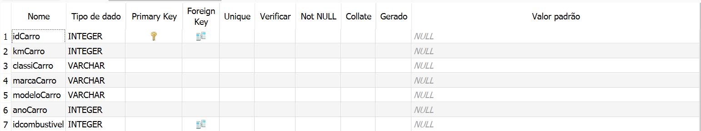
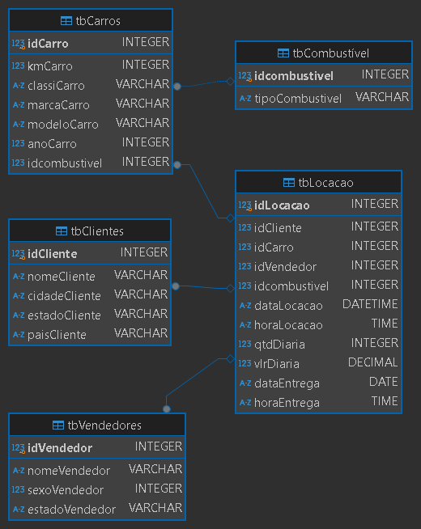
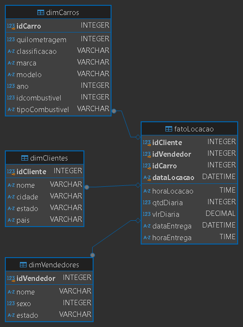

# **Resolução do Desafio: Sprint 2**

## **Entedimento sobre o Desafio**

Para a realização do Desafio recebemos um Banco de Dados .sqlite, que consistia de uma grande tabela, chamada de tb_locacao, com diversos itens sobre uma locadora de veículos:


A primeira coisa que foi notada é que para a realização do Desafio da Sprint 2, seria necessário que a tabela fosse **Normalizada** para que fosse possível a criação da **Modelo Relacional** requisitado, tal qual, o Banco de Dados .sqlite normalizado. Entretando também é necessário que seja feito a granulação dessa tabela para que possa ser feito o **Modelo Dimensional** da tabela, por meio da criação de uma tabela fato e outras tabelas dimensionais. 

Para melhor organização do Desafio, utilizei dois Bancos de Dados .sqlite para melhor organização, sendo um para o [Modelo Relacional](../Desafio/Relacional.sqlite) e outro  para o [Modelo Dimensional](../Desafio/Dimensional.sqlite). Para a normalização, granulação e criação de tabelas eu optei por utilizar o SQLiteStudio, para a criação dos Diagramas de Modelo Relacional e Dimensional optei pelo DBeaver, por conta de sua praticidade e clareza, na hora hora de mostrar os conteúdos e relações entre as tabelas.

## **Desafio**

### **Normalização da Tabela "tb_locacao"**

A primeira etapa do desafio foi normalizar a tabela "tb_locacao" para que eu pudesse criar meu modelo relacional. Para isso, eu utilizei as 3 formas de normalização. 

**Primeira Forma Normal (1FN):** Como sabemos objetivo é retirar os atributos ou grupos repetitivos. Em outras palavras, representações de informações que se repetem para a mesma unidade, retratando ocorrências de um mesmo fato dentro de uma única entidade. Gerando novas tabelas.

- **Primeiro verificação:** Verifico se há valores que não estão no formato atômico (indivisíveis). Neste caso, a tabela que nos foi fornecida já está com todos os seus valores atômicos.

- **Segunda Verficação:** Verificio se há apenas uma dado por coluna (Não-Multivalorado). Novamente, a tabela fornecida não possuia nenhum dado multivalorado em sua composição.

- **Terceira Verificação:** Verifico se há alguma Chave Primária na tabela fornecida. Neste caso há, mas a coluna não é declarada como tal, então eu declaro manualmente a coluna "tbLocacao" como uma Chave primária.

‎


**Segunda Forma Normal (2FN):** O objetivo é separar as dependências parciais. Localizar os valores que dependem parcialmente da chave primária e criar tabelas separadas para conjuntos de valores que aplicam a vários registros e relacionar 
estas tabelas com uma nova chave estrangeira.


Neste caso então, procuro se há dependências parciais, e encontrei algumas, assim criando 4 tabelas distintas, uma para Clintes, uma para Vendedores, uma para Carros e outra para o Combustível. O desafio facilitou, uma vez que todas as colunas que tinham um sufixo semelhante possuim dependências parciais:

___
**Depêndencias Carros:**


**Criação de Tabela:**

```SQL
CREATE TABLE tbCarros (
    idCarro       INTEGER PRIMARY KEY
                          REFERENCES tbLocacao (idLocacao),
    kmCarro       INTEGER,
    classiCarro   VARCHAR,
    marcaCarro    VARCHAR,
    modeloCarro   VARCHAR,
    anoCarro      INTEGER,
    idcombustivel INTEGER REFERENCES tbCombustível (idcombustivel) 
);
```
___

**Depêndencias Clientes:**


**Criação da Tabela:**

```SQL
CREATE TABLE tbClientes (
    idCliente     INTEGER PRIMARY KEY
                          REFERENCES tbLocacao (idLocacao),
    nomeCliente   VARCHAR,
    cidadeCliente VARCHAR,
    estadoCliente VARCHAR,
    paisCliente   VARCHAR
);
```
___

**Depêndencias Vendedores:**


**Criação da Tabela:**

```SQL
CREATE TABLE tbVendedores (
    idVendedor     INTEGER PRIMARY KEY
                           REFERENCES tbLocacao (idLocacao),
    nomeVendedor   VARCHAR,
    sexoVendedor   INTEGER,
    estadoVendedor VARCHAR
);
```
___

**Depêndencias Combustível:**


**Criação da Tabela:**

```SQL
CREATE TABLE tbCombustível (
    idcombustivel   INTEGER PRIMARY KEY,
    tipoCombustivel VARCHAR
);
```
___

**Nova Tabela de Locação (Antiga Pode ser Deletada):**


**Criação da Tabela:**
```SQL
CREATE TABLE tbLocacao (
    idLocacao     INTEGER         PRIMARY KEY,
    idCliente     INTEGER,
    idCarro       INTEGER,
    idVendedor    INTEGER,
    idcombustivel INTEGER,
    dataLocacao   DATETIME,
    horaLocacao   TIME,
    qtdDiaria     INTEGER,
    vlrDiaria     DECIMAL (18, 2),
    dataEntrega   DATE,
    horaEntrega   TIME
);
```
___

**Terceira Forma Normal (3FN):**  O objetivo é eliminar dependências transitivas. Entretanto, após as Etapas 1FN e 2FN já não se faz necessário isso. Nesta parte eu somento monto as relações entre Chaves Primárias e Estrangeiras.

Após a realização da Normalização da tabela, eu tenho algumas tebelas *ao vento*, mas não é isso que quero, por isso utilizei Chaves primárias nos IDs de cada tabela e relacionar por meio das Chaves Estrangeiras, abaixo o relacionamento entre elas:

**tbLocacao:**


**tbClientes:**


**tbVendedores:**


**tbCarros:**



**tbCombustível:**


___

### **Diagrama de Dados: Relacional**

O diagrama gerado no DBeaver apresenta a estrutura final do modelo relacional, destacando as chaves primárias e estrangeiras, os relacionamentos entre as tabelas e os tipos de dados de cada coluna (e.g., INTEGER, VARCHAR, DATE). As chaves primárias identificam unicamente cada registro dentro de suas respectivas tabelas, enquanto as chaves estrangeiras conectam as tabelas, garantindo a integridade referencial entre elas. Esse modelo permite uma visualização clara dos relacionamentos e das regras de integridade aplicadas ao banco de dados.



___


### **Modelagem Dimensional dos dados**

**Fato:** Representa registros de medidas resultantes de eventos de negócios, tipicamente com valores numéricos, associados ao grão estabelecido, ou seja, ao nível de detalhe com o qual os dados são registrados. Os registros na tabela fato contêm medidas numéricas (como valores monetários, quantidades, datas), que representam eventos específicos (por exemplo, uma locação, venda, compra). A tabela fato também inclui chaves estrangeiras para conectar as dimensões relevantes (como cliente, produto, vendedor) que descrevem o contexto do fato.

Os itens selecionados para a tabela fato foram escolhidos por sintetizarem o relacionamento entre as dimensões. No caso, um CLIENTE alugando um CARRO com a mediação de um VENDEDOR gera os seguintes fatos: data e hora da locação, valor da diária, data de devolução, entre outros. Dessa forma, a tabela fato que foi criada serve como um ponto central que permite consultas analíticas (OLAP), viabilizando respostas eficientes para perguntas baseadas nas associações entre as dimensões.

**Dimensões:** As tabelas dimensionais fornecem um contexto descritivo aos eventos registrados na tabela de fatos, permitindo responder a perguntas como "quando", "quem", "o que" e "por quê". Os dados das dimensões são usados para filtrar e agrupar os fatos, possibilitando a análise a partir de diferentes perspectivas.

As dimensões escolhidas para este modelo são Carros, Clientes e Vendedores. Essas dimensões foram selecionadas por serem diretamente relevantes ao processo de locação, com atributos altamente correlacionados que permitem análises detalhadas. Observa-se que a tabela Combustível, presente no modelo relacional, foi omitida aqui, pois, em uma estrutura de análise OLAP, a normalização extrema não é necessária. Em vez disso, o foco está em fornecer uma estrutura eficiente para consultas analíticas.

As chaves primárias das tabelas dimensionais (IDs) também funcionam como chaves estrangeiras na tabela de fatos fatoLocacao, permitindo responder eficientemente a perguntas típicas de um ambiente OLAP.

**Exemplo de Pergunta OLAP:** "Qual cliente alugou carros mais vezes no período da tarde?"

```SQL
SELECT 
    dimClientes.nome AS nomeCliente,
    COUNT(*) AS totalLocacoes
FROM 
    fatoLocacao
LEFT JOIN 
    dimClientes ON fatoLocacao.idCliente = dimClientes.idCliente
WHERE 
    fatoLocacao.horaLocacao BETWEEN '12:00:00' AND '18:00:00'
GROUP BY 
    dimClientes.nome
ORDER BY 
    totalLocacoes DESC
LIMIT 1
```

___

**Tabela Fato:**


**Criação de Tabela:**

```SQL
CREATE TABLE fatoLocacao (
    idCliente   INTEGER,
    idVendedor  INTEGER,
    idCarro     INTEGER,
    dataLocacao DATETIME,
    horaLocacao TIME,
    qtdDiaria   INTEGER,
    vlrDiaria   DECIMAL (18, 2),
    dataEntrega DATETIME,
    horaEntrega TIME,
    PRIMARY KEY (
        idCliente,
        idVendedor,
        idCarro,
        dataLocacao
    )
);
```
___

**Dimensional Carros:**


**Criação de Tabela:**

```SQL
CREATE TABLE dimCarros (
    idCarro         INTEGER PRIMARY KEY
                            REFERENCES fatoLocacao (idCliente),
    quilometragem   INTEGER,
    classificacao   VARCHAR,
    marca           VARCHAR,
    modelo          VARCHAR,
    ano             INTEGER,
    idcombustivel   INTEGER,
    tipoCombustivel VARCHAR
);
```
___

**Dimensional Clientes:**


**Criação de Tabela:**

```SQL
CREATE TABLE dimClientes (
    idCliente INTEGER PRIMARY KEY
                      REFERENCES fatoLocacao (idCliente),
    nome      VARCHAR,
    cidade    VARCHAR,
    estado    VARCHAR,
    pais      VARCHAR
);
```
___

**Dimensional Vendedores:**


**Criação de Tabela:**

```SQL
CREATE TABLE dimVendedores (
    idVendedor INTEGER PRIMARY KEY
                       REFERENCES fatoLocacao (idCliente),
    nome       VARCHAR,
    sexo       INTEGER,
    estado     VARCHAR
);
```
___

### **Diagrama de Dados: Dimensional**

O diagrama final, gerado no DBeaver, representa a estrutura dimensional consolidada do banco de dados, com uma visualização detalhada das chaves primárias e estrangeiras, os relacionamentos entre as tabelas e os tipos de dados de cada coluna (e.g., INTEGER, VARCHAR, DATE). As chaves primárias servem para identificar de forma única cada registro nas tabelas, enquanto as chaves estrangeiras estabelecem conexões entre elas, assegurando a integridade referencial. Esse modelo fornece uma base clara para análises OLAP, permitindo uma navegação eficiente pelas dimensões e agregação de dados com base nos relacionamentos estabelecidos.

