# **Resumo: Conteúdo da Sprint 2**

### **SQL para Análise de Dados: Do básico ao avançado**

**Comandos Básicos:** 

- **SELECT**
- **FROM**
- **DISTINCT**
- **WHERE**
- **ORDER BY**
- **LIMIT**

**Operadores:**

- **Aritméticos**
	- +, -, *, /, ^, %, ||
- **Comparativos**
	- =, >, <, >=, <=, <>
- **Lógicos**
	- AND, OR, NOT, BETWEEN, IN, LIKE, ILIKE, IS NULL

**Tratamento de Dados:**

- **Conversão de Unidades:** **'::'** e CAST
```sql
	- < conteudo > :: < tipo_conversão >
	- CAST(< conteudo > as < tipo_conversao >)
```
- **Tratamento Geral:** Case When, Coalesce()
```sql
	- CASE 
		WHEN < condição > 
		.
		.
		. 
		ELSE < ação > 
		END AS < nome >

	- COALESCE(< nao nulo >, < nulo >)
```

- **Tratamento de Texto:** LOWER(), UPPER(), TRIM(), REPLACE()

- **Tratamento de Datas:** INTERNAL, DATA_TRUNC, EXTRACT, DATEDIFF
```sql
	- SELECT < date > + INTERNAL < NUM > < TIPO DE DATA >

	- DATE_TRUNC(< TIPO DE DATA >, < COLUNA >)

	- EXTRACT(< TIPO DE DATA > FROM < DATA >)

	- SELECT DATEDIFF(< TIPO DE DATA>, < DATA 1 >, < DATA 2 >)
```

**Funções:**

```sql
	CREATE FUNCTION < NOME > (< PARAMÊTROS >)
	RETURNS < TIPO DE DADO >
	LENGUAGE SQL 

	AS 
	$$
	< SCRIPT >
	$$
```

**Funções Agregadas:** COUNT(), SUM(), MIN(), MAX(), AVG()
- GROUP BY
- HAVING

**Joins:** 

- **LEFT JOIN**
- **INNER JOIN**
- **RIGHT JOIN**
- **FULL JOIN**

**Unios:** Junta duas tabelas

- **UNION ALL:** Não remove linhas duplicadas
- **UNION:** Remove linhas duplicadas

**Subquery:** Funcionam como métodos

- **No WHERE**
- **No WITH**
- **No FROM**
- **No SELECT**

**Manipulação de Tabelas:**

- **Criação a partir de uma query**
	```sql
		SELECT
		< CONDIÇÕES >
		INTO < SCHEMA >.< TABELA >
		FROM < TABELA >
	```

- **Criação do Zero:**
	```sql
		CREATE TABLE < SCHEMA >.< TABELA >(
			< COLUNA > < TIPO DE DADO >
			.
			.
			.
		)
	```
- **Inserindo Conteúdo:**
	```sql
		INSERT INTO < TABELA >
		(COLUNAS ...)
		VALUES 
		< VALORES >
	```

- **Deletando tabela:**
	```sql
		DROP TABLE < TABELA >
	```

- **Atualização de linha:**
	```sql
		UPDATE < TABELA >
		SET < COLUNA > = < CONTEUDO COLUNA >
		WHERE < COLUNA > = < CONTEUDO COLUNA >
	```

- **Deleção de linha:**
	```sql
		DELETE FROM < TABELA >
		WHERE < COLUNA > = < CONTEUDO LINHA >
		OR < COLUNA > = < CONTEUDO LINHA >
	```

- **Inserção de Coluna:**
	```sql
		ALTER TABLE < TABELA >
		ADD < NOME COLUNA > < TIPO DADO >
	```

- **Atualização de Coluna:**
	```sql
		UPDATE < SCHEMA >< TABELA >
		SET < COLUNA > = < CONTEUDO >
		WHERE < ONDE ATUALIZAR >
	```
- **Deleção de Coluna:**
	```sql
		ALTER TABLE < TABELA >
		DROP COLUMN < COLUNA >
	```

- **Alterar Tipo de Dado da Coluna: (PostgreSQL)**
	```sql
		ALTER COLUMN < COLUNA > TYPE < DADO >
	```

- **Renomear Coluna: (PostgreSQL)**
	```sql
		RENAME COLUMN < COLUNA > TO < NOVO NOME >
	```

### **Big Data**

De acordo com o glossário do Gartner, Big Data é um grande volume de dados, de alta velocidade e/ou de alta variedade, que exige formas inovadoras e econômicas de processamento de informação, permitindo uma melhor percepção, tomada de decisões e automação de processos. Esses enormes volumes de dados podem ser usados para resolver problemas de negócios que as empresas não conseguiriam solucionar antes.

**Definição de Doug Laney:**

- **Volume:** A quantidade de dados importa! Com Big Data, grandes volumes de dados estruturados e não estruturados serão processados, incluindo dados de valores conhecidos e desconhecidos.

- **Velocidade:** Os dados são recebidos em alta velocidade e precisam ser gerenciados em tempo hábil.

- **Variedade:** Com o aumento do Big Data, os dados vêm em novos formatos não estruturados (e.g., textos, áudios e vídeos).

- **Variabilidade:** Os fluxos de dados podem ser altamente inconsistentes, com picos periódicos, tornando-os mais difíceis de gerenciar e manipular.

- **Complexidade:** Os dados originam-se de múltiplas tecnologias, o que torna difícil ligá-los, combiná-los, limpá-los e transformá-los entre sistemas. É necessário conectar e correlacionar relações, hierarquias e múltiplas ligações; caso contrário, corre-se o risco de perder o controle sobre esses dados.

Com a chegada de novas tecnologias como IoT e Machine Learning, foi criada a necessidade de serviços que pudessem lidar com a quantidade de dados gerados. Nesse caso, o Hadoop e o NoSQL se popularizaram.

De acordo com a SAS, a importância do Big Data não gira em torno da quantidade de dados que a empresa possui, mas do que a empresa pode produzir com eles.

### **Ciência de Dados**


Com o surgimento e a popularização do Big Data e o desenvolvimento de áreas como Machine Learning, a Ciência de Dados tornou-se uma área interdisciplinar voltada para o estudo e a análise de dados, visando à extração de conhecimento ou insights para apoiar a tomada de decisões. Dessa forma, a Ciência de Dados permite transformar grandes quantidades de dados brutos em informações valiosas, possibilitando que empresas tomem decisões que as conduzam a melhores resultados.

- **Cientista de Dados:** É um profissional com formação básica bem sólida com conhecimento nas áreas de ciência da computação, estatística, modelagem, análises, matemática, machine learning, banco de dados, business intelligence, ciência social ou física, entre outros. Sendo assim, essa área permite que exista 3 tipos de profissionais:

	- **Desenvolvedor:** profissionais focados em problemas técnicos e no gerenciamento dos dados. Claramente escrevendo código,provavelmente código em produção, no seu dia-a-dia. São pessoas com muitas habilidades técnicas, tendo graduação em Ciência da Computação, Engenharia da Computação e afins.

	- **Estátistico:** profissionais focados em problemas estatísticos. Normalmente começaram em projetos de pesquisa acadêmicos em ciência física ou social. São pessoas que foram ou são Estatísticos e que normalmente passaram muito tempo em Universidades fazendo mestrado e/ou doutorado

	- **Businessperson:** profissionais focados na empresa e em como projetos de dados podem gerar lucros. São pessoas que se classificam como líderes ou empreendedores e possuem certas habilidades técnicas, possivelmente tendo graduação em exatas. São profissionais generalistas, que atuam conjunto com todos os outros perfis, com habilidades de comunicação e integração entre os perfis e também entre os Engenheiros de Dados, Arquitetos de Soluções e Desenvolvedores.

- **Arquiteto de Soluções para Dados:** Tem como objetivo tornar o negócio simples - *"making simple to business"*. É uma prática de definição e descrição de um arquitetura de um sistema no contexto de uma solução específica e pode englobar descrição do sistema inteiro ou só de parte do sistema. Como a arquitetura é desenhada para o cliente, o arquiteto deve ter conhecimento em muitas técnologias (Python, SQL, Java...), conceitos (Data Warehouse, Data Lake, Big Data...) e infraestruturas (AWS, Azure, Google...).

- **Engenheiro de Dados:** É um profissional com amplo e profundo conhecimento sobre a implantação de componentes tecnológicos. Entre as tarefas esperadas estão a criação de metodologias de desenvolvimento específicas para clientes contemplando todo o ciclo de vida dos dados do Data Lake em conjunto com as decisões arquiteturais definidas no projeto, ser o responsável por buscar ferramentas e soluções para deploy e sustentação de Data Lakes, conhecer e sugerir melhores práticas e trabalhar em conjunto com o Arquiteto de Soluções em
tempo de definição e em conjunto com os desenvolvedores em tempo de implementação.

- **Desenvolvedores:** Profissional com habilidades de codificação de sistemas que irá trabalhar em conjunto com o Engenheiro de dados e com o Arquiteto de Soluções. Junto ao arquiteto com a visão do todo, trazendo necessidades e angustias do cliente e sugerindo mudanças no desenho da solução. Junto ao Engenheiro de Dados na implementação da solução e apresentando sugestões de melhoria de processos previamente
definidos.


### **Tipo de Dados**

- **Literal:** É um valor isolado, seja ele numérico, textual ou alfanumérico (letras, símbolos e números).

- **Dado:** O dado representa a menor partícula de uma informação, assim como um átomo representa a menor partícula de uma matéria. Portanto, um dado pode ser simplesmente um caractere, um texto, um número ou uma combinação de ambos, mas pode ser mais do que isso
também. Logo, dados são simples valores literais ou agrupados em valores.

	- **Estruturados:** São aqueles organizados e representados com uma estrutura rígida, a qual foi PREVIAMENTE PLANEJADA para armazená-los (e.g. Banco de Dados e Formulários). É caracterizado pela presença de relações entre dados, atributos e formatoss para dados.

	- **Não-Estruturados:** São aqueles que possuem uma estrutura flexível e dinâmica, SEM ESTRUTURA DEFINIDA. O melhor exemplo são redes sociais, as quais possuem um enorme volume de dados, como textos, imagens e vídeos criados DIARIAMENTE por usuários. Cerca de 80% do counteúdo digital gerado no mundo é Não-Estruturado.

	- **Semi-Estruturado:** Apresentam uma representação heterogênea, ou seja, possuem estrutura, mas ela é flexível. Assim, ela facilita o controle por ter um pouco de estrutura, mas também permite uma maior flexibilidade. Um exemplo típico é um arquivo em XML (eXtensible Markup Language, que significa, em português, linguagem de marcação estendida), o qual possui nós, que são rótulos de abertura e fechamento, este precedido com o símbolo “/”, com os dados inseridos entre os nós.

- **Informação:** A informação requer um processamento ou interpreção/análise de dados brutos. Para que assim, seja dado sentido ao dado e ele passe a ser uma informação.

- **Conhecimento:** Após o dado ser processado ou interpretado, chegamos a uma informação e, então, quando ela é contextualizada, chega-se ao conhecimento. Corresponde a uma informação relevante e valiosa.

- **Inteligência:** Conhecimento é transformado em Inteligência quando passa pelo processo de aprendizado ou aplicação e avaliação dos conhecimentos, servindo como importante ferramenta para tomada de decisão.

### **Banco de Dados**

Um banco de dados é uma coleção organizada de dados, geralmente armazenados e acessados eletronicamente de um sistema de
computador. São coleções organizadas de dados que se relacionam de forma a criar algum sentido e dar mais eficiência durante uma
pesquisa ou estudo.

O Sistema de Gerenciamento de Banco de Dados (SGBD), do inglês Database Management System (DBMS), é o software que interage
com usuários finais, aplicativos e com o próprio banco de dados para capturar e analisar os dados. Os SGBDs podem ser classificados de
acordo com o modelo do banco de dados, os modelos mais comuns são SGBDs Relacional e NoSQL.

- **Bancos de Dados Relacionais (RDBMS):** Consiste de Tabelas, Colunas, Registros, Relacionamentos entre componentes, por meio do uso de Chaves (Primárias e Estrangeiras). Em bancos de dados relacionais é necessário estruturas os objetos antes de inserir os dados. Esta estruturação dos objetos, dá-se o nome de Modelagem, que pode seguri um processo de Normalização. Respeitam as propriedades ACID.

	- **Atomicidade:** Garante que uma transação seja realizada por completo ou não é realizada. Não existe transação parcial.
	- **Consistência:** Garante que somente dados válidos são armazenados de acordo com as regras pré-definidas no BD.
	- **Isolamento:** Garante a proteção de que o dado de uma transação não afete o dado de outra transação.
	- **Durabilidade:** Garante que todos os dados salvos não serão perdidos.

- **Banco de Dados NoSQL:** É um termo genérico que representa os Bancos de Dados Não Relacionais, tem como objetivo atender as necessidades de aplicações que necessitam de um desempenho superior ao oferecido por BD Relacionais e realizar o dimensionamento da infraestrutura. Respeitam as propriedades BASE.

	- **Basicamente Disponível:** Distribui os dados em diferentes repositórios tornando-os sempre disponíveis para aplicações.
	- **Estado Leve:** Não é consistente o tempo todo o que deixa o funcionamento leve.
	- **Eventualmente Consistente::** Garante que em algum momento do tempo os dados estarão consistentes.

- **Teorema CAP:** Afirma que é impossível para um sistema de armazenamento de dados distribuído fornecer simultaneamente mais de dus das três propriedades.

	- **Consistência:** Cada leitura recebe a escrita mais recente ou uma mensagem de erro.
	- **Disponibilidade:** Cada requisição recebe uma resposta (sem erro) - sem garantia de que contém a escrita mais recente.
	- **Tolerância à Partição:** O sistema continua operando apesar de um número arbitrário de mensagens serem descartadas (ou atrasadas) pela rede entre os nós.

- **Change Data Captura (CDC):** É um Design Pattern em bancos de dados utilizado para determinar os dados que mudaram para que a ação possa ser executada. Esta abordagem de integração tem como objetivo diminuir a necessidade de carregar muitos dados e reduzir janelas de cargas batch ou streaming/micro-batch. 
	
	- **Linhas com Data de Modificação:** O objeto monitorado possui uma coluna que representa a hora ou minuto ou segunda da última alteração.
	- **Linhas com nº de versão do registro/linha:** O objeto monitorado possui uma coluna que representa a versão da última alteração
	- **Linhas com indicadores de status:** O objeto monitorado possui uma coluna com o status indicador que a linha foi modificada.
	- **Tabelas com triggers:** Quando alguma operação de insert ou update ou delete ocorrerem no objeto monitorado, uma trigger inclui essa informação numa tabela shadow (sombra). Nesta tabela pode ter a linha inteira modificada ou apenas a chave primária é armazenada, bem como o tipo de operação (inserir, atualizar ou excluir).
	- **Pesquisa em Logs Transacionais do banco de dados:** Os bancos de dados transacionais armazenam todas as alterações em um log detransações para recuperar o estado do banco de dados, caso o banco de dados falhe por qualquer motivo. O CDC baseado em log aproveita esse aspecto do banco de dados transacional para ler as alterações do log do objeto monitorado.
	- **Eventos programados:** Realiza uma alteração no código fonte do sistema, em pontos apropriados que se referem ao objeto monitorado, para fornecer o CDC de que os dados foram alterados.

### **Tipo de Armazenamentos**

- **TXT**
- **CSV**
- **XML**
- **JSON**
- **AVRO**
- **PARQUET**
- **ORC**

### **Data Lake**

Um Data Lake é um local central para armazenar todos os seus dados, independentemente de sua origem ou formato. Data Lakes são
alimentados com informações em sua forma nativa com pouco ou nenhum processamento realizado para adaptar a estrutura a um
esquema corporativo. A estrutura dos dados coletados, portanto, não é conhecida quando é inserida no Data Lake, mas é encontrada
somente por meio da descoberta, quando lida. Por isso uma grande vantagem de um Data Lake é a flexibilidade.

- Deve ser um único repositório compartilhado de dados.
- Incluir capacidades de orquestração e agendamento de tarefas (jobs)
- Conter um conjunto de aplicativos ou de workflows para consumir, processar ou agir de acordo com os dados

### **Arquitetura Lambda**

Arquitetura Lambda é um modelo de arquitetura BigData
proposto por Nathan Marz. Este modelo independe de soluções tecnológicas específicas para a ingestão, armazenamento e
processamento dos dados, ou seja, é um modelo teórico. Marz reforça que não há uma única ferramenta que provem uma solução
completa de BigData, é necessário utilizar uma variedade de ferramentas e técnicas para construir um sistema completo de Big Data. Por isso tem-se que reforçar a importância do desenho de arquitetura de uma solução.

- **Batch Layer:** Dados são armazenados de maneira
atômica, ou seja, nada é atualizado ou sobrescrito. Caso exista a necessidade de uma mudança, uma nova versão do dado já alterada é
armazenada e a anterior não é removida e continua sem mudanças. Isso permite que o dado em seu formato original sempre esteja
disponível. Esses dados que estão na batch layer são então processados para gerar visualizações pré-calculadas com as informações ajustadas e organizadas de acordo com a necessidade de negócio.

- **Speed Layer:** A função principal da serving layer é disponibilizar dados para consultas e análises de forma rápida e eficiente. Em uma arquitetura Lambda, por exemplo, essa camada é responsável por fornecer a visão unificada dos dados processados tanto pela camada de batch (em lote) quanto pela camada de stream (fluxo). Isso permite que o sistema ofereça insights em tempo real, enquanto mantém dados históricos para análises mais abrangentes. Como a quantidade de dados armazenados a cada dia só cresce, e os dados da serving layer só são recebidos ao final do
processamento da batch layer, o resultado é que cada vez o intervalo para a atualização no serving layer fica maior.

- **Serving Layer:** A execução na speed layer é bem mais complexa uma vez que os dados precisam ser atualizados e agrupados de acordo com a necessidade do negócio, pois se fossem mantidos em sua forma original inviabilizaria o processamento. Porém essa camada somente
precisa se preocupar com os dados que ainda não foram entregues pela batch layer, o que reduz imensamente a quantidade de dados a
ser processada. Assim que o processamento da batch layer termina e uma nova versão é disponibilizada, esses dados na speed layer
podem ser descartados.

### **Técnicas de Processamento de Dados**

- **Batch:** é o processamento que acontece em blocos de
dados que já foram armazenados durante um período de tempo, ou seja, é o processamento de diversas transações que ocorreram num
sistema de origem e serão processadas para outros sistemas em conjunto ou em bloco. Por exemplo: processar todas as transações
que ocorreram em uma semana na empresa. 

- **Stream:** m trabalha com fluxos de dados que são capturados em tempo real e processados com latência mínima para o
sistema de destino. Neste processamento uma ou um pequeno conjunto de transações é processada e enviada ao sistema de destino.

### **Business Intelligence (BI)**

É um termo abrangente que inclui os aplicações, infraestrutura, ferramentas e boas práticas que permitem o acesso e a análise de informações para melhorar e otimizar as decisões. Ou seja, resumidamente, o BI é um conjunto de teorias, metodologias, práticas, processos, tecnologias e estruturas para desenvolver uma inteligência ao negócio.

Tecnologias BI fornecem a visão do histórico das operações de negócios, assim como a visão atual e as possíveis previsões. As principais funções de um BI são: relatórios, análises, mineração de dados, processamento de eventos complexos, gerenciamento de desempenho dos negócios, benchmarking, mineração de dados, análises previsíveis e análises prescritivas.

### **Data Warehouse (DW)**

Armazém de Dados, ou do inglês Data Warehouse, tem por objetivo a centralização dos dados retirados de diversas origens para facilitar
ou simplificar o consumo futuro. É um repositório centralizado otimizado para análises. Analistas de negócios, cientistas de dados e tomadores de decisões acessam os dados por meio de ferramentas de inteligência de negócios (BI), clientes SQL e outros aplicativos de análise. Um DW possui diversos Data marts e um Data mart é um pequeno DW ou uma pequena parte de um DW. De acordo com a Amazon, um data mart é um data warehouse que atende às necessidades de uma equipe ou unidade de negócios específica, como finanças, marketing ou vendas. O data mart é menor, mais focado e pode conter resumos de dados para atender melhor à comunidade de usuários.

Um Data Warehouse utiliza dados em formado de-normalizados para aumentar o desempenho das consultas e torna-se maisintuitivo para os utilizadores. A esta maneira de distribuir os dados se denomina modelagem dimensional. A modelagem dmensional é um tipo de modelagem entidade-relacionamento (ER). Em um DW, pode-se ter a necessidade de armazenamento de dados históricos. Para atender a este objetivo, pode-se utilizar a técnica de Slowly Changing Dimension (SCD) ou Dimensões que Mudam Lentamente, em português.

- **SCD Tipo 1 (Sobreposição):** É o comportamento padrão de um objeto, sem versionamento, ou seja, os novos dados substituem os dados existentes, sem deixar com que eles sejam armazenados em outro lugar.

- **SCD Tipo 2 (Criação de novo registro):** É a técnica mais utilizada para atualizações de dimensões. Mantém o histórico completo dos valores. Ou seja, um novo registro é criado com os valores de dados alterados e esse registro se torna o atual. Para saber o tempo em que o registro esteve ativo é armazenado o tempo efetivo e o tempo de expiração.

- **SCD Tipo 3 (Criação de novo campo):** : Armazena duas versões de valores para determinados atributos. Cada registro armazena o valor
anterior e o valor atual do atributo. Quando o valor de qualquer um dos atributos selecionados é alterado, o valor atual é armazenado
como o valor antigo e o novo valor se torna o valor atual.

- **SCD Tipo 6 ou SCD Híbrido:** Pode combinar todos os tipos de SCD anteriores.

### **Mineração de Dados**

É o processo de descobrir correlações, padrões e
tendências significativos analisando grandes quantidades de dados armazenados em repositórios. A mineração de dados emprega
tecnologias de reconhecimento de padrões, bem como técnicas estatísticas, matemáticas, machine learning e inteligência artificial.

### **Machine Learning**

Machine Learning ou aprendizado de máquina é uma espécie de inteligência artificial que é responsável por fornecer aos computadores a capacidade de aprender sobre novos conjuntos de dados sem serem programados por meio de uma fonte explícita. De acordo com o glossário do Gartner, são algoritmos avançados de aprendizado de máquina compostos de muitas tecnologias (como deep learning, redes
neurais e processamento de linguagem natural), usadas em aprendizado supervisionado e não supervisionado, que operam guiados por
lições de informações existentes.

- **Aprendizado Reforçado:** São treinados por meio de exemplos rotulados, como uma entrada na qual a saída desejada é conhecida. Logo é comumente empregado em aplicações nas quais dados históricos preveem eventos futuros prováveis.

- **Aprendizado Não-Supervisionado:** É utilizado contra dados que não possuem rótulos histórios, ou seja, a "resposta certa" não é informada ao sistema. O objetivo é encontrar alguma estrutura dentro dos dados explorados. ENCONTRAR PADRÕES.

- **Aprendizado Semi-Supervisionado:** Mesma aplicação que Aprendizado Reforçado, entretanto, utiliza-se tanto de dados rotulados quanto de dados não-rotulados. (Normalmente é mais BARATO).

- **Aprendizado por Reforço:** É, normalmente, utilizado em robótica, jogos e navegação. O algoritmo descobre atráves de teste de "tentativa e erro" quais ações rendem as maiores recompensas, ou seja, quais ações o agente deve tomar para que a recompensa seja maximizada.

### **Deep Learning**

Deep learning é um tipo de machine learning com o objetivo de treinar computadores para realizar tarefas como seres humanos, o que
inclui reconhecimento de fala, identificação de imagem e previsões. Em vez de organizar os dados para serem executados através de
equações predefinidas, o deep learning configura parâmetros básicos sobre os dados e treina o computador para aprender sozinho
através do reconhecimento padrões em várias camadas de processamento. Por exemplo, o deep learning é usado para classificar
imagens, reconhecer fala, detectar objetos e descrever conteúdo. Sistemas como Siri e Cortana são parcialmente alimentados por deep
learning.

### **Relatórios e Dashboards**

Conceito bastante conhecido, porém muitas pessoas confundem e criam gráficos acreditando que estão fazendo relatórios. Relatório é um
documento que apresenta informações em um formato organizado para um público específico e propósito. Embora os resumos dos
relatórios possam ser entregues oralmente, os relatórios completos são quase sempre na forma de documentos escritos.

Dashboard basicamente é um indicador de negócios, pode ser um número ou um gráfico. Um conjunto de dashboards chama-se painel de
dados, e é uma importante ferramenta para gerenciamento de informações que visualmente, analisa e exibe os principais indicadores de desempenho, ou do inglês Key Performance Indicators (KPI) e/ou métricas de dados principais para monitorar a integridade de uma empresa, departamento ou processo específico. Eles são personalizáveis para atender às necessidades específicas de um departamento e empresa. Por trás dp dashboard, um painel se conecta a seus arquivos, anexos, serviços e APIs, exibindo todos esses dados na forma de tabelas, gráficos de linhas, gráficos de barras, indicadores entra outras formas de visualização.

### **Internet of Things (IoT)**

Internet das coisas, do inglês Internet of Things (IoT), de acordo com o Gartner é a rede de objetos físicos que contém tecnologia
embarcada para comunicar e sentir ou interagir com seus estados internos ou com o ambiente externo. Em outras palavras, são
dispositivos físicos (veículos, videogames, edifícios, câmeras, sensores e outros dotados de tecnologia embarcada conexão com a rede)
capaz de coletar e transmitir dados.

### **APIs**

Uma API, do inglês Application Program Interface, é um conjunto de rotinas, protocolos e ferramentas para criar aplicativos de software.
Basicamente, uma API especifica como os componentes de software devem interagir. Além disso, as APIs são usadas ao programar
componentes da interface gráfica do usuário (GUI). Uma API define a maneira correta para um desenvolvedor escrever um programa.

As APIs são compostas de dois elementos. O primeiro é uma especificação que descreve como as informações são trocadas entre os
programas, realizadas através de um request/solicitação de processamento e retornando os dados solicitados. O segundo é uma
interface de software escrita para que essa especificação esteja publicada de alguma forma para que o uso ocorra da forma correta. APIs são importantes para que um sistema interaja com outros sistemas sempre do mesmo formato.

- **APIs local:**  Geralmente são serviços de sistema operacional (SO) ou de middleware
para programas. 
- **APIs web-like:** As APIs da Web são projetadas para representar recursos amplamente usados, como páginas HTML, e são acessadas
usando um protocolo HTTP simples. Qualquer URL da web ativa uma API da web. As APIs da Web são geralmente chamadas de REST (representational state transfer) ou RESTful ou SOAP.
- **APIs program-like:** As APIs de programa são baseadas na tecnologia de chamada de Remote Procedure Call (RPC) que faz com que um componente de programa remoto pareça ser local para o restante do software.

### **Métodos de acesso à Banco de Dados**

- **ODBC da Microsoft** 
- **JDBC (Java Database Connectivity)**

### **ETL e ELT**

- **Extração, Transformação e Carregamento (ETL):** É um processamento de blocos de dados (Batch) em etapas. São comumente utilizados na criação de Data Warehouses e Business Intelligence, mas podem ser usados para outras finalidades, como por exemplo, a ingestão de dados frios ou históricos num Data Lake. Os dados são retirados (extraídos) de um sistema-fonte, convertivos (transformados) em um formato que possa ser analisado, e armazenados (carregados) em um armazém ou outro sistema.

- **Extração, Carregamento e Transformação (ELT):** As funções são as mesmas que a de uma ETL, entretanto, muda a sequência das etapas: Primeiro os dados são extraídos, e carregados no banco de dados e dentro dele irá ocorrer a transformação. A vantagem do Uso de um ELT é que ele necessita de menos fontes remotas, exigindo apenas dados brutos e despreparados.

### **OLTP e OLAP**

- **Online Transaction Processing (OLTP):** É um sistema de processamento de transações em tempo real. É amplamente utilizado em negócios que exigem operações frequentes de leitura e escrita, como ERPs e E-commerces, por exemplo. Suas principais características são:

	- **Alta normalização:** Os dados organizados em várias tabelas interligadas para evitar redundâncias e garantir integridade.
	- **Baixa latência:** Os tempos de respostas são curtos, pois o sistema precisa ser ágil para lidar com um grande número de transações simultâneas.

	- **Confiabilidade e Consistência:** O foco é manter a precisão de dados, seguindo as propriedades ACID.

- **Online Analytical Processing (OLAP):** É um sistema focado em análises de grandes volumes de dados com foco em Business Intelligence. Permite que os usuários consultem dados históricos e gerem relatórios complexos para apoiar a tomada de decisões. Suas principais características são:

	- **Alta desnormalização:** Os dados são organizados de forma a facilitar a análise, o que geralmente envolve redundância para agilizar consultas.

	- **Consultas complexas e agregações:** Foca em consultas complexas, agregações e cálculos que envolvem grandes volumes de dados.
	- **Esquemas específicos:** Esquemas diratamente ligados a modelagem dimensional, "Esquema Estrela" e "Esquema Floco de Neve".

### **Modelagem Relacional e Normalização**

A Modelagem Relacional pode ser definida pelo teoria chamada *"A Lei do Mundo"*, de Peter P. Chen, ela consiste em três partes:
	
- **O mundo está cheio de coisas:** Tudo que possa ser caracterizado, conceituado, real ou imaginário, no nosso Universo, é definido como coisa, que futuramente, dependendo da abordagem, poderá ser definido com entidade.

- **Que possuem cacterísticas próprias:** Características comuns percebidas entre as coisas de modo que haja a possibilidade de enquadramento dessas coisas em conjuntos particulares.

- **E que se relacionam entre si:** Como as coisas irão relacionar-se entre elementos individualizados de diferentes conjuntos ou entre elementos de um mesmo conjunto. A forma de comunicação entre as  coisas ou conjunto de diferente conjuntos.

Com isso em mente, podemos classificar a Modelagem Relacional com as seguintes características:

- **Objeto de dados ou Entidade:** É a representação genérica de um componente do mundo real, sobre o qual desejamos armazenar informações, ou seja, qualquer coisa que produza ou consuma informações.
	- **Coisas Tangíveis:** Produto, Animal, Carro...
	- **Funções:** Autor, Cliente, Professor...
	- **Eventos ou Ocorrências:** Venda, Compra, Lançamento em conta corrente...

- **Nomenclatura e Dicionarização:** Como objeto de comunicação, um modelo de dados, deve ter a capacidade de informar sobre o que representa de forma clara. Por isso a nomenclatura de objetos devem prever nomes breves e objetivos, que indentifiquem facilmente o conteúdo da entidade.

- **Atributo:** Propriedades particulares que descrevem uma entidade, por exemplo, um paciente tem: Nome, idade e endereço. Atributos podem ser classificados como:

	- **Simples:** São indivisíveis, ou seja, são atributos atômicos (É indivisível).
	- **Composto:** Podem ser divididos em partes menores, que representam outros atributos. Endereço pode ser subdividido em CEP, Cidade, Estado...
	- **Monovalorados:** Sexo e Idade... (Apenas um idade e um sexo)
	- **Multivalorados:** Pode ter um ou mais valores associados a ele, por exemplo, uma pessoa pode ter mais de 1 número de telefone.

	- **Derivação:** Atributos que dependem de outros atributo ou entidade para existir, como por exemplo, o atributo idade e data de nascimento.

	- **Chave:** É utilizado para identificar de forma única um entidade, ou seja, valores associados a esses atributos são distintos dentre o conjunto de entidades.

- **Relacionamento:** As entidades podem se relacionar entre si, havendo assim uma associação, que conhecemos como relacionamento que normalmente são representados por verbos.

	- **Um para Um:** Uma ocorrência da entidade X se associa unicamente a uma ocorrência de uma entidade Y.
	- **Um para Muitos:** Uma ocorrência da entidade X se associa a várias ocorrências de uma entidade Y, porém Y pode apenas se associar a uma ocorrência da entidade X.
	- **Muitos para Muitos:** Uma ocorrência da entidade X se associa a várias ocorrências de uma entidade Y e a entidade Y pode também se associar a várias ocorrências da entidade X.

- **Tipos de Modelos de Dados:**

	- **Modelo Conceitual:** É o modelo de nível mais alto, ou seja, o que está mais próximo da realidade dos usuários. É desenvolvido com alto nível de abstração (Orientado a Objetos), a partir dos requisitos obtidos durante a fase de levantamento de requisitos. Diagrama de Entidade e Relacionamento e/ou Diagrama de Classes.

	- **Modelo Lógico:** Descreve como os dados serão armazenados no banco e também seus relacionamentos. Esse modelo adota alguma tecnologia, pode ser: relacional, orientada a objetos , orientado a colunas...

	- **Modelo Físico:** Descreve, por meio de alguma linguagem, como será feita a armazenagem no banco. Escolhe o SGBD que será utilizado.

- **Integridade:** Realizada por meio de restrições, que são condições obrigatórias impostas pelo modelo, como exemplo, integridade de domínio ou referencial.

	- **Restrição de Check:** Permite controlar os dados inseridos em certa coluna, de qualquer tabela, avaliando uma expressão matemática ou lógica.

	- **Nulidade:** Controla se existe o valor para aquela coluna.
	- **Unicidade:** Toda tabela deve ter definido um atributo ou conjuto de atributos cujo o valor ou combinação deve ser distinto em qualquer ocorrência da tabela.
	- **Unique:** Determina que todos os valores, de uma determinada coluna, precisam ser exclusivos.
	- **Dafault:** Estabelece um valor padrão para determinada coluna.

- **Normalização:** É um processo formal, passo a passo, que examina os atributos de uma entidade, com objetivo de evitar anomalias observadas na inclusão, exclusão e alteração de linhas específicas. Tem como objetivo preservar a integridade dos dados, gerar estabilidade para o modelo e eliminar redundâncias. 

	- **Primeira Forma Normal (1FN):** O objetivo é retirar os atributos ou grupos repetitivos. Em outras palavras, representações de informações que se repetem para a mesma unidade, retratando ocorrências de um mesmo fato dentro de uma única entidade. Gerando novas tabelas.

	- **Segunda Forma Normal (2FN):** O objetivo é separar as dependências parciais. Localizar os valores que dependem parcialmente da chave primária e criar tabelas separadas para conjuntos de valores que aplicam a vários registros e relacionar estas tabelas com uma nova chave estrangeira.

	- **Terceira Forma Normal (3FN):"** O objetivo é eliminar dependências transitivas. 

### **Modelagem Dimensional**

É uma técnica associada a construção de Data Warehouse, cuja essência está na estruturação dos dados de modo a favorecer seu consumo por meio de ferramentas analíticas (OLAP). Seus elementos são: Fatos, Dimensões e Métricas.

- **Granularidade:** Representa o que cada fato pode nos dizer, no caso, custo e velocidade. Quanto maior o detalhamento dos dados, maior será o volume armazenado e, por conseguinte, maior será o tempo necessário para que consultas sejam processadas. Logo, o custo computacional é diretamente impactado pela granularidade dos dados.

- **Fatos:** São registros de medidas resultantes dos eventos de negócio. Seus valores são geralmente númericos e sempre estarão intrinsecamente associados com o grão estabeleciddo. Ou seja, devemos registrar as medidas conforme o nível de detalhamento estabelecido. Geralmente, possuem um ou mais fatos númericos (ex. chaves, datas, valores...) de fatos que ocorreram (ex. de uma venda, compra, produção...), além das chaves para as dimensões (ex. clientes, produto, vendedor...) que fazem parte daquele fato.

- **Dimensões:** Oferecem um contexto descritivo ao evento de negócio registrado. Respondem a questões como quando, quem, o que, por que... Dados de dimensão são utilizados para filtrar e agrupar os fatos, permitindo observar os fatos a partir de diferentes perspectivas. 

- **Métricas:** São quantificações atribuídas a um registro de fato. É o que representa a coluna "valor total" na tabela que apresentamos anteriormente. E sobre essas quantificações, aplicam-se funções agregadores, que permitem consolidar as métricas sobre o olhar de uma ou mais dimensões. Exemplo: *"Qual foi o faturamento de vendas no ano de 2018 via método de pagamento Pix?"*.

A Representação de Dados do Modelo Dimensional pode ser:

- **Esquema em Estrela (Star Schema):** Comumente implantado em banco de dados relacionais. Caracterizado por tabelas fatos associadas à dimensões por meio de chaves estrangeiras. A sua estruturação otimiza consultas em grandes volumes de dados. É importante lembrar que é um modelo não normalizado, para que haja ganhos em performance no momento das consultas.

- **Esquema em Floco de Neve (SnowFlake Schema):** É uma variação do modelo Star Schema, entretanto, sua principal diferença é que criam-se hierarquias de dimensões (normalizadas) sempre que necessário. 

### **AWS Skill Builder - AWS Partner: Sales Accreditation**

**Computação em Nuvem:** Computação em nuvem é a entrega de recursos de TI sob demanda pela Internet com pagamento conforme o uso. Em vez de comprar e manter data centers e servidores físicos, você acessa os serviços de tecnologia conforme sua necessidade. 

**Tendências na evolução da computação:** O nível de abstração - uma forma de ocultar os detalhes de trabalho de um subsistema - é diretamente proporcional ao foco na lógica de negócios, então quanto mais alto for mais o provedor de nuvem agregará valor e descarregará atividades não estratégicas do consumidor.

**Modelos de implantação de computação em nuvem:**

- **Software como Serviço (SaaS):** É um modelo de entrega de software o qual permite usuários acessarem aplicativos baseados em nuvem pela internet. Assim, os usuários não precisam instalar o software em suas máquinas, pois ele é hospedado na nuvem.
	- **Vantagens:** Redução de custos; Implementação, dimensionamento e atualizações mais rápidas; Previsão mais precisa do custo total de propriedade; agilidade, praticidade e usabilidade.3
	- **Desvantagem:** Um empresa, torna-se dependente do provedor do SaaS, uma vez que é caro migrar para um novo aplicativo, já que todo o banco de dados da organização está armazenado no aplicativo antigo.

- **Plataforma como Serviço (PaaS):** É um modelo de computação em nuvem que oferece um ambiente completo, implantação e gerenciamento de aplicativos, ou seja, é providenciado acesso a ferramentas de software e hardware.
	- **Vantagens:** Cliente não precisa se preocupar com a manutenção do hardware, atualização do SO ou gerenciamento de rede; Acesso às ferramentas PaaS sob demanda, com preço baseado no uso
	- **Desvantagens:** Disponibilidade de serviço podem ser prejudicadas por conta de problemas de conectividade ou interrupções; Segurança pode ser comprometida; Dependência de fornecedor; Entre outros...

- **Infraestrutura como Serviço (IaaS):** É um modelo de negócios que fornece recursos de computação, armazenamento e rede pela internet, sob demanda e com pagamento conforme o USO. Dessa forma, as empresas não precisam adquirir, configurar ou gerenciar infraestrutura, pois quem é responsável por isso é o provedor, como a AWS, a empresa só precisa pagar apenas o que usou.
	- **Vantagens:** Flexibilidade, controle e lidar com demandas imprevisíveis e necessidades de armazenamento em crescimento constant, e por fim, diminuí os gastos.
	- **Desvantagens:** Os usuários não têm total acesso à configuração e aos detalhes da infraestrutura, o que reduz a customização.
	

**Padrões entre clientes da AWS:**

- **Desenvolver e Testar:** Migração de cargas de baixo risco para a nuvem.
- **Produção:** Migração de cargas de trabalho de produção para a nuvem.
- **Essencial para a Operação:** Migração de cargas de trabalho essenciais para a operação.

- **Integral:** Migração TOTAL para a nuvem.

**Variedade de Serviços e Desacoplamento do cenário de TI:** A AWS disponibiliza uma ampla gama de produtos e serviços, que é um dos motivos que leva a migração dos clientes para IaaS da AWS. Levando em conta o seu desacoplamento do cenário de TI, que permite a otimização, ou seja, que o cliente só use o trecho que ele, realmente precisa. 

**Categorias de serviço:** Conhecer cada categoria de serviço é importante para criar soluções eficazes. Para saber mais sobre as categorias de serviço mais usadas, escolha cada uma das seis categorias a seguir.

- Computação;
- Armazenamento;
- Banco de dados;
- Segurança;
- Gerenciamento;
- Redes.

**Biblioteca de Soluções da AWS:** As soluções da AWS são implementações de referência técnica verificadas que ajudam os clientes a solucionar problemas comuns e criar mais rapidamente. Todas as soluções da AWS são avaliadas por arquitetos da AWS e desenvolvidas para oferecer efetividade, confiabilidade, segurança e economia operacional. 

**Recursos do AWS Marketplace:** O AWS Marketplace é um catálogo digital que ajuda os clientes a descobrir, adquirir, licenciar, provisionar e governar softwares de terceiros. Os clientes também podem conhecer e comprar serviços profissionais para configurar, implantar e gerenciar softwares de terceiros.  

**Modernização de aplicativos:** Uma evolução na arquitetura de aplicativos está acontecendo, e os serviços da AWS permitem que essa mudança aconteça numa velocidade e qualidade muito boa, as mudanças de serviços acoplados ou monolíticos para serviços desacoplados ou microsserviços, que são menores e independentes.
	- Microsserviços: São serviços mínimos de função implantados separadamente, mas podem interagir juntos para alcançar um caso de uso mais amplo. Dividir para Conquistar!

**Valor comercial da Nuvem:**

- **Redução de Custo:** Manter ou reduzir o gasto total com a AWS, independentemente do uso e também deixar que os custos aumentem em resposta ao aumento da demanda. A tendência é que a migração para serviços AWS reduzem o custo com TI e gastos com infraestrutura.

- **Produtividade da Equipe:** A produtividade do pessoal é a melhoria da eficiência por função numa base tarefa a tarefa. Isso significa tornar a equipe mais produtiva, reduzindo ou eliminando o tempo gasto em tarefas desnecessárias na nuvem.

- **Resiliência Operacional:** O valor comercial que a nuvem gera na forma de resiliência inclui maior disponibilidade do sistema, latência reduzida, maior alcance de SLA e melhor segurança. Para as empresas, isso significa aumento da disponibilidade, melhoria da segurança e redução das interrupções não planejadas, pois isso pode gerar uma bola de neve de problemas e gerar um prejuízo que não é bem-vindo.

- **Agilidade Empresarial:** Agilidade refere-se à capacidade de responder de forma rápida e eficaz a mudanças nas condições de negócios ou eventos de negócios inovadores. Ter sucesso em um setor ou mercado digitalmente competitivo depende muito da agilidade no desenvolvimento de produtos. A agilidade empresarial permite mais experimentação, o que aumenta o ritmo da inovação. Conforme aumenta a inovação, diminui o risco de falhas de alto custo em estágios posteriores. 

**Otimização de custos da AWS:** 

- Escolher o modelo certo de preços
- Combinar a capacidade com a demanda
- Implementar processos para identificar desperdício de recursos

**Segurança, Conformidade e Privacidade:** A infraestrutura central da AWS foi criada para satisfazer aos requisitos de segurança militares, de bancos globais e de outras organizações que lidam com informações altamente protegidas. A AWS é responsável pela segurança DA nuvem, o cliente é responsável pela segurança NA nuvem.

- Ferramentas de segurança na nuvem
- Padrões e certificações de conformidade
- Criptografia de dados

**Visibilidade, governança e controle:** Com a AWS, os clientes gerenciam os controles de privacidade de seus dados, controlam como os dados são usados, quem tem acesso a eles e como são criptografados. Sustentamos esses recursos com um ambiente de computação em nuvem flexível e seguro.

**Migração com Infraestrutura Pré-Existente:** Trata-se de otimizar e simplificar sua infraestrutura, o que significa que eles migram para a nuvem apenas o que faz sentido. Essa abordagem híbrida é possível porque a AWS tem uma oferta muito ampla de soluções de nuvem híbrida, que inclui Amazon Virtual Private Cloud (Amazon VPC), AWS Direct Connect e AWS Storage Gateway.

**Déficit de habilidades:** 

- Reconheça a questão 
- Avaliar o preparo 
- Atenuar as lacunas de habilidades

**Atrelamento ao Fornecedor (AWS):** 

- A troca de custos é um compromisso entre o custo inicial e o custo futuro de transferência.
- Do ponto de vista técnico, a AWS oferece muitos serviços baseados em soluções de código aberto que possibilitam não ficar “bloqueado” a uma tecnologia e que proporcionam aos clientes a melhor reversibilidade possível. 

- A nuvem AWS tem menor atrelamento porque usa o modelo de pagamento conforme o uso. Os clientes escolhem e controlam o ritmo da migração para a nuvem. 

**Sustentabilidade:** A AWS é significativamente mais eficiente em termos de energia e tem uma pegada de carbono significativamente menor do que a maioria dos data centers dos EUA.

**Fundamentos da Venda Conjunta:** A venda conjunta com a AWS é uma dinâmica de vendas em que a AWS e AWS Partners trabalham em conjunto em uma oportunidade do cliente. As equipes de vendas da AWS querem trabalhar com AWS Partners para agilizar o tempo de entrega de valor aos clientes por meio de soluções especializadas, conhecimento do setor e modelos flexíveis de engajamento.

- **Por que os parceiros vendem em conjunto com a AWS?**
	- Aumentar receita
	- Melhorar relacionamentos com clientes
	- Ganhar incentivos financeiros

- **Princípios de envolvimento do AWS Partner**
	- Segurança
	- Obsessão pelo cliente
	- Obsessão pelo parceiro
	- Somente as Informações

**Trabalhar com AWS:**

- **Com quem os Parceiros trabalham na AWS?**
	- AWS Partner (Gerente de Parceiro e Partner Solution Architects)
	- Equipe de Vendas da AWS (Gerente de Contas, Solutions Architects e Gerente de Vendas de Parceiro ou ISV)
	- AWS Marketplace (Consultor do cliente) 

- **AWS Marketplace:** A equipe do AWS Marketplace ajuda os parceiros a incluir produtos e serviços no Marketplace e ajuda os clientes a encontrar soluções.

- **Segmentação de clientes:** A AWS organiza sua equipe de vendas com base em características comuns dos clientes finais, agrupados em comercial ou setor público.

	- Segmentos Comerciais: Empresas que seguem o modelo DNB, ENT, ISV, Startup ou SMB
	- Segmentos do Setor Público: Governo, Educação, ONGS e Saúde

**Práticas Recomendadas:**

- **Articular valor exclusivo:** Ao apresentar a uma equipe de vendas da AWS, o parceiro deve explicar de forma simples como a solução da sua empresa agrega valor ao cliente e funciona com as ofertas da AWS:
	- Soluções comprovadas do AWS Partner
	- Conhecimento do Segmento ou Setor
	- Referências dos clientes, vitórias, estudos de caso
	- Relacionamentos com clientes no território	
	- Trabalho Reverso (Como a solução aborda um resultado pretendido pelo cliente)

- **Apropriar-se da Oportunidade:** Quando os parceiros estão trabalhando com equipes de vendas da AWS em uma oportunidade, eles devem criar confiança fazendo o seguinte:
	- Cria uma oportunidade e compartilhem-na no ACE
	- Comuniquem frequentemente
	- Peça Ajuda

		- O que pedir: Alinhamento com Stakeholders do cliente; Recomendação de aquisição; Financiamento da Oportunidade e Design de Solução Técnica
		- O que não pedir: Informações Confidencias; Lista de conta e Apresentações frias 

- **Quando enviar uma oportunidade ACE:**
	- **Preparado:** Consentimento do cliente; Parceiro originado e liderado; Status ativo e data de fechamento desejada; Novo negócio AWS e Limpar descrição do Processo
	- **Não Preparado:** Status lançado (ganho) ou fechado; Prospectar, liderar ou solicitar apresentações de contas; Faltam detalhes; Oportunidades Duplicadas

**Programas de financiamento AWS Partner:**

- **Oportunidades de Financiamento:** 

	- **Provas de Conceitos (POCs):** Para os clientes que ainda não se comprometeram totalmente a adotar a AWS e querem testar, há o financiamento de Prova de Conceito.
	    - Para novos clientes, as POCs podem ajudar a demonstrar a viabilidade e os benefícios da AWS Cloud.
	    - Para clientes existentes, as POCs podem ajudar a aumentar a utilização da AWS otimizando as soluções atuais e introduzindo novos produtos da AWS quando aplicável.
	    - Uma POC pode ser aplicável a clientes existentes quando eles desejam dinamizar uma solução existente ou nova para a nuvem AWS.
	- **Migration Acceleration Program (MAP):** Para os clientes que querem migrar ou modernizar, o AWS Migration Acceleration Program (MAP) é um programa estratégico que apoia os AWS Partners com migrações para a AWS Cloud por meio de metodologia comprovada, ferramenta e incentivos. 
		- **Fase Avaliar:** pode incluir a descoberta das cargas de trabalho de origem do cliente, análise de custo que compara a permanência no ambiente atual com o custo estimado da AWS, recomendação do padrão de migração/modernização ou um caso de negócio para motivar a decisão de migrar ou modernizar. 
		- **Fase Mobilizar:** Pode incluir planejamento, preparação e capacitação do cliente para sua migração ou modernização para a AWS e pode incluir experiência de migração piloto para a AWS. 
		- **Fase Migrar e Modernizar:** Pode incluir a execução do projeto de migração ou modernização do cliente.
	- **Programa de migração de carga de trabalho do ISV (ISV WMP):** Para os clientes que querem migrar para uma solução SaaS, o Programa de migração de cargas de trabalho de ISVs da AWS (ISV WMP) trabalha com os parceiros de software da AWS para criar um recurso repetível de migração e estratégia de lançamento no mercado, promovendo migrações em escala do cliente para suas ofertas de nuvem. O programa oferece orientação técnica prescritiva e automação para o processo de migração e financiamento para ajudar a mitigar os custos.
___

# Exercícios

[**Exercício 1**](../Sprint2/Exercicios/ex1.sql): *Apresente a query para listar todos os livros publicados após 2014. Ordenar pela coluna cod, em ordem crescente, as linhas.  Atenção às colunas esperadas no resultado final: cod, titulo, autor, editora, valor, publicacao, edicao, idioma*

[**Exercício 2**](../Sprint2/Exercicios/ex2.sql): *Apresente a query para listar os 10 livros mais caros. Ordenar as linhas pela coluna valor, em ordem decrescente.  Atenção às colunas esperadas no resultado final:  titulo, valor.*

[**Exercício 3**](../Sprint2/Exercicios/ex3.sql): *Apresente a query para listar as 5 editoras com mais livros na biblioteca. O resultado deve conter apenas as colunas quantidade, nome, estado e cidade. Ordenar as linhas pela coluna que representa a quantidade de livros em ordem decrescente.*

[**Exercício 4**](../Sprint2/Exercicios/ex4.sql): *Apresente a query para listar a quantidade de livros publicada por cada autor. Ordenar as linhas pela coluna nome (autor), em ordem crescente. Além desta, apresentar as colunas codautor, nascimento e quantidade (total de livros de sua autoria).*

[**Exercício 5**](../Sprint2/Exercicios/ex5.sql): *Apresente a query para listar o nome dos autores que publicaram livros através de editoras NÃO situadas na região sul do Brasil. Ordene o resultado pela coluna nome, em ordem crescente. Não podem haver nomes repetidos em seu retorno.*

[**Exercício 6**](../Sprint2/Exercicios/ex6.sql): *Apresente a query para listar o autor com maior número de livros publicados. O resultado deve conter apenas as colunas codautor, nome, quantidade_publicacoes.*

[**Exercício 7**](../Sprint2/Exercicios/ex7.sql): *Apresente a query para listar o nome dos autores com nenhuma publicação. Apresentá-los em ordem crescente.*

[**Exercício 8**](../Sprint2/Exercicios/ex8.sql): *Apresente a query para listar o código e o nome do vendedor com maior número de vendas (contagem), e que estas vendas estejam com o status concluída.  As colunas presentes no resultado devem ser, portanto, cdvdd e nmvdd.*

[**Exercício 9**](../Sprint2/Exercicios/ex9.sql): *Apresente a query para listar o código e nome do produto mais vendido entre as datas de 2014-02-03 até 2018-02-02, e que estas vendas estejam com o status concluída. As colunas presentes no resultado devem ser cdpro e nmpro.*

[**Exercício 10**](../Sprint2/Exercicios/ex10.sql): *A comissão de um vendedor é definida a partir de um percentual sobre o total de vendas (quantidade * valor unitário) por ele realizado. O percentual de comissão de cada vendedor está armazenado na coluna perccomissao, tabela tbvendedor.* 

*Com base em tais informações, calcule a comissão de todos os vendedores, considerando todas as vendas armazenadas na base de dados com status concluído.*

*As colunas presentes no resultado devem ser vendedor, valor_total_vendas e comissao. O valor de comissão deve ser apresentado em ordem decrescente arredondado na segunda casa decimal.*

[**Exercício 11**](../Sprint2/Exercicios/ex11.sql): *Apresente a query para listar o código e nome cliente com maior gasto na loja. As colunas presentes no resultado devem ser cdcli, nmcli e gasto, esta última representando o somatório das vendas (concluídas) atribuídas ao cliente*

[**Exercício 12**](../Sprint2/Exercicios/ex12.sql): *Apresente a query para listar código, nome e data de nascimento dos dependentes do vendedor com menor valor total bruto em vendas (não sendo zero). As colunas presentes no resultado devem ser cddep, nmdep, dtnasc e valor_total_vendas.*


*Observação: Apenas vendas com status concluído.*

[**Exercício 13**](../Sprint2/Exercicios/ex13.sql): *Apresente a query para listar os 10 produtos menos vendidos pelos canais de E-Commerce ou Matriz (Considerar apenas vendas concluídas).  As colunas presentes no resultado devem ser cdpro, nmcanalvendas, nmpro e quantidade_vendas.*

[**Exercício 14**](../Sprint2/Exercicios/ex14.sql): *Apresente a query para listar o gasto médio por estado da federação. As colunas presentes no resultado devem ser estado e gastomedio. Considere apresentar a coluna gastomedio arredondada na segunda casa decimal e ordenado de forma decrescente.*

*Observação: Apenas vendas com status concluído.*

[**Exercício 15**](../Sprint2/Exercicios/ex15.sql): *Apresente a query para listar os códigos das vendas identificadas como deletadas. Apresente o resultado em ordem crescente.*

[**Exercício 16**](../Sprint2/Exercicios/ex16.sql): *Apresente a query para listar a quantidade média vendida de cada produto agrupado por estado da federação. As colunas presentes no resultado devem ser estado e nmprod e quantidade_media. Considere arredondar o valor da coluna quantidade_media na quarta casa decimal. Ordene os resultados pelo estado (1º) e nome do produto (2º).*

*Obs: Somente vendas concluídas.*

___

# **Evidências**

## **Resultado Exercícios:**

**Exercício 1:** Ao executar a query no SQLiteStudio foi obitido o seguinte resultado:

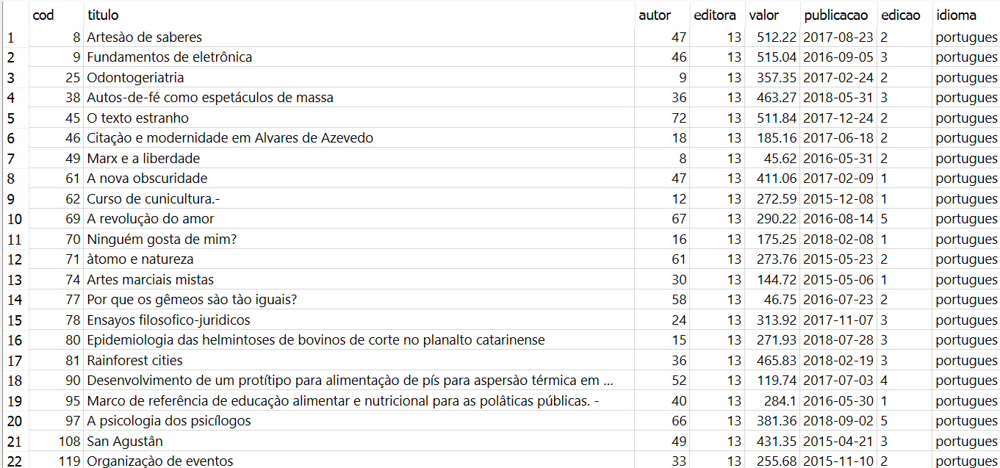

Que, consequentemente, ao colocar no Compilador da Udemy gerou o mesmo resultado, assim fazendo com que o exercício configurasse como "Sucesso":

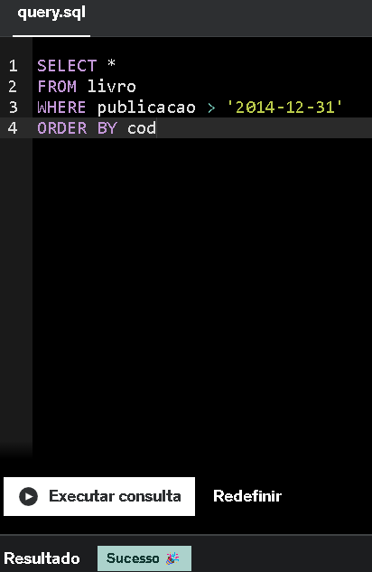

**Exercício 2:** Ao executar a query no SQLiteStudio foi obitido o seguinte resultado:

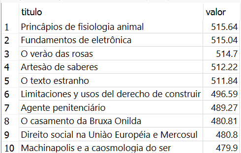

Que, consequentemente, ao colocar no Compilador da Udemy gerou o mesmo resultado, assim fazendo com que o exercício configurasse como "Sucesso":

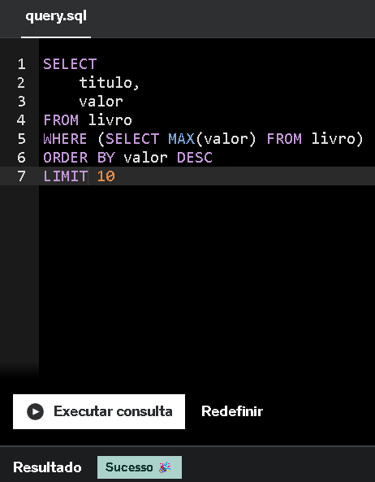

**Exercício 3:** Ao executar a query no SQLiteStudio foi obitido o seguinte resultado:

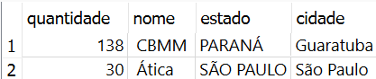

Que, consequentemente, ao colocar no Compilador da Udemy gerou o mesmo resultado, assim fazendo com que o exercício configurasse como "Sucesso":

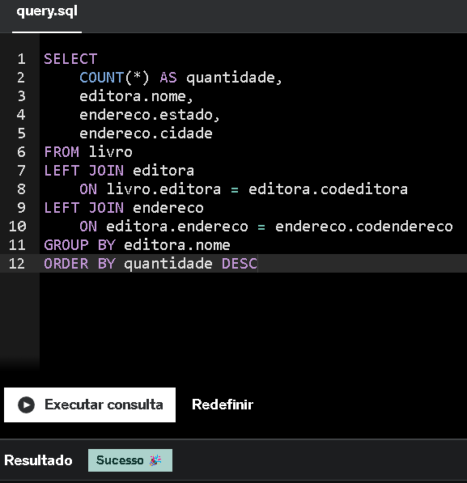

**Exercício 4:** Ao executar a query no SQLiteStudio foi obitido o seguinte resultado:

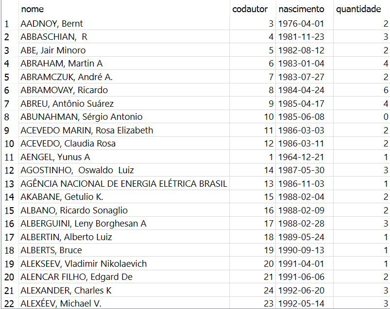

Que, consequentemente, ao colocar no Compilador da Udemy gerou o mesmo resultado, assim fazendo com que o exercício configurasse como "Sucesso":

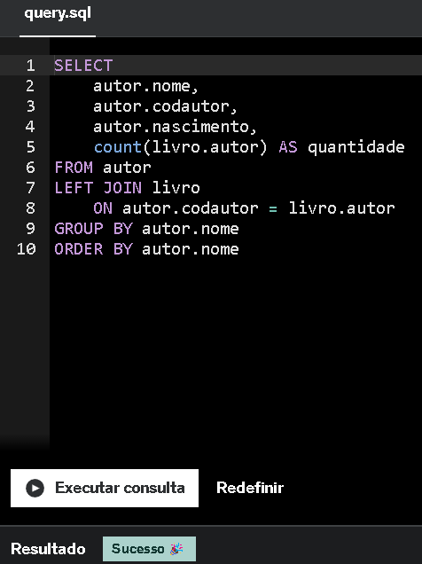

**Exercício 5:** Ao executar a query no SQLiteStudio foi obitido o seguinte resultado:

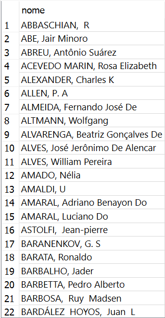

Que, consequentemente, ao colocar no Compilador da Udemy gerou o mesmo resultado, assim fazendo com que o exercício configurasse como "Sucesso":

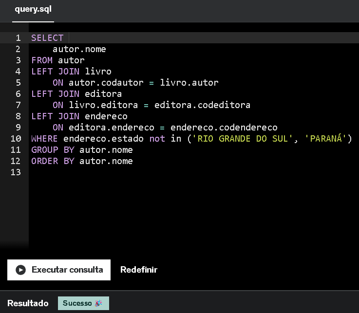

**Exercício 6:** Ao executar a query no SQLiteStudio foi obitido o seguinte resultado:

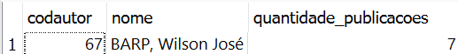

Que, consequentemente, ao colocar no Compilador da Udemy gerou o mesmo resultado, assim fazendo com que o exercício configurasse como "Sucesso":

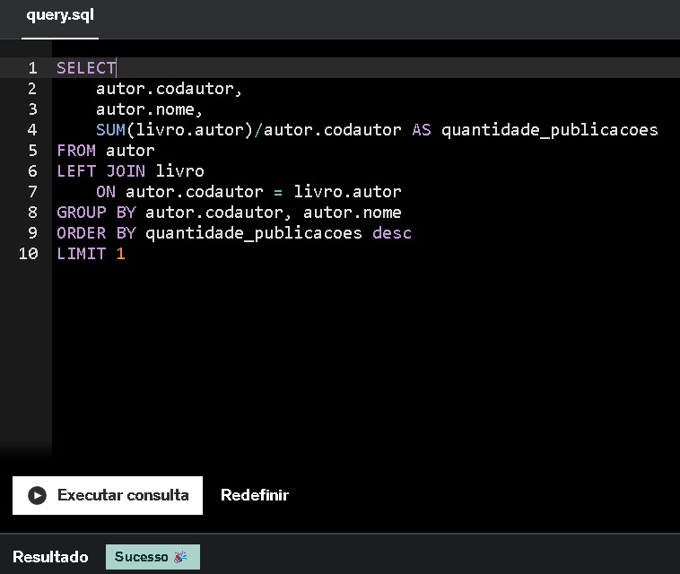

**Exercício 7:** Ao executar a query no SQLiteStudio foi obitido o seguinte resultado:

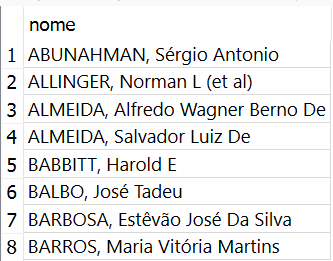

Que, consequentemente, ao colocar no Compilador da Udemy gerou o mesmo resultado, assim fazendo com que o exercício configurasse como "Sucesso":

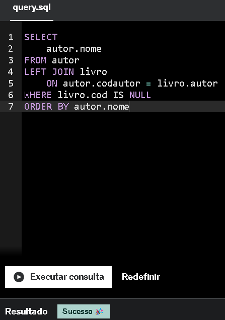

**Exercício 8:** Ao executar a query no SQLiteStudio foi obitido o seguinte resultado:

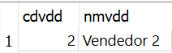

Que, consequentemente, ao colocar no Compilador da Udemy gerou o mesmo resultado, assim fazendo com que o exercício configurasse como "Sucesso":

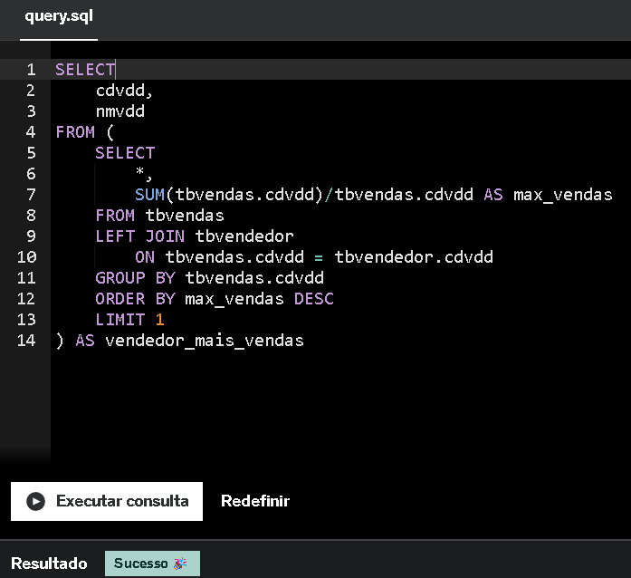

**Exercício 9:** Ao executar a query no SQLiteStudio foi obitido o seguinte resultado:

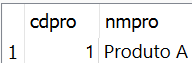

Que, consequentemente, ao colocar no Compilador da Udemy gerou o mesmo resultado, assim fazendo com que o exercício configurasse como "Sucesso":

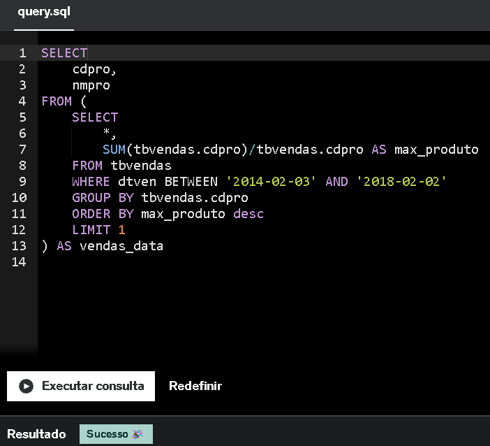

**Exercício 10:** Ao executar a query no SQLiteStudio foi obitido o seguinte resultado:

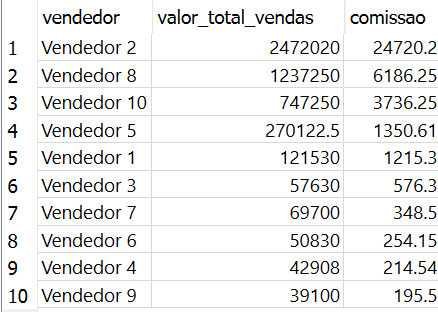

Que, consequentemente, ao colocar no Compilador da Udemy gerou o mesmo resultado, assim fazendo com que o exercício configurasse como "Sucesso":

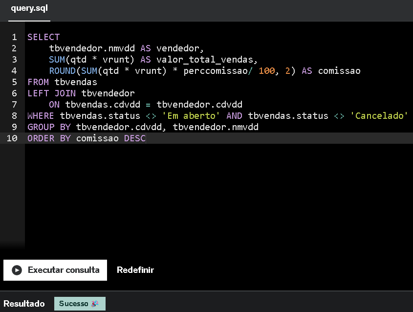

**Exercício 11:** Ao executar a query no SQLiteStudio foi obitido o seguinte resultado:

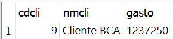

Que, consequentemente, ao colocar no Compilador da Udemy gerou o mesmo resultado, assim fazendo com que o exercício configurasse como "Sucesso":

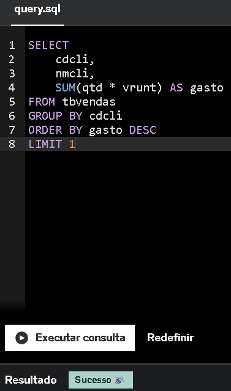

**Exercício 12:** Ao executar a query no SQLiteStudio foi obitido o seguinte resultado:

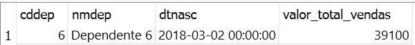

Que, consequentemente, ao colocar no Compilador da Udemy gerou o mesmo resultado, assim fazendo com que o exercício configurasse como "Sucesso":

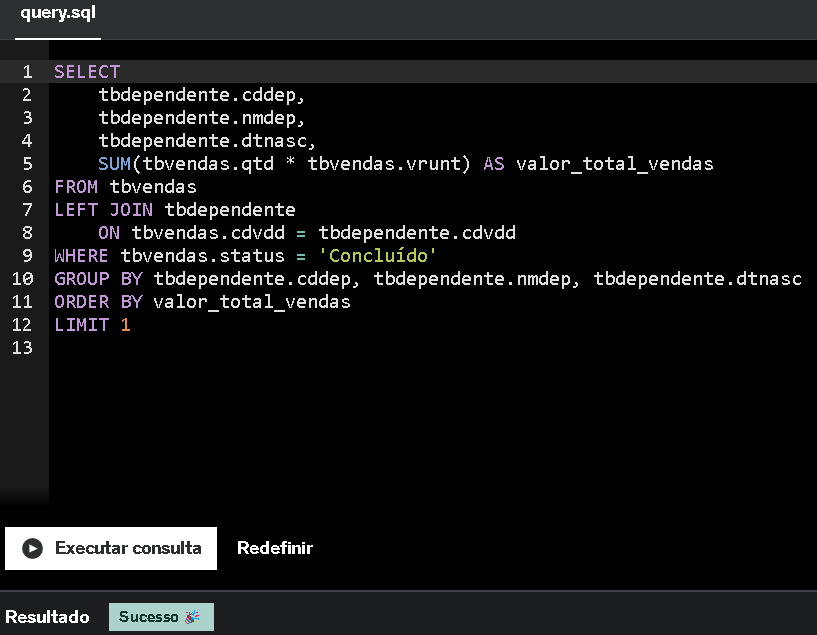

**Exercício 13:** Ao executar a query no SQLiteStudio foi obitido o seguinte resultado:

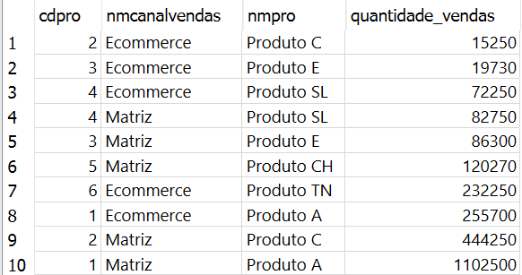

Que, consequentemente, ao colocar no Compilador da Udemy gerou o mesmo resultado, assim fazendo com que o exercício configurasse como "Sucesso":

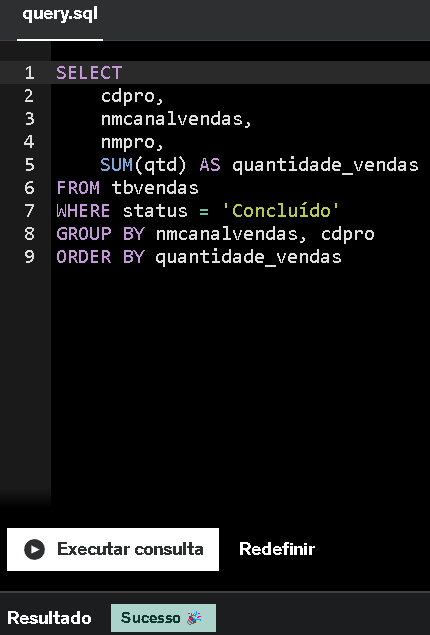

**Exercício 14:** Ao executar a query no SQLiteStudio foi obitido o seguinte resultado:

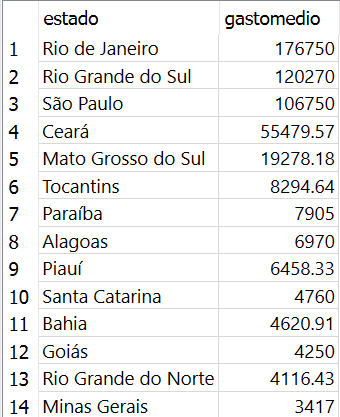

Que, consequentemente, ao colocar no Compilador da Udemy gerou o mesmo resultado, assim fazendo com que o exercício configurasse como "Sucesso":

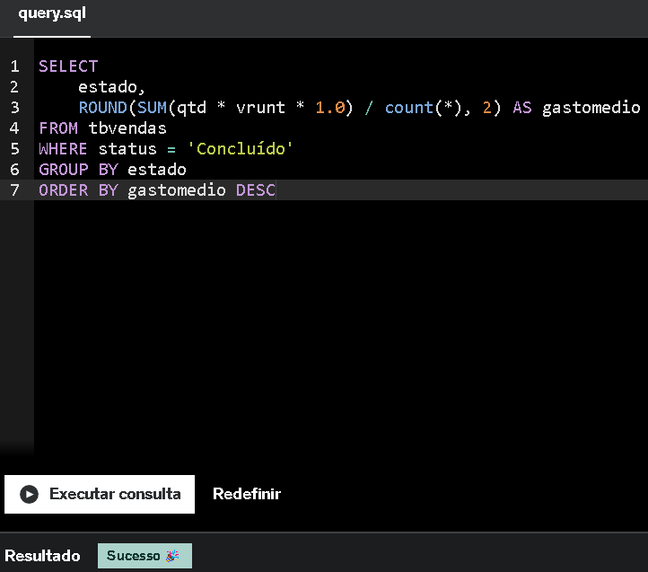

**Exercício 15:** Ao executar a query no SQLiteStudio foi obitido o seguinte resultado:

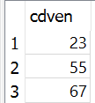

Que, consequentemente, ao colocar no Compilador da Udemy gerou o mesmo resultado, assim fazendo com que o exercício configurasse como "Sucesso":

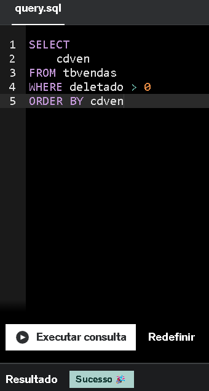

**Exercício 16:** Ao executar a query no SQLiteStudio foi obitido o seguinte resultado:

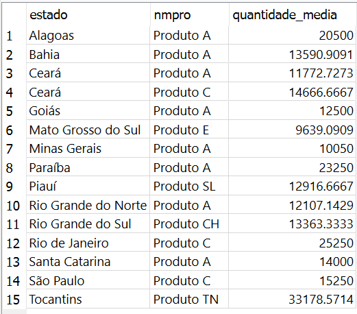

Que, consequentemente, ao colocar no Compilador da Udemy gerou o mesmo resultado, assim fazendo com que o exercício configurasse como "Sucesso":

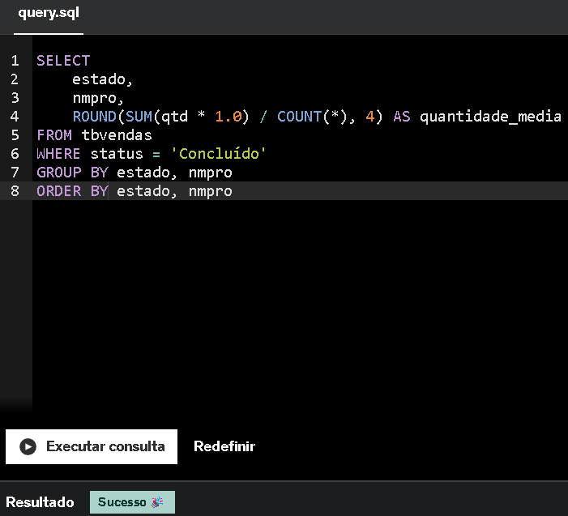
___

# **Certificados**

[***Certificado do Curso: AWS Skill Builder - AWS Partner: Sales Accreditation***](../Sprint2/Certificados/AWS_Sales_Accreditation.png)