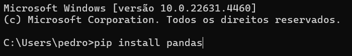
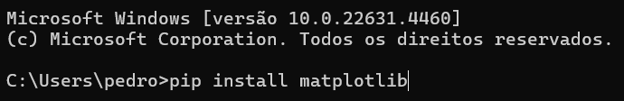
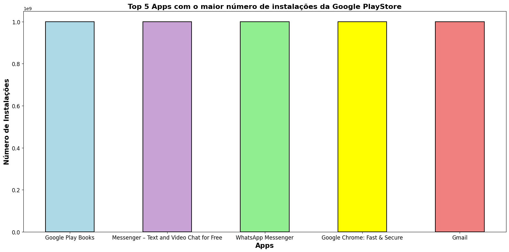
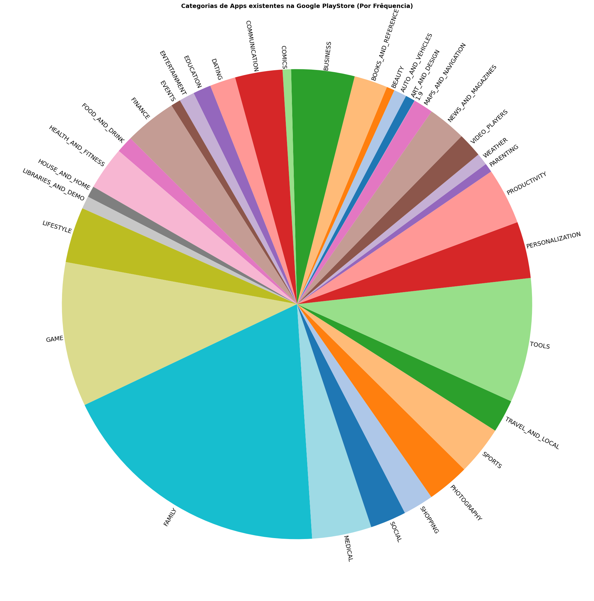
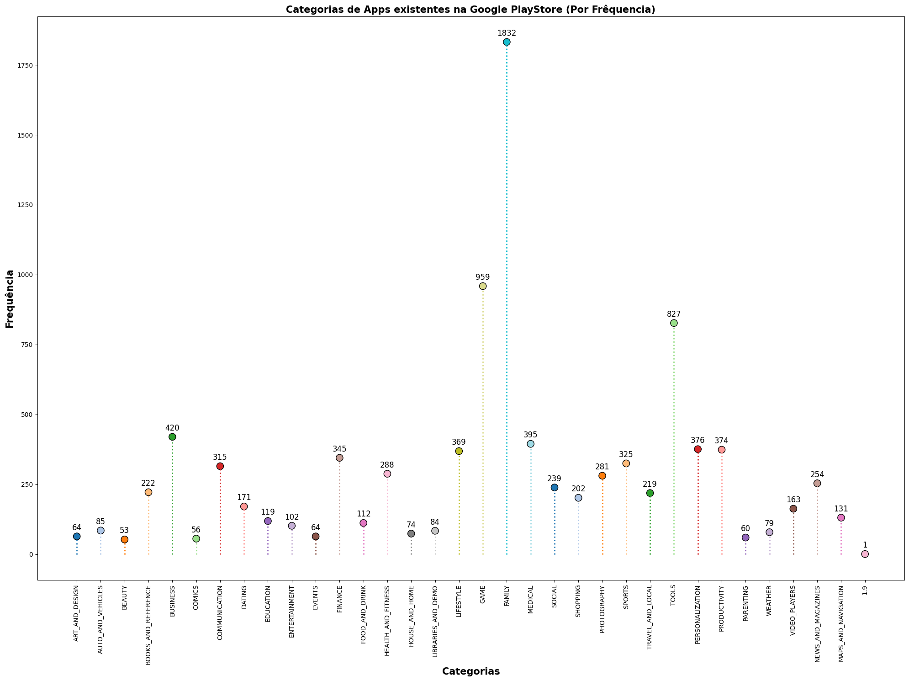

# **Resolução do Desafio: Sprint 3**

## **Entedimento sobre o Desafio**
    
Ao ler o desafio, entendi que ele não seria como os outros, que consistiam na criação de algo individualizado. Em vez disso, o foco está no desenvolvimento de pequenos algoritmos para praticar o uso das bibliotecas **Pandas** e **Matplotlib**, bem como a utilização do **Jupyter Notebook**. Para a realização desse desafio, já concluí a instalação das bibliotecas necessárias e adicionei a extensão do Jupyter ao Visual Studio Code.

**Instalações:**






Com o ambiente preparado, baixei o arquivo [*googleplaystore.csv*](../../Sprint3/Desafio/googleplaystore.csv) e li as questões que o desafio pedia.

## **Desafio**

Como o desafio pedia eu criei um arquivo .IPYNB que é um Jupyter Notebook onde foi realizado todas as etapas do desafio, o arquivo que criei é [*Desafio.IPYNB*](./Desafio.IPYNB). Toda a parte técnica está armazenada nele, então este README será utilizado apenas para o entendimento conceitual, para visualização simples dos resultados e entendimento das minhas escolhas durante a realização do Desafio.

**Primeira Questão:** *Leia o arquivo csv [*googleplaystore.csv*](../../Sprint3/Desafio/googleplaystore.csv) e realize as seguintes atividades sobre o dataset utilizando as bibliotecas Pandas e Matplotlib. Remova as linhas duplicadas.*

Ao entender minha primeira tarefa já fui direto procurar entender como a biblioteca pandas poderia facilitar essa tarefa para mim, uma vez que fazer isso manualmente já se provou um pouco mais trabalhoso durante a realização dos exercícios da Sprint. Encontrado a forma implementei um código e gerei uma nova versão do arquivo [*googleplaystore.csv*](../../Sprint3/Desafio/googleplaystore.csv) uma vez que acho muito importante manter um histórico dos documentos utilizados em caso de necessidade, o arquivo gerado foi [*googleplaystoreAtt.csv*](../../Sprint3/Desafio/googleplaystoreAtt.csv), o qual tem originalmente tinha 483 linhas duplicas, mas após mais observações foi notado que haviam aplicativos duplicados mas que haviam diferença entre seus números de instalações, o que pode ser um indicativo de uma adição dupla em diferente horários no MESMO DIA, o que, acredito que não era a intenção, por isso também fiz suas remoções, assim o novo arquivo ficou com 9661 linhas, ou seja, uma diferença de 1181 linhas entre os dois arquivos.

**Algoritmo Utilizado:**

```Python
import pandas as pd

# Lê o arquivo googlepalystore.csv e armazena na variável dataset.
dataset = pd.read_csv('googleplaystore.csv')

# A variável dataset_limpo recebe o conteúdo de dataset SEM linhas duplicadas.
dataset_limpo = dataset.drop_duplicates()

# Remove duplicatas com o mesmo nome exato na coluna App.
dataset_limpo = dataset.drop_duplicates(subset='App')

# Crio outro arquivo para receber o googleplaystore.csv sem linhas duplicadados e nomeio ele como 'googleplaystoreAtt.csv' (Att = Atualizado).
dataset_limpo.to_csv('googleplaystoreAtt.csv', index=False)
```

**Segunda Questão:** *Faça um gráfico de barras contendo os top 5 apps por número de instalação.*

Para resolver essa questão, rapidamente, notei que precisaria usar a biblioteca Matplotlib para plotar o gráfico e a Pandas para a criar informações a partir dos dados contidos no meu arquivo [*googleplaystoreAtt.csv*](../../Sprint3/Desafio/googleplaystoreAtt.csv).

**Algoritmo Utilizado:**
```Python
import pandas as pd
import matplotlib.pyplot as plt

# Lê o arquivo googlepalystoreAtt.csv e armazena na variável dataset.
dataset = pd.read_csv('googleplaystoreAtt.csv')

# Garante que não haverá caracteres especiais como +, substituindo-os por um espaço vazio, e depois verifica se é um número.
dataset = dataset[dataset['Installs'].str.replace('[+,]', '', regex=True).str.isdigit()]

# Faz basicamente a mesma coisa que o código anterior, mas garante que os valores serão convertidos para float.
dataset['Installs'] = dataset['Installs'].str.replace('[+,]', '', regex=True).astype(float)

# Armazena os 5 maiores valores da coluna Installs, na variável topCincoNumInstalacoes.
topCincoNumInstalacoes = dataset.nlargest(5, 'Installs')

# Crio um dicionário que tem como key o nome do app e o value como o número de instalações que app teve.
topCincoAppsMaisInstalacoes = dict(zip(topCincoNumInstalacoes['App'], topCincoNumInstalacoes['Installs']))

# # Defino a área do gráfico como 16x8.
plt.figure(figsize=(16, 8))

# Variável cores recebe cores que contém a identidade visual dos Apps encontrados.
cores = ['lightblue', '#C8A2D4', 'lightgreen', 'yellow', 'lightcoral']

# Crio um gráfico de barras verticais, com as barras tendo as cores que havia escolhido anteriormente, com uma largura de 0.5, com bordas pretas
# de 1.5 de largura.
plt.bar(topCincoAppsMaisInstalacoes.keys(), topCincoAppsMaisInstalacoes.values(), color=cores, width=0.5, edgecolor = 'black', linewidth = 1.5)

# Defino o título do gráfico e o tamanho de sua fonte como 16, em negrito.
plt.title('Top 5 Apps com o maior número de instalações da Google PlayStore', fontsize = 16, fontweight='bold')

# Defino o label do eixo X como Apps e o tamanho da sua fonte como 15, em negrito.
plt.xlabel('Apps', fontsize = 15, fontweight='bold')

# Defino o label do eixo Y como Número de Instalações e sua fonte como 15.
plt.ylabel('Número de Instalações', fontsize = 15, fontweight='bold')

# Defino o tamanho da fonte para os eixos x e y como 12.
plt.xticks(fontsize = 12)
plt.yticks(fontsize= 12)

# Ajusto o gráfico para que ele use a área disponível de forma mais eficiente e faço sua exibição em sequência.
plt.tight_layout()
plt.show()
```

**Gráfico Gerado:**



Achei que visualmente ficaria mais interessante se cada coluna tivesse uma cor diferente, após a primeira execução entendi quais eram os aplicativos e coloquei as cores que lembram visualmente eles. Claro, em caso de ser uma lista mais dinâmica a qual os dados mudam constantemente essa seleção de cores não significaria isso. Os eixos X e Y foram nomeados de acordo com o objetivo do gráfico, para que assim, quem estivesse lendo ficasse claro a informação que o gráfico quer transmitir,, no caso: **Top 5 Apps com o maior número de instalações da Google PlayStore**.

**Terceira Questão:** *Faça um gráfico de pizza (pie chart) mostrando as categorias de apps existentes no dataset de acordo com a frêquencia em que elas aparecem.*

Novamente, entendi que meu objetivo era utilizar as bibliotecas Pandas e Matplotlib para extrair uma informação daqueles dados, então novamente coloquei a mão na massa e escrevi um algoritmo que pudesse realizar a questão. Mas após a realização inicial notei que haviam muitas categorias então as paletas de cores genéricas que encontrei não eram suficientes, então pesquisei um biblioteca que me permitia criar as minhas próprias de forma rápida e eficiente, por conta disso os próximos gráficos gerados no Desafio utilizaram, também, a biblioteca seaborn.

**Algoritmo Utilizado:**

```Python
import pandas as pd
import matplotlib.pyplot as plt
# Utilizo a biblioteca seaborn para criar um paleta de cores que atenda o meu gráfico.
import seaborn as sns

# Lê o arquivo googlepalystoreAtt.csv e armazena na variável dataset.
dataset = pd.read_csv('googleplaystoreAtt.csv')

# Crio um dicionário chamado de aparicoes para receber a categoria como key e o número de aparições como Value.
aparicoes = {}

# Passo por todos os valores da coluna Category, caso a categoria já esteja no dicionário como uma key é adcionado 1 ao value da key, 
# caso não, a categoria é adicionada como um key de value 1.
for categorias in dataset['Category']:
    if categorias in aparicoes.keys():
        aparicoes[categorias] += 1
    else:
        aparicoes[categorias] = 1

# Crio uma paleta de cores com o número de chaves do dicionário aparicoes.
num_cores = len(aparicoes)
cores = sns.color_palette('tab20', num_cores)

# Defino a área do gráfico como 100x20.
plt.figure(figsize=(100, 20))

# Defino o título do gráfico, o tamanho da fonte como 14, em negrito.
plt.title('Categorias de Apps existentes na Google PlayStore (Por Frêquencia)', fontsize = 14, fontweight='bold')

# Crio o gráfico pie chart (pizza) e atribuo os values do dicionário aparicoes como conteúdo que preenche o gráfico, cada value terá sua key.
# como label, o ângulo dos labels começam com 60°, 1 de distância do gráfico, com font 14. Também adiciono as cores da paleta ao gráfico.
plt.pie(aparicoes.values(), labels=aparicoes.keys(), startangle=60, labeldistance=1, rotatelabels=True, textprops={'fontsize': 14}, colors=cores)

# Ajusto o gráfico para que ele use a área disponível de forma mais eficiente e faço sua exibição em sequência.
plt.tight_layout()
plt.show()
```

**Gráfico Gerado:**



O gráfico de pizza gerado foi esse, pessoalmente, não acho ele a melhor forma para representar a resposta da questão que foi apresentada. Deixei labels no topo de cada fatia do gráfico para que ficasse claro sobre qual categoria aquela fatia pertencia, também optei por não deixar as porcentagens aparecendo nos gráficos uma vez que achei que elas ficaram muito deslocadas por conta de algumas fatia EXTREMAMENTE pequenas como a da categoria 1.9, que só possui uma aparição em app. O título do gráfico serve para que possa ser entendido a informação que o gráfico deseja passar.

**Quarta Questão:** *Mostre qual o app mais caro existente no dataset.*

Somente lendo a pergunta já percebi que era uma questão mais simples, ou seja, que não haveria a necessidade de plotar qualquer tipo de gráfico, por dois motivos: com apenas uma resposta para essa pergunta não seria possível realizar um gráfico e também por que o exercício não pedia que fosse criado um gráfico. Então, consequentemente, só utilizei a biblioteca pandas e suas facilidades para a realização do exercício.

**Algoritmo Utilizado:**

```Python
import pandas as pd

# Lê o arquivo googlepalystoreAtt.csv e armazena na variável dataset.
dataset = pd.read_csv('googleplaystoreAtt.csv')

# Converte os conteúdos da coluna Price para númerico, para isso são substituidos caracteres especiais por espaços vazios. Caso algum valor não
# possa ser convertido será substituido por Not a Number, que evita que o programa lance erros ao econtrar valores inválidos.
dataset['Price'] = pd.to_numeric(dataset['Price'].replace('[\$]', '', regex=True), errors='coerce')

# Consigo o maior valor da coluna price e mostrando somente o valor, ignorando o índice e o nome da coluna.
maiorPreco = dataset['Price'].nlargest(1).iloc[0]

# Encontra o índice do maior preço para buscar seu valor relacionado à coluna App.
indiceMaiorPreco = dataset['Price'].idxmax()

# Obtém o conteúdo relacionado ao índice do maior preço à coluna App.
appMaiorPreco = dataset.loc[indiceMaiorPreco, 'App']

# Mostra o resultado final no console.
print(f'O App com o maior preço é: {appMaiorPreco}, por {maiorPreco} $')

# Outra opção para a verifação do resultado é a criação de um arquivo .txt com o resultado.
with open('AppMaisCaro.txt', 'w') as saida:
    saida.write(f'O App com o maior preço é: {appMaiorPreco}, por {maiorPreco} $')
```

O algoritmo imprime o resultado final no console, ou seja, no próprio arquivo [*Desafio.IPYNB*](./Desafio.IPYNB), mas para que ele pudesse ser referenciado aqui no README eu coloquei seu resultado no arquivo [*AppMaisCaro.txt*](../Desafio/AppMaisCaro.txt).

**Quinta Questão:** *Mostre quantos apps são classificados como 'Mature 17+'.*

Novamente, uma questão que não seria necessário plotar um gráfico e que retorna somente uma informação ao usuário: Número de Apps com classificação 'Mature 17+'. Usei a biblioteca pandas para a realização do exercício.

**Algoritmo Utilizado:**

```Python
import pandas as pd

# Lê o arquivo googleplaystoreAtt.csv e armazena na variável dataset.
dataset = pd.read_csv('googleplaystoreAtt.csv')

quantidade = 0

# Um loop que verifica quantas vezes a string 'Mature 17+' aparece na coluna Content Rating, cada vez que aparece é somado 1 na variável quantidade.
for registros in dataset['Content Rating']:
    if registros == 'Mature 17+':
        quantidade += 1

# Mostra o resultado final no console
print(f'Existem {quantidade} apps que tem como classificação indicativa de Mature 17+.')

# Outra opção para a verifação do resultado é a criação de um arquivo .txt com o resultado.
with open('AppsClassificados.txt', 'w') as saida:
    saida.write(f'Existem {quantidade} apps que tem como classificação indicativa de Mature 17+.')
```

O algoritmo imprime o resultado final no console, ou seja, no próprio arquivo [*Desafio.IPYNB*](./Desafio.IPYNB), mas para que ele pudesse ser referenciado aqui no README eu coloquei seu resultado no arquivo [*AppsClassificados.txt*](../Desafio/AppsClassificados.txt).

**Sexta Questão:** *Mostre o top 10 apps por número de reviews bem como o respectivo número de reviews. Ordene a lista de forma decrescente por número de reviews.* 

Dessa vez foi observado que poderia ser retornado o resultado como gráfico, mas como não foi pedido acabei por não fazer. Utilizei a biblioteca Pandas para a realização do exercício.

```Python
import pandas as pd

# Lê o arquivo googlepalystoreAtt.csv e armazena na variável dataset.
dataset = pd.read_csv('googleplaystoreAtt.csv')

# Garanto que todos os valores da coluna Reviews serão numéricos, caso algum valor não possa ser convertido será substituido por Not a Number
# que evita que o programa lance erros ao econtrar valores inválidos.
dataset['Reviews'] = pd.to_numeric(dataset['Reviews'], errors='coerce')

# A variável maiorNumeroReviews recebe os 10 maiores valores contidos na coluna Reviews. (É considerada como um dataframe).
maiorNumeroReviews = dataset.nlargest(10, 'Reviews')

appsMaiorNumReviews = []

# Itera pelas linhas do dataframa maiorNumeroReviews e coleta suas informações: Nome do App e Número de Reviews.
for _, coluna in maiorNumeroReviews.iterrows():
    # Armazena os conteúdos numa tupla que será inserida na lista appsMaiorNumReviews.
    appsMaiorNumReviews.append((coluna['App'], int(coluna['Reviews'])))

# Ordena a lista appsMaiorNumReviews apartir de uma lógica definida, utilizando o segundo elemento de cada item (número de reviews).
# A função sorted é usada para realizar a ordenação, e o parâmetro key define que o critério será o segundo valor (índice 1) de cada tupla.
# O argumento reverse=True indica que a ordenação decrescente.
appsMaiorNumReviews = sorted(appsMaiorNumReviews, key=lambda x: x[1], reverse=True)

# Mostra o resultado final no console.
print('Em ordem decrescente: ', end='\n\n')
for app, reviews in appsMaiorNumReviews:
    print(f'App: {app}, Número de Reviews: {reviews}\n')

# Outra opção para a verifação do resultado é a criação de um arquivo .txt com o resultado.
with open('DezAppsComMaisReviews.txt', 'w') as saida:
    saida.write('Em ordem decrescente:\n\n')
    for app, reviews in appsMaiorNumReviews:
        saida.write(f'App: {app}, Número de Reviews: {reviews}\n')
```

O algoritmo imprime o resultado final no console, ou seja, no próprio arquivo [*Desafio.IPYNB*](./Desafio.IPYNB), mas para que ele pudesse ser referenciado aqui no README eu coloquei seu resultado no arquivo [*DezAppsComMaisReviews.txt*](../Desafio/DezAppsComMaisReviews.txt). Importante notar que foi nesse exercício que foi notado que haviam Apps idênticos mas com número de instalações diferentes, por isso foram retiradas no primeiro algoritmo mostrado no começo do README.

**Sétima Questão:** *Crie pelo menos mais 2 cálculos sobre o dataset e apresente em um formato de lista e outro em formato de valor. Por exemplo: "top 10 apps por número de reviews" e o "app mais caro existente no dataset".*

**Escolha 1:** *Mostre as 10 datas que tiveram mais atualizações. (Caso mais de um tenha sido atualizado no mesmo dia, usar ordem alfabética)*

**Escolha 2:** *Qual foi o último app a ser atualizado? Mostre sua data (Caso mais de um tenha sido atualizado no mesmo dia, usar ordem alfabética)*

As minhas escolhas de *exercícios* foram baseadas na minha vontade de explorar o uso de DateTime em Python, conteúdo que eu ainda não havia explorado 100%, encontrei algumas dificuldades, tanto é que na resolução da minha segunda escolha não consegui colocar uma máscara no formato da data.

**Algoritmo Utilizado - Escolha 1:**
```Python
import pandas as pd

# Lê o arquivo googlepalystoreAtt.csv e armazena na variável dataset.
dataset = pd.read_csv('googleplaystoreAtt.csv')

# Garante que as aspas duplas serão subtituidas por espaços vazios nos conteúdos armazenados na coluna Last Updated e
# serão convertidos para o tipo DateTime.
dataset['Last Updated'] = pd.to_datetime(dataset['Last Updated'].replace('"', '', regex=True), errors='coerce')

# Passo por todos os valores da coluna Last Updated, caso a data já esteja no dicionário como uma key, é adcionado 1 ao value da key, 
# caso não, a data é adicionada como um key de value 1.
qtdAtualizacoesPorData = {}
for registros in dataset['Last Updated']:
    if registros in qtdAtualizacoesPorData.keys():
        qtdAtualizacoesPorData[registros] += 1
    else:
        qtdAtualizacoesPorData[registros] = 1

# Ordeno o dicionário apartir de uma lógica definida, utilizando o segundo elemento de cada item (número de atualizações).
# A função sorted é usada para realizar a ordenação, e o parâmetro key define que o critério será o segundo valor (índice 1) de cada tupla.
# O argumento reverse=True indica que a ordenação decrescente.
qtdAtualizacoesPorData = dict(sorted(qtdAtualizacoesPorData.items(), key=lambda item: item[1], reverse=True))

# Crio uma variável que recebe as 10 primeiras datas com mais atualizações, para isso transformo o dicionário 
# qtdAtualizacoesPorData em uma lista que só retorna os 10 primeiros items e depois transformo novamente em um dicionário.
qtdAtualizacoesPorDataSlice = dict(list(qtdAtualizacoesPorData.items())[:10])

# Mostra o resultado final no console.
for data, quantidade in qtdAtualizacoesPorDataSlice.items():
    print(f'Em {data} aconteceram {quantidade} atualizações em diferentes aplicativos', end='\n')

# Outra opção para a verifação do resultado é a criação de um arquivo .txt com o resultado.
with open('DataQuantidadeVezes.txt', 'w') as saida:
    for data, quantidade in qtdAtualizacoesPorDataSlice.items():
        saida.write(f'Em {data} aconteceram {quantidade} atualizações em diferentes aplicativos\n')
```

O algoritmo imprime o resultado final no console, ou seja, no próprio arquivo [*Desafio.IPYNB*](./Desafio.IPYNB), mas para que ele pudesse ser referenciado aqui no README eu coloquei seu resultado no arquivo [*DataQuantidadeVezes.txt*](../Desafio/DataQuantidadeVezes.txt). 

**Algoritmo Utilizado - Escolha 2:**
```Python
import pandas as pd

# Lê o arquivo googlepalystoreAtt.csv e armazena na variável dataset.
dataset = pd.read_csv('googleplaystoreAtt.csv')

# Garante que as aspas duplas serão subtituidas por espaços vazios nos conteúdos armazenados na coluna Last Updated e
# serão convertidos para o tipo DateTime.
dataset['Last Updated'] = pd.to_datetime(dataset['Last Updated'].replace('"', '', regex=True), errors='coerce')

# Garante que as linhas do dataset serão ordenadas por ordem alfabética na coluna App. Dessa forma, ao encontrar o maior 
# valor na coluna Last Updated, o pandas utilizará o menor índice (relacionado à ordem alfabética de App) como 
# critério de desempate em caso de datas iguais.
datasetOrdemAlfabetica = dataset.sort_values(by=['Last Updated', 'App'], ascending=[False, True])

# A variável ultimaData recebe a data da última atualização de um App.
ultimaData = datasetOrdemAlfabetica['Last Updated'].nlargest(1).iloc[0]

# Uso loc para descobrir a localização da linha onde se encontra a última data de atualização, por meio do método idxmax.
ultimoApp = datasetOrdemAlfabetica.loc[datasetOrdemAlfabetica['Last Updated'].idxmax()]

# Armazeno o conteúdo que se encontrava na linha da última data relacionado a coluna App.
ultimoAppAtualizado = ultimoApp['App']

# Será impresso no console o resultado (Por padrão a data estará no formato YY-MM-DD).
print(f'O app {ultimoAppAtualizado} foi o último aplicativo da Google PlayStore a ser atualizado! Foi atualizado em: {ultimaData}')

# Outra opção para a verifação do resultado é a criação de um arquivo .txt com o resultado.
with open('DataUltimaAtualizacaoApp.txt', 'w') as saida:
    saida.write(f'O app {ultimoAppAtualizado} foi o último aplicativo da Google PlayStore a ser atualizado! Foi atualizado em: {ultimaData}')
```

O algoritmo imprime o resultado final no console, ou seja, no próprio arquivo [*Desafio.IPYNB*](./Desafio.IPYNB), mas para que ele pudesse ser referenciado aqui no README eu coloquei seu resultado no arquivo [*DataUltimaAtualizacaoApp.txt*](../Desafio/DataUltimaAtualizacaoApp.txt). 

**Oitava Questão:** *Crie pelo menos outras 2 formas gráficas de exibição dos indicadores acima utilizando a biblioteca matplotlib. Escolha tipos gráficos diferentes dos explorados acima. Por exemplo: linhas e dispersão.*

**Escolha 1:** *Exibir novamente o conteúdo do gráfico da **Terceira Questão** uma vez que não achei que o pie chart era a melhor forma de demonstrar quais categorias de apps existiam no dataset de acordo com sua frequência, como visto anteriormente.*

**Escolha 2:**

**Algoritmo Utilizado - Escolha 1:**
```Python
import pandas as pd
import matplotlib.pyplot as plt
# Utilizo a biblioteca seaborn para criar um paleta de cores que atenda o meu gráfico.
import seaborn as sns

# Lê o arquivo googlepalystoreAtt.csv e armazena na variável dataset.
dataset = pd.read_csv('googleplaystoreAtt.csv')

# Crio um dicionário chamado de aparicoes para receber a categoria como key e o número de aparições como Value.
aparicoes = {}

# Passo por todos os valores da coluna Category, caso a categoria já esteja no dicionário como uma key é adcionado 1 ao value da key, 
# caso não, a categoria é adicionada como um key de value 1.
for categorias in dataset['Category']:
    if categorias in aparicoes.keys():
        aparicoes[categorias] += 1
    else:
        aparicoes[categorias] = 1


# Crio uma paleta de cores com o número de chaves do dicionário aparicoes.
num_cores = len(aparicoes)
cores = sns.color_palette('tab20', num_cores)

# Defino a área do gráfico com 20x15.
plt.figure(figsize=(20, 15))

# Defino o título do gráfico, o tamanho de sua fonte 15, em negrito.
plt.title('Categorias de Apps existentes na Google PlayStore (Por Frêquencia)', fontsize = 15, fontweight='bold')

# Crio o gráfico de disperção, com os valores do eixo X sendo as keys contidas no dicionário aparicoes, 
# os valores do eixo Y sendo os values contidos no dicionário aparicoes.
# Defino as cores dos pontos, com base na paleta criada anteriormente, seu contorno como preto e seu tamanho como 120.
plt.scatter(aparicoes.keys(), aparicoes.values(), color=cores, edgecolors='black', s=120)

cont = 0
# Defino neste loop as linhas pontilhadas que ligam as categorias às suas frequências.
for categoria, valor in aparicoes.items():
    # A linha deve começar nas coordenas (x, y), sendo um X fixo (Categoria = aparicoes.keys()) e 
    # y começando do 0 indo até o seu valor (Valor = aparicoes.value()).
    # Defino uma cor diferente a cada iteração, tal qual o estilo da linha e sua grossura.
    plt.vlines(x=categoria, ymin=0, ymax=valor, colors=cores[cont], linestyles=':', linewidth=2)
    cont += 1
    
# Defino neste loop a frequêcia de cada categoria nos seus pontos do gráfico.
for categoria, valor in aparicoes.items():
    # O valor (Valor = aparicoes.value()) é anotado nas coordenadas (X=Categoria(keys), Y=Valor(values)).
    # Defino que a posição do texto será ajustada em relação às coordenadas especificadas, posicionp +10 no eixo y, 
    # centralizo o texto e defino o tamanho da fonte como 12.
    plt.annotate(f'{valor}', (categoria, valor), textcoords="offset points", xytext=(0, 10), ha='center', fontsize=12)

# Defino o texto dos labels X (Categorias) e Y (Frequência), com tamanho da fonte 15 em negrito.
plt.xlabel('Categorias', fontsize = 15, fontweight='bold')
plt.ylabel('Frequência', fontsize = 15, fontweight='bold')

# Defino que os labels de cada valor do eixo X devem estar com uma rotação de 90°.
plt.xticks(rotation=90)

# Ajusto o gráfico para que ele use a área disponível de forma mais eficiente e faço sua exibição em sequência.
plt.tight_layout()
plt.show()
```
**Gráfico Gerado:**



Eu fiz como um gráfico de dispersão, pois acho visualmente menos massivo que um pie chart e mais organizado. Inicialmente, só havia os pontos, então coloquei as mesmas cores que havia colocado anteriormente, adicionei um pontilhado que ia do eixo X, melhor dizendo da Categoria que estava no eixo X, até o valor do eixo Y que estava relacionado com aquela categoria, assim sendo mais fácil de entender as relações. Para saber o número exato de quantas vezes cada categoria apareceu eu coloquei o número logo acima do ponto no gráfico. O título do gráfico é o mesmo que o de pizza, fazendo-se simples de entender, mas para facilitar ainda mais adicionei labels no eixo X e Y.

## **Pontos Importantes à Ressaltar**

### **Pricipais Problemas e Dificuldades:**

Acredito que meu maior problema nesta Sprint foi o planejamento. Acabei vacilando na gestão do tempo e me enrolando em algumas etapas, o que me forçou a apressar outras e resultou em erros que consumiram ainda mais tempo. Por exemplo, não realizei uma análise aprofundada do arquivo CSV no início, o que me levou a enfrentar diversos problemas, como linhas em formatos inesperados e conteúdos que não estavam no data type desejado. Isso fez com que eu precisasse dar várias voltas até conseguir atingir meu objetivo. Com certeza, não repetirei esse erro!


### **Principais Aprendizados:**

Acredito que os principais pontos de aprendizado vieram a partir da identificação de problemas e dificuldades que tive. Sendo os principais aprendizados: Conversão de Tipos e Análise Do Arquivo CSV.

**Análise Do Arquivo CSV:** Ao resolver as questões propostas, como mencionado anteriormente, encontrei diversos problemas, como os dados não estarem no formato desejado para a análise. Esses obstáculos frequentemente comprometiam toda a lógica que eu havia desenvolvido, devido à falta de uma análise mais aprofundada do arquivo CSV antes de começar a trabalhar com ele. Isso me obrigava a mudar de estratégia constantemente, resultando em uma grande perda de tempo, o que definitivamente não é o ideal. Portanto, um aprendizado que levarei dessa experiência é a importância de um planejamento mais detalhado ao lidar com arquivos robustos.

**Conversão de Tipos:** Em praticamente todos os exercícios propostos, foi necessário realizar algum tipo de conversão ou transformação dos dados fornecidos. Nos primeiros exercícios, a sintaxe parecia bastante intimidadora, mas, à medida que fui utilizando, tornou-se cada vez mais simples de aplicar. Esse aprendizado foi, sem dúvida, o mais marcante.