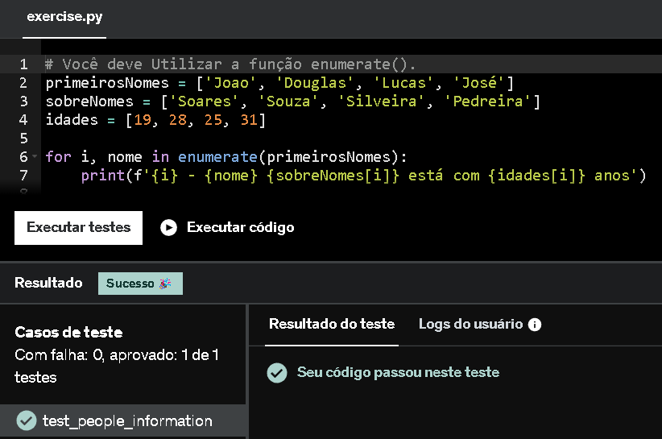
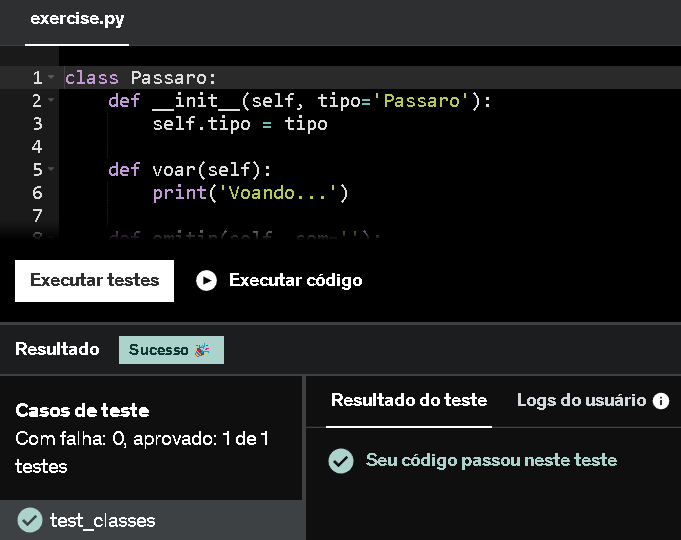

# Resumo

### **Python 3 - Curso Completo do Básico ao Avançado**

### **Python é uma linguagem de programação dinamicamente tipada e fortemente tipada:**

**Dinamicamente tipada:** Em Python, você não precisa declarar o tipo de uma variável antes de usá-la; o tipo é determinado automaticamente no momento da atribuição. Por exemplo, ao fazer x = 10, Python entende que x é um int, e, se posteriormente x = "texto" for atribuído, o tipo de x muda para str. Isso significa que o tipo é verificado durante a execução (runtime) e não na compilação.

**Fortemente tipada:** Python não realiza conversões automáticas entre tipos diferentes sem que você solicite explicitamente. Por exemplo, tentar somar um número inteiro (int) com uma string (str) como em 1 + "1" resultará em um erro. Para realizar essa operação, é necessário fazer uma conversão explícita, como 1 + int("1").

### **Tipos de Dados BásicosS:**
- bool (True ou False)
- int (Números Inteiros) 
- float (Números Reais)
- str (Strings / Textos)
- list (Lista com conteúdos)
- dict (Dicionário, chave e valor da chave)
- NoneType (None)

### **Operadores Aritméticos:**

- % - Módulo entre dois operadores
- // - Divisão que sempre resulta em um número real truncando (Basicamente um número inteiro)
- ** - Potenciação
- += - Variável recebe o seu valor + Valor de outra variável ou número (DEPENDE DO CONTEXTO)
- -= - Variável recebe o seu valor - Valor de outra variável ou número (DEPENDE DO CONTEXTO)
- *= - Variável recebe o seu valor * Valor de outra variável ou número (DEPENDE DO CONTEXTO)
- /= - Variável recebe o seu valor / Valor de outra variável ou número (DEPENDE DO CONTEXTO)
- //= - Variável recebe o seu valor // Valor de outra variável ou número (DEPENDE DO CONTEXTO)
- %= - Variável recebe o seu valor % Valor de outra variável ou número (DEPENDE DO CONTEXTO)

### **Operadores Relacionais:**

- ==
- != 
- *>*
- <
- =<
- <=

### **Operadores Lógicos:**

- AND
    - Usar & para operações Bit-a-Bit
- OR
    - Usar | para operações Bit-a-Bit
- NOT
- XOR (Usamos o != para operações do tipo OU-EXCLUSIVO)
    - Usar ^ para operações Bit-a-Bit


### **Interpolação:**

```Python
from string import Template

nome, idade = 'Pedro', 19

#--------------------------------------------------

print('Nome = {0} Idade = {1}'.format(nome, idade))

#--------------------------------------------------

print('Nome = %s Idade = %d' % (nome, idade))

#--------------------------------------------------

print(f'Nome: {nome} Idade = {idade}')

#--------------------------------------------------

s = Template('Nome = $nome Idade = $idade')
print(s.substitute(nome=nome, idade=idade))

#--------------------------------------------------
```

### **Operadores Unários:**

- +< var > (Valor se torna positivo)
- -< var > (Valor se torna negativo)
- not < var > (Nega o valor lógico da variável False -> True e True -> False)

### **Operadores Ternários:**

- **Exemplo Prático:**
```Python
esta_chovendo = True
'Hoje estou com as roupas ' + ('secas.', 'molhadas.')[esta_chovendo] # Formato (False, True)[Variável analisada]

# A reposta será 'Hoje estou com as roupas molhadas.

'Hoje estou com as roupas ' + ('molhadas.' if esta_chovendo else 'secas.') # Outro formato
```

### **Operadores *"não básicos"***
- **Operador de Membro:**
    - **Exemplo Prático:**
    ```Python
    lista = [1, 2, 3, 'Ana', 'Carla']
    2 in lista # True
    'Ana' not in lista # False
    ```
- **Operador de Identidade:**
    **- Exemplo Prático:**
    ```Python
    x = 3 
    y = x
    z = 3

    x is y # True
    y is z # True
    y is not z # False
    ```

    **Em caso de listas a resolução é diferente:**
    ```Python
    lista1 = [1, 2, 3]
    lista2 = lista1
    lista3 = [1, 2, 3]

    lista1 is lista2 # True
    lista2 is lista3 # False (Aponta para uma lista diferente na memória, mesmo que seus conteúdos sejam idênticos)
    lista1 is not lista2 # True
    ```
### **Builtins:**

Em Python todos os símbolos (variáveis, classes, funções, etc) necessários precisam ser importados para estarem disponíveis, porém existe um módulos "embutido" da linguagem chamada __builtins__, que é importado automaticamente, é neste módulo que os tipos de dados mais básicos são definidos, e um grande conjunto de funções estão automaticamente disponíveis.

### **Conversão de Tipos:**

- **Cast:**
    - **Exemplo prático:**

    ```Python
    a = 2
    b = '3'

    print(a + int(b)) # Resposta será 5
    print(str(a) + b) # Resposta será 23
    print(a + float('3.4')) # Resposta será 5.4

    print(a + int('Legal!')) # NÃO funciona!
    ```
- **Coerção Automático (Conversão Implicita):** Quando não há forma do *"Python"* ou do Programador se "confundir", o interpretador considera a conversão de forma implicita.

### **Listas:**

- **Exemplos de Funções:**

```Python
lista = [2, 3, 4, 5] # Não é recomendado trabalhar com listas com DIFERENTES TIPOS DE DADOS

lista.append(1) # Adiciona o valor 1 para a lista, neste formato, sempre é adicionado ao final da lista

lista.remove(1) # Remove o ELEMENTO 1, NÃO o valor armazenado no índice 1

lista.reverse() # Inventer a lista (Altera o valor na MEMÓRIA)

lista.index(3) # Retorna o índice em que o "3" se encontra, ou acontece um erro, o valor não está presenta na lista
```

### **Tuplas:**
- **Exemplos de Funções:**

```Python
tupla = tuple() # Seus valores são IMUTÁVEIS

tupla = ('verde', 'amarelo', 'azul', 'branco','branco')

tupla.index('verde') # Retornaria 0
tupla.count('branco') # Retornaria 2
len(tupla) # Retornaria 5
```

### **Dicionários:**

- **Exemplos de Funções:**

```Python
pessoa = {'nome': 'Pedro Isse', 'idade': 19, 'curso': ['ADS', 'Trainee'] }

pessoa['nome'] # Retorna o valor associado a chave, neste caso 'Pedro Isse'

pessoa.keys() # Retorna as chaves do dicionário

pessoas.values() # Retorna os valores

pessoas.items() # Retorna chaves e valores 

pessoas['curso'].append('Engenharia de Software') # Adiciona um valor à chave associada

pessoas['nome'] = 'Pedro Isse de Souza' # Altera o valor da chave associada
```

### **Conjunto:**

- **Exemplos de Funções:**

```Python
a = {1, 2, 3}
a = set('coddddd3r') # Conjunto retornará como: {'d', '3', 'o', 'c', 'r'}

{1, 2, 3} == {3, 2, 1, 3} # SIM! Os valores duplicados não importam, e conjuntos são NÃO-indexados

c1 = {1, 2}
c2 = {2, 3}

c1.union(c2) # Retornará: {1, 2, 3}
c1.intersection(c2) # Retornará: {2}
c1.update(c2) # União co c1 com c2, mas que muderá o valor da variável c1

c2 <= c1 # C2 é Subconjunto do C1? SIM! c1 = {1, 2, 3} e c2 = {2, 3}

c1 - c2 # Retornará: {1}
```

### **Estruturas Condicionais:**
```Python
    nota_aluno =  7.5

    if nota_aluno > 5:
        print("Passou")
    elif nota_aluno >= 0:
        print("Não Passou!")
    else:
        print("Nota inválida!")
```

### **Estrturas de Repetição:**

- **While:**
```Python
contador = 1

while contador <= 5:
    print(contador)
    contador += 1
```

- **For:**

    **Listas**
    ```Python
    frutas = ["maçã", "banana", "laranja", "uva"]

    for fruta in frutas:
    print(fruta)
    ```

    **Tuplas**
    ```Python
    cores = ("vermelho", "azul", "verde")

    for cor in cores:
    print(cor)
    ```

    **Conjuntos**
    ```Python
    numeros = {1, 2, 3, 4, 5}

    for numero in numeros:
    print(numero)
    ```

    **Dicionários**
    ```Python
    for chave, valor in aluno.items():
    print(f"{chave}: {valor}")
    ```
    **For com Else:**
    ```Python
    # O else só será executado caso não haja nenhuma condição que resulte em break.


    for in in range(1, 10):
        print(i)
    else:
        print('Fim')
    ```

    - **Break e Continue:** Break saí do laço de repetição, o Continue passa para a próxima iteração do laço.

### **Switch:**

- **Exemplos Práticos:**
    ```Python
   def get_dia_semana(dia):
    match dia:
        case 1:
            return 'Domingo'
        case 2:
            return 'Segunda'
        case 3:
            return 'Terça'
        case 4:
            return 'Quarta'
        case 5:
            return 'Quinta'
        case 6:
            return 'Sexta'
        case 7:
            return 'Sabado'
        case _:
            return '** inválido **'
    
 
    if __name__ == '__main__':
        for dia in range(0, 9):
            print(f'{dia}: {get_dia_semana(dia)}')
    ```

    ```Python
    def get_tipo_dia(dia):
    match dia:
        case 2 | 3 | 4 | 5 | 6 :
            return 'Dia de semana'
        case 1 | 7:
            return 'Fim de semana'
        case _:
            return '** inválido **'
            
 
    if __name__ == '__main__':
        for dia in range(0, 9):
            print(f'{dia}: {get_tipo_dia(dia)}')
    ```

### **Manipulação de Arquivos:**

- **Exemplos Práticos:**

**Leitura Básica:**

```Python
arquivo = open('pessoas.csv')  # Abre o arquivo .csv em modo de leitura

dados = arquivo.read()  # Lê todo o conteúdo do arquivo e armazena na variável 'dados'

arquivo.close()  # Fecha o arquivo para liberar o recurso

for registro in dados.splitlines():  # Itera sobre cada linha (registro) do conteúdo lido
    print('Nome: {}, Idade: {}'.format(*registro.split(',')))  # Divide cada linha por vírgula e imprime 'Nome' e 'Idade' formatados
```

**Leitura Stream:**

```Python
arquivo = open('pessoas.csv') # Abre o arquivo .csv em modo de leitura

for registro in arquivo:
    print('Nome: {}, Idade: {}'.format(*registro.split(','))) # Faz a leitura stream dos dados do arquivo .csv, ou seja, NÃO precisa carregar TODOS os dados de uma vez na máquina

arquivo.close() # Fecha o arquivo para liberar o recurso
```

```Python
with open('pessoas.csv') as arquivo: # Garante que o arquivo .csv será fechado
    for registro in arquivo:
        print('Nome: {}, Idade: {}'.format(*registro.split(',')))
```

**Leitura de Arquivo**
```Python

with open('pessoas.csv') as arquivo:
# Abre o arquivo 'pessoas.txt' para escrita; ele será usado para salvar a saída formatada
with open('pessoas.txt', 'w') as saida:
    for registro in arquivo:
        pessoa = registro.strip().split(',')
        # Escreve no arquivo 'pessoas.txt' o texto formatado como "Nome: <nome>, Idade: <idade>"
        print('Nome: {}, Idade: {}'.format(*pessoa), file=saida)
```

**Leitura com Módulo CSV**
```Python
import csv  # Importa o módulo 'csv', que facilita a leitura e escrita em arquivos CSV


with open('pessoas.csv') as entrada:
    for pessoas in csv.reader(entrada):   # Utiliza o leitor CSV para iterar sobre cada linha do arquivo 'pessoas.csv'
        print('Nome: {}, Idade {}'.format(*pessoas))
```

### **Comprehesion:** 

**List Comprehesion:** É uma forma concisa e eficiente de criar listas em Python. Em vez de usar um loop tradicional para preencher uma lista, você pode usar uma única linha de código para realizar a mesma tarefa.

- **Exemplos Práticos:**
```Python
dobros = [i * 2 for i in range(10)] # 0 2 4 6 8 10 12 16 18

dobros_dos_pares = [i * 2 for i in range(10) if i % 2 == 0] # 0 4 8 12 16
```

**Generators:**

- **Exemplos Práticos:**
```Python
generator = (i ** 2 for i in range(10) if i % 2 == 0)
print(next(generator)) # Saída: 0
print(next(generator)) # Saída: 4
print(next(generator)) # Saída: 16
print(next(generator)) # Saída: 36
print(next(generator)) # Saída: 64
print(next(generator)) # ERRO !!!!!

# Generators geram sob demanda, ou seja, o consumo gasto da memória é MUITO menor do que o uso de uma List Comprehension

# Pode ser usado com loops para ser criado

for numero in generator:
    print(numero)
```

**Dicit Comprehension:**

```Python
dicionario = {f'Item {i}': i * 2 for i in range(10) if i % 2 == 0}
```

### **Funções:**

**Parâmetros Opicionais:**

```Python
def sucesso_venda(produto, estado='pronto')
    return f'Produto: {produto} Estado: {estado}'


# Quando a função for chamada, devem ser colocados os parâmetros, caso não seja colacado nada como paremêtro de "etado", ela utilizara o valor 'pronto' atribuido a ela
```

**Parâmetros Nomeados:**

```Python
def sucesso_venda(produto, estado='Pronto', inline=False):
    tag = '...' if inline else '!'
    return f'Produto: {produto} Estado: {estado}{tag}'

print(sucesso_venda('Tênis')) # Retorna: Produto: Tênis Estado: Pronto!

print(sucesso_venda('Tênis', 'Produzindo', True)) # Retorna: Produto: Tênis Estado: Produzindo...

print(sucesso_venda('Tênis', inline=True)) # Retorna: Produto: Tênis Estado: Pronto...

# Ou seja, desde que use paramêtro nomeado é possível que a ordem dos paramêtros não sejam lineares
```

**Packing e Unpacking:** 

**\*args**
```Python
def calcular_media(*notas):  # Packing: agrupa várias notas em uma tupla
    # Soma as notas e divide pelo número total para obter a média
    return sum(notas) / len(notas)

def exibir_dados(nome, idade, cidade):
    # Exibe as informações do indivíduo formatadas
    print(f"Nome: {nome}, Idade: {idade}, Cidade: {cidade}")

if __name__ == '__main__':
    # PACKING: Chamando a função com vários argumentos
    media = calcular_media(8, 9.5, 10, 7.8)  # As notas são "empacotadas" em uma tupla
    print(f"Média do aluno: {media:.2f}")  # Exibe a média com duas casas decimais

    # Criando uma tupla com informações
    dados = ("Alice", 25, "São Paulo")

    # UNPACKING: Passando a tupla desempacotada como argumentos individuais
    exibir_dados(*dados)  # Cada elemento da tupla é enviado como argumento
```

**\*\*kwargs**

```Python
# Função com **kwargs (Packing)
def exibir_detalhes(**kwargs):
    for chave, valor in kwargs.items():
        print(f"{chave}: {valor}")


# Função com parâmetros nomeados (Unpacking)
def processar_dados(nome, idade, cidade):
    print(f"Processando dados de {nome}, {idade} anos, residente em {cidade}.")


if __name__ == '__main__':
    # Packing: Criando um dicionário de argumentos dinamicamente
    dados = {
        'nome': 'Pedro',
        'idade': 25,
        'cidade': 'Sorocaba'
    }
    
    print("Detalhes (Packing):")
    exibir_detalhes(**dados)  # Unpacking do dicionário no print

    print("\nProcessamento (Unpacking):")
    processar_dados(**dados)  # Unpacking do dicionário nos argumentos

```

**Callable:**

**Simples:**
```Python
def executar(funcao):
    funcao()


def bom_dia():
    print('Bom dia!')


def boa_tarde():
    print('Boa tarde!')


if __name__ == '__main__':
    print(executar(boa_tarde))
    print(executar(bom_dia))

# Uma função que pode chamar outras funções como parâmetro!
```

**Com Unpacking:**

```Python
def calc_preco_final(preco_bruto, calc_imposto, *params):
    resultado preco_bruto + preco_bruto * calc_imposto(*params)


def imposto_x(importado):
    return 0.22 if importado else 0.13


def imposto_y(explosivo, fator_mult=1):
    return 0.11 * fator_mult if explosivo else 0


if __name__ == '__main__':
    preco_bruto = 134.98
    preco_final = calc_final(preco_bruto, imposto_x, True)
    preco_final = calc_preco_final(preco_final, imposto_y, True, 1.5)
```

**Decorator:** Um decorator é basicamente uma função que recebe uma função como argumento. O decorator retorna uma nova função que, geralmente, chama a função original com algum comportamento extra. O Python permite que você "decore" uma função com o símbolo @ seguido do nome do decorator, o que faz com que o Python aplique o decorator à função.

```Python
def decorator(funcao):
    def wrapper(*args, **kwargs):
        print(f'Inicio da chamada da função: {funcao.__name__}')
        print(f'args: {args}')
        print(f'kwargs: {kwargs}')
        resultado = funcao(*args, **kwargs)
        print(f'Resultado da chamada: {resultado}')
        return resultado
    return wrapper

@decorator
def soma(x, y)
    return x + y

if __name__ == '__main__':
    soma(5, 2)
```

### **Pacotes:** 

Em Python, pacotes são uma maneira de organizar módulos em uma estrutura hierárquica, facilitando a modularização e reutilização de código. Um pacote é basicamente um diretório contendo um arquivo especial chamado **__init__.py**, que pode ser vazio ou conter código de inicialização para o pacote.

**Importação simples:**
```Python
from pacote1 import modulo1

print(type(modulo1))
print(modulo1.soma(2, 3))
```

**Pacotes com o mesmo nome:**
```Python
from pacote1 import modulo1
from pacote2 import modulo1 as modulo1_sub

print('Soma', modulo1.soma(3, 2))
print('Subtração', modulo1_sub.subtracao(3, 2))
```

**Importação direta da função:**
```Python
from pacote1.modulo1 import soma
from pacote2.modulo1 import subtracao

print('Soma', soma(3, 2))
print('Subtração', subtracao(3, 2))
```

**Pacote com Façade:**

```Python
from calc import soma, subtracao

print('Soma', soma(3, 2))
print('Subtração', subtracao(3, 2))

# Um pacote que AGRUPA outros pacotes (Ótimo para a modularização do código)
```

### **Programação Orientada a Objetos (POO)**

**O que é:** A orientação a objetos consiste em abordar a resolução de um problema, através da análise das entidades e seus relacionamentos, dentro do contexto em que se situa o problema. A orientada a objetos permite a reutilização de código e seu algoritmo não é ordenado como o da estruturada que é sequencial. A estruturada trabalha com procedimentos e funções e a orientada a objetos trabalha com métodos. 

**Classe vs Objeto:** As classes (grupo ou categoria de objetos) possuem características que definem um objeto da vida real, seja de natureza física, conceitual ou de software. Cada classe reúne objetos com características em comum, descreve todos os serviços disponíveis por seus objetos e quais informações podem ser armazenadas. A classe é o “molde” dos objetos. Uma classe pode ter muitos objetos instanciados a partir dela.

```Python
class Carro:
    def __init__(self, modelo, ano):
        self.modelo = modelo
        self.ano = ano
    
    def ligar(self):
        print(f"O {self.modelo} está ligado!")

# Uso
meu_carro = Carro("Sedan", 2020)  # Objeto criado
print(meu_carro.modelo)  # Sedan
meu_carro.ligar()  # O Sedan está ligado!
```

**Pilares da POO:**

- **Herança:** Permite que uma classe reutilize ou estenda o comportamento de outra. É usado para criar hierarquias e reaproveitar código.

```Python
class Animal:
    def comer(self):
        print("O animal está comendo.")

class Cachorro(Animal):  # Cachorro herda de Animal
    def latir(self):
        print("O cachorro está latindo.")

# Uso
rex = Cachorro()
rex.comer()  # Herança do método da classe Animal
rex.latir()  # Método da classe Cachorro
```

- **Polimorfismo:** Permite que métodos ou classes assumam formas diferentes, dependendo do contexto.
Há dois tipos:
    - **Sobrecarga:** Métodos com o mesmo nome, mas parâmetros diferentes.
    - **Sobrescrita:** Substituir o comportamento de um método em uma classe filha.

```Python
class Animal:
    def fazer_som(self):
        print("O animal faz um som.")

class Gato(Animal):
    def fazer_som(self):  # Sobrescrevendo o método
        print("O gato faz miau.")

class Cachorro(Animal):
    def fazer_som(self):  # Sobrescrevendo o método
        print("O cachorro faz au au.")

# Uso
animais = [Gato(), Cachorro()]
for animal in animais:
    animal.fazer_som()
```

- **Encapsulamento:** Encapsulamento é o princípio de esconder os detalhes internos de um objeto, expondo apenas o que é necessário por meio de métodos. Em Python, atributos podem ser protegidos usando _ (protegido) ou __ (privado).

```Python
class Pessoa:
    def __init__(self, nome, idade):
        self.__nome = nome  # Atributo privado
        self.__idade = idade  # Atributo privado
    
    # Métodos públicos para acessar os atributos
    def get_nome(self):
        return self.__nome
    
    def set_nome(self, nome):
        self.__nome = nome

# Uso
pessoa = Pessoa("Alice", 30)
print(pessoa.get_nome())  # Alice
pessoa.set_nome("Bob")
print(pessoa.get_nome())  # Bob
```

- **Abstração:** Abstração é focar nos aspectos essenciais de uma entidade. Em Python, usamos classes abstratas da biblioteca abc.

```Python
from abc import ABC, abstractmethod

class Forma(ABC):
    @abstractmethod
    def calcular_area(self):
        pass  # Método abstrato 

class Retangulo(Forma):
    def __init__(self, largura, altura):
        self.largura = largura
        self.altura = altura
    
    def calcular_area(self):
        return self.largura * self.altura

class Circulo(Forma):
    def __init__(self, raio):
        self.raio = raio
    
    def calcular_area(self):
        return 3.14 * self.raio ** 2

# Uso
formas = [Retangulo(10, 5), Circulo(7)]
for forma in formas:
    print(f"Área: {forma.calcular_area()}")
```

### **AWS Partner: Economias na nuvem AWS:**

**Aspector Econômicos da Nuvem**


# Exercícios

[**Exercício 1:**](../Sprint3/Exercicios/Exercícios%20Python%20I/ex1.py) *Desenvolva um código em Python que crie variáveis para armazenar o nome e a idade de uma pessoa, juntamente com seus valores correspondentes. Como saída, imprima o ano em que a pessoa completará 100 anos de idade.*

[**Exercício 2:**](../Sprint3/Exercicios/Exercícios%20Python%20I/ex2.py) *Escreva um código Python que use a função range() para adicionar três números em uma lista(Esta lista deve chamar-se 'números')  e verificar se esses três números são pares ou ímpares. Para cada número, imprima como saída Par: ou Ímpar: e o número correspondente (um linha para cada número lido).*

[**Exercício 3:**](../Sprint3/Exercicios/Exercícios%20Python%20I/ex3.py) *Escreva um código Python para imprimir os números pares de 0 até 20 (incluso).*

[**Exercício 4:**](../Sprint3/Exercicios/Exercícios%20Python%20I/ex4.py) *Escreva um código Python para imprimir todos os números primos entre 1 até 100. Lembre-se que você deverá desenvolver o cálculo que identifica se um número é primo ou não.*

[**Exercício 5:**](../Sprint3/Exercicios/Exercícios%20Python%20I/ex5.py) *Escreva um código Python que declara 3 variáveis:*

- *dia, inicializada com valor 22*

- *mes, inicializada com valor 10 e*

- *ano, inicializada com valor 2022*

*Como saída, você deverá imprimir a data correspondente, no formato a seguir dia/mes/ano.*

[**Exercício 6:**](../Sprint3/Exercicios/Exercícios%20Python%20II/ex6.py) *Escreva um programa para avaliar o que ambas as listas têm em comum (sem repetições), imprimindo a lista de valores da interseção na saída padrão.*

[**Exercício 7:**](../Sprint3/Exercicios/Exercícios%20Python%20II/ex7.py) *Faça um programa que gere uma nova lista contendo apenas números ímpares.*

[**Exercício 8:**](../Sprint3/Exercicios/Exercícios%20Python%20II/ex8.py) *Verifique se cada uma das palavras da lista ['maça', 'arara', 'audio', 'radio', 'radar', 'moto'] é ou não um palíndromo.*

*Obs: Palíndromo é uma palavra que permanece igual se lida de traz pra frente.*

[**Exercício 9:**](../Sprint3/Exercicios/Exercícios%20Python%20II/ex9.py) *Faça um programa que imprima o dados na seguinte estrutura: "índice - primeiroNome sobreNome está com idade anos".*

[**Exercício 10:**](../Sprint3/Exercicios/Exercícios%20Python%20II/ex10.py) *Escreva uma função que recebe uma lista e retorna uma nova lista sem elementos duplicados. Utilize a lista a seguir para testar sua função: ['abc', 'abc', 'abc', '123', 'abc', '123', '123']*

[**Exercício 11:**](../Sprint3/Exercicios/Exercícios%20Python%20II/ex11.py) *Leia o arquivo person.json, faça o parsing e imprima seu conteúdo.*

*Dica: leia a documentação do pacote json*

[**Exercício 12:**](../Sprint3/Exercicios/Exercícios%20Python%20II/ex12.py) *Implemente a função my_map(list, f) que recebe uma lista como primeiro argumento e uma função como segundo argumento. Esta função aplica a função recebida para cada elemento da lista recebida e retorna o resultado em uma nova lista.*

*Teste sua função com a lista de entrada [1, 2, 3, 4, 5, 6, 7, 8, 9, 10] e com uma função que potência de 2 para cada elemento.*

[**Exercício 13:**](../Sprint3/Exercicios/Exercícios%20Python%20II/ex13.py) *Escreva um programa que lê o conteúdo do arquivo texto arquivo_texto.txt e imprime o seu conteúdo.*

*Dica: leia a documentação da função open(...)*

[**Exercício 14:**](../Sprint3/Exercicios/Exercícios%20Python%20II/ex14.py) *Escreva uma função que recebe um número variável de parâmetros não nomeados e um número variado de parâmetros nomeados e imprime o valor de cada parâmetro recebido.*

*Teste sua função com os seguintes parâmetros:*

*(1, 3, 4, 'hello', parametro_nomeado='alguma coisa', x=20)*

[**Exercício 15:**](../Sprint3/Exercicios/Exercícios%20Python%20II/ex15.py) *Implemente a classe Lampada. A classe Lâmpada recebe um booleano no seu construtor, Truese a lâmpada estiver ligada, False caso esteja desligada. A classe Lampada possuí os seguintes métodos:*

- *liga(): muda o estado da lâmpada para ligada*

- *desliga(): muda o estado da lâmpada para desligada*

- *esta_ligada(): retorna verdadeiro se a lâmpada estiver ligada,falso caso contrário*

[**Exercício 16:**](../Sprint3/Exercicios/Exercícios%20Python%20II/ex16.py) *Escreva uma função que recebe uma string de números separados por vírgula e retorne a soma de todos eles. Depois imprima a soma dos valores.*

*A string deve ter valor  "1,3,4,6,10,76"*

[**Exercício 17:**](../Sprint3/Exercicios/Exercícios%20Python%20II/ex17.py) *Escreva uma função que recebe como parâmetro uma lista e retorna 3 listas: a lista recebida dividida em 3 partes iguais. Teste sua implementação com a lista abaixo*

*lista = [1, 2, 3, 4, 5, 6, 7, 8, 9, 10, 11, 12]*

[**Exercício 18:**](../Sprint3/Exercicios/Exercícios%20Python%20II/ex18.py) *Dado o dicionário a seguir: speed = {'jan':47, 'feb':52, 'march':47, 'April':44, 'May':52, 'June':53, 'july':54, 'Aug':44, 'Sept':54}*

*Crie uma lista com todos os valores (não as chaves!) e coloque numa lista de forma que não haja valores duplicados.*

[**Exercício 19:**](../Sprint3/Exercicios/Exercícios%20Python%20II/ex19.py) *Calcule o valor mínimo, valor máximo, valor médio e a mediana da lista gerada na célula abaixo:*

*Obs.: Lembrem-se, para calcular a mediana a lista deve estar ordenada!*

```Python
import random 
# amostra aleatoriamente 50 números do intervalo 0...500
random_list = random.sample(range(500),50)
```

[**Exercício 20:**](../Sprint3/Exercicios/Exercícios%20Python%20II/ex20.py) *Imprima a lista abaixo de trás para frente.*

*a = [1, 0, 2, 3, 5, 8, 13, 21, 34, 55, 89]*

[**Exercício 21:**](../Sprint3/Exercicios/Exercícios%20Python%20II/ex21.py) *Implemente duas classes, Pato e Pardal , que herdam de uma superclasse chamada Passaro as habilidades de voar e emitir som.*

*Contudo, tanto Pato quanto Pardal devem emitir sons diferentes (de maneira escrita) no console*

[**Exercício 22:**](../Sprint3/Exercicios/Exercícios%20Python%20II/ex22.py) *Crie uma classe chamada Pessoa, com um atributo privado chamado nome (declarado internamente na classe como __nome) e um atributo público de nome id.*

*Adicione dois métodos à classe, sendo um para definir o valor de __nome e outro para retornar o valor do respectivo atributo.*

*Lembre-se que o acesso ao atributo privado deve ocorrer somente através dos métodos definidos, nunca diretamente.  Você pode alcançar este comportamento através do recurso de properties do Python.*

[**Exercício 23:**](../Sprint3/Exercicios/Exercícios%20Python%20II/ex23.py) *Crie uma classe  Calculo  que contenha um método que aceita dois parâmetros, X e Y, e retorne a soma dos dois. Nessa mesma classe, implemente um método de subtração, que aceita dois parâmetros, X e Y, e retorne a subtração dos dois (resultados negativos são permitidos).*

[**Exercício 24:**](../Sprint3/Exercicios/Exercícios%20Python%20II/ex24.py) *Crie uma classe Ordenadora que contenha um atributo listaBaguncada e que contenha os métodos ordenacaoCrescente e ordenacaoDecrescente.*

*Instancie um objeto chamado crescente dessa classe Ordenadora que tenha como listaBaguncada a lista [3,4,2,1,5] e instancie um outro objeto, decrescente dessa mesma classe com uma outra listaBaguncada sendo [9,7,6,8].*

*Para o primeiro objeto citado, use o método ordenacaoCrescente e para o segundo objeto, use o método ordenacaoDecrescente.*

[**Exercício 25:**](../Sprint3/Exercicios/Exercícios%20Python%20II/ex25.py) *Crie uma classe Avião que possua os atributos modelo, velocidade_maxima, cor e capacidade.*

*Defina o atributo cor de sua classe , de maneira que todas as instâncias de sua classe avião sejam da cor “azul”.*

*Após isso, a partir de entradas abaixo, instancie e armazene em uma lista 3 objetos da classe Avião.*

*Ao final, itere pela lista imprimindo cada um dos objetos no seguinte formato:*

*“O avião de modelo “x” possui uma velocidade máxima de “y”, capacidade para “z” passageiros e é da cor “w”.*

*Sendo x, y, z e w cada um dos atributos da classe “Avião”.*

*Valores de entrada:*

- *modelo BOIENG456: velocidade máxima 1500 km/h: capacidade para 400 passageiros: Cor Azul*

- *modelo Embraer Praetor 600: velocidade máxima 863km/h: capacidade para 14 passageiros: Cor Azul*

- *modelo Antonov An-2: velocidade máxima de 258 Km/h: capacidade para 12 passageiros: Cor Azul*

[**Exercício ETL 1:**](../Sprint3/Exercicios/Exercícios%20ETL%20com%20Python/ExETL1.py) *Apresente o ator/atriz com maior númerode filmes e a respectiva quantidade. A quantidade de filmes encontra-se na coluna Number of movies do aruqivo*

[**Exercício ETL 2:**](../Sprint3/Exercicios/Exercícios%20ETL%20com%20Python/ExETL2.py) *Apresente a média de receita de bilheteria bruta dos principais filmes, considerando todos os atores. Estamos falando aqui da média da coluna Gross*

[**Exercício ETL 3:**](../Sprint3/Exercicios/Exercícios%20ETL%20com%20Python/ExETL3.py) *Apresente o ator/atriz com a maior média de receita de bilheteria bruta por filme do conjunto de dados. Considere a coluna Average per Movie para fins de cálculo.*

[**Exercício ETL 4**](../Sprint3/Exercicios/Exercícios%20ETL%20com%20Python/ExETL4.py) *A coluna #1 Movie contém o filme de maior bilheteria em que ator atuou. Realize a contagem de aparições destes filmes no dataset, listando-os ordenados pela quantidade de vezes em que estão presentes. Considere a ordem decrescente e, em segundo nível, o nome do filme.*

*Ao escrever no arquivo, considere o padrão de saída (sequencia) - O filme (nome filme) aparece (quantidade) vez(es) no dataset, adicionando um resultado a cada linha* 

[**Exercício ETL 5:**](../Sprint3/Exercicios/Exercícios%20ETL%20com%20Python/ExETL5.py) *Apresente a lista dos atores ordenada pela receita bruta de bilheteria de seus filmes (coluna Total Grass), em ordem decrescente.*

*Ao escrever no arquivo, considere o padrão de saída (nome do ator) - (receita total bruto), adicionando um resultado a cada linha*

# Evidências

**Resultado Exercício 1:** Ao executar o algoritmo em python na VM da Udemy o resultlado Obtido foi um sucesso! Como visto na imagem a seguir:


**Resultado Exercício 2:** Ao executar o algoritmo em python na VM da Udemy o resultlado Obtido foi um sucesso! Como visto na imagem a seguir:


**Resultado Exercício 3:** Ao executar o algoritmo em python na VM da Udemy o resultlado Obtido foi um sucesso! Como visto na imagem a seguir:


**Resultado Exercício 4:** Ao executar o algoritmo em python na VM da Udemy o resultlado Obtido foi um sucesso! Como visto na imagem a seguir:


**Resultado Exercício 5:** Ao executar o algoritmo em python na VM da Udemy o resultlado Obtido foi um sucesso! Como visto na imagem a seguir:


**Resultado Exercício 6:** Ao executar o algoritmo em python na VM da Udemy o resultlado Obtido foi um sucesso! Como visto na imagem a seguir:


**Resultado Exercício 7:** Ao executar o algoritmo em python na VM da Udemy o resultlado Obtido foi um sucesso! Como visto na imagem a seguir:


**Resultado Exercício 8:** Ao executar o algoritmo em python na VM da Udemy o resultlado Obtido foi um sucesso! Como visto na imagem a seguir:


**Resultado Exercício 9:** Ao executar o algoritmo em python na VM da Udemy o resultlado Obtido foi um sucesso! Como visto na imagem a seguir:



**Resultado Exercício 10:** Ao executar o algoritmo em python na VM da Udemy o resultlado Obtido foi um sucesso! Como visto na imagem a seguir:


**Resultado Exercício 11:** Ao executar o algoritmo em python na VM da Udemy o resultlado Obtido foi um sucesso! Como visto na imagem a seguir:


**Resultado Exercício 12:** Ao executar o algoritmo em python na VM da Udemy o resultlado Obtido foi um sucesso! Como visto na imagem a seguir:


**Resultado Exercício 12:** Ao executar o algoritmo em python na VM da Udemy o resultlado Obtido foi um sucesso! Como visto na imagem a seguir:


**Resultado Exercício 1:** Ao executar o algoritmo em python na VM da Udemy o resultlado Obtido foi um sucesso! Como visto na imagem a seguir:


**Resultado Exercício 14:** Ao executar o algoritmo em python na VM da Udemy o resultlado Obtido foi um sucesso! Como visto na imagem a seguir:


**Resultado Exercício 15:** Ao executar o algoritmo em python na VM da Udemy o resultlado Obtido foi um sucesso! Como visto na imagem a seguir:


**Resultado Exercício 16:**Ao executar o algoritmo em python na VM da Udemy o resultlado Obtido foi um sucesso! Como visto na imagem a seguir:


**Resultado Exercício 17:** Ao executar o algoritmo em python na VM da Udemy o resultlado Obtido foi um sucesso! Como visto na imagem a seguir:


**Resultado Exercício 18:** Ao executar o algoritmo em python na VM da Udemy o resultlado Obtido foi um sucesso! Como visto na imagem a seguir:


**Resultado Exercício 19:** Ao executar o algoritmo em python na VM da Udemy o resultlado Obtido foi um sucesso! Como visto na imagem a seguir:


**Resultado Exercício 20:** Ao executar o algoritmo em python na VM da Udemy o resultlado Obtido foi um sucesso! Como visto na imagem a seguir:


**Resultado Exercício 21:** Ao executar o algoritmo em python na VM da Udemy o resultlado Obtido foi um sucesso! Como visto na imagem a seguir:



**Resultado Exercício 22:** Ao executar o algoritmo em python na VM da Udemy o resultlado Obtido foi um sucesso! Como visto na imagem a seguir:


**Resultado Exercício 23:** Ao executar o algoritmo em python na VM da Udemy o resultlado Obtido foi um sucesso! Como visto na imagem a seguir:


**Resultado Exercício 24:** Ao executar o algoritmo em python na VM da Udemy o resultlado Obtido foi um sucesso! Como visto na imagem a seguir:


**Resultado Exercício 25:** Ao executar o algoritmo em python na VM da Udemy o resultlado Obtido foi um sucesso! Como visto na imagem a seguir:


**Resultado Exercício ETL 1:** Ao executar o algoritmo em python no terminal foi obitido o seguinte resultado:


**Resultado Exercício ETL 2:** Ao executar o algoritmo em python no terminal foi obitido o seguinte resultado:


**Resultado Exercício ETL 3:** Ao executar o algoritmo em python no terminal foi obitido o seguinte resultado:


**Resultado Exercício ETL 4:** Ao executar o algoritmo em python no terminal foi obitido o seguinte resultado:


**Resultado Exercício ETL 5:** Ao executar o algoritmo em python no terminal foi obitido o seguinte resultado:


# Certificados