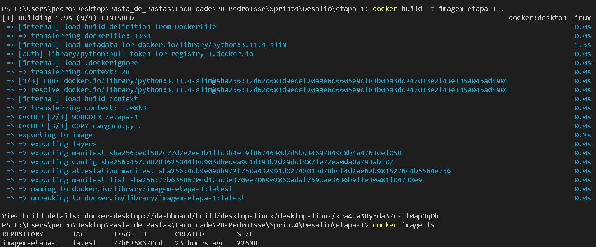
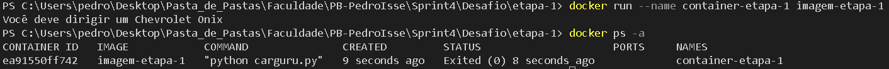

# **Resolução do Desafio: Sprint 4**

## **Entedimento sobre o Desafio**
    
Ao abrir o Desafio, percebi que ele não seria de grande dificuldade, pois durante a realização do Curso eu tomei um tempo maior para realizar o Curso de Docker, assim entendi bastante o conceito de criação de imagems e executando containers, ao testar o uso de Compose, Docker Swarm e Kubernetes.

Imagem é um conjunto imutável de camadas empilhadas que contém arquivos e instruções necessárias para executar uma aplicação em ambiente isolado, chamdo container. 

Containers são ambientes isolados e portáteis (podem ser executados em diferentes máquinas) que contém tudo o que é necessário para executar uma aplicação, incluindo o código, bibliotecas, dependências e configurações.

### **Etapa 1:**

Com isso em mente, meu objetivo na [***etapa 1***](../Desafio/etapa-1/) era criar uma imagem e um container para a execução do algoritmo [***carguru.py***](../Desafio/etapa-1/carguru.py), que nos foi fornecido:

```Python
import random

carros = ['Chevrolet Agile','Chevrolet C-10','Chevrolet Camaro','Chevrolet Caravan','Chevrolet Celta','Chevrolet Chevette','Chevrolet Corsa','Chevrolet Covalt','Chevrolet D-20','Chevrolet Monza','Chevrolet Onix','Chevrolet Opala','Chevrolet Veraneio','Citroën C3','Fiat 147','Fiat Argo','Fiat Cronos','Fiat Mobi','Fiat Panorama','Ford Corcel','Ford Escort','Ford F-1000','Ford Ka','Ford Maverick','Honda City','Honda Fit','Hyundai Azera','Hyundai HB20','Hyundai IX-35','Hyundai Veloster','Peugeot 2008','Peugeot 206','Peugeot 208','Peugeot 3008','Peugeot 306','Peugeot 308','Renault Kwid','Renault Logan','Renault Sandero','Renault Twingo','Renault Zoe','Toyota Etios','Toyota Yaris ','Volkswagen Apolo','Volkswagen Bora','Volkswagen Brasilia   ','Volkswagen Fusca','Volkswagen Gol','Volkswagen Kombi','Volkswagen Parati','Volkswagen Passat','Volkswagen Polo','Volkswagen SP2','Volkswagen Santana','Volkswagen Voyage','Volkswagen up!']

random_carros = random.choice(carros)

print('Você deve dirigir um '+ random_carros)
```

Cujo o objetivo é retornar a mensagem *Você deve dirigir um (carro)*, carro esse que deve estar presente na lista carros, com 56 elementos, para que a resposta não seja previsível foi utilizado a bibilioteca random para escolher o carro aleatoriamente.

Então eu criei um arquivo [***Dockerfile***](../Desafio/etapa-1/Dockerfile) para ele definisse o *"roteiro"* de como a imagem para a aplicação deveria ser construída. O Dockerfile é um arquivo de texto contendo instruções sequencias que especificam quais passos o Docker deve seguir para criar a Imagem:

```Docker
# Especifica a imagem base a ser utilizada.

# Aqui, escolhi a imagem oficial do Python na versão 3.11.4 "slim".

# A versão "slim" é uma variante minimalista, reduzindo o tamanho da imagem ao remover componentes não essenciais.

# Isso resulta em um ambiente mais leve e eficiente para aplicações Python.

FROM python:3.11.4-slim

# Define o diretório de trabalho dentro do container.

# Este será o diretório padrão onde todos os comandos a seguir serão executados.

# Escolhi "/etapa-1" como uma forma de organizar o projeto, mas poderia ser qualquer outro diretório.

WORKDIR /etapa-1

# Copia o arquivo "carguru.py" do diretório atual no host para o diretório de trabalho do container.

COPY carguru.py .

# Aqui, estamos configurando o Python para executar o arquivo "carguru.py".

CMD ["python", "carguru.py"]
```

Com isso criado, agora só falta criar a imagem e executar o container... **E foi um sucesso!** Aqui estão os resultado:

**Criando a Imagem:**



- **Comando Usados:**

    ```Docker
    # Faz a construção da imagem noemada "imagem-etapa-1", por conta da flag -t, baseada no Dockerfile do diretório atual

    docker build -t imagem-etapa-1 .

    # Lista as imagens da máquina (Created 23 hours ago: ela reutilizou layers que já haviam sido criados anteriormente, mas a imagem acabou de ser criada!)

    docker image ls
    ```

**Executando Container e Testando:**



- **Comandos Utilizados:**

    ```Docker 
    # Coloco o container nomeado "container-etapa-1", com a flag --name <nome>, usando a imagem "imagem-etapa-1" criada anteriormente

    docker run --name container-etapa-1 imagem-etapa-1

    # Resultado da execução acima

    Resultado: Você deve dirigir um Chevrolet Onix

    # Lista os containers, a flag -a é utilizada pois o container é encerrado após escrever a resposta então acessamos containers cujo a execução já foram encerradas

    # Isso pode ser visto no "Status: Exited (0) 8 seconds ago"

    docker ps -a 
    ```

### **Etapa 2:**