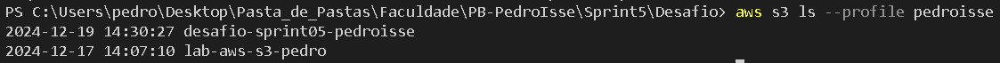
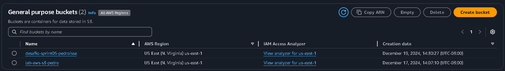
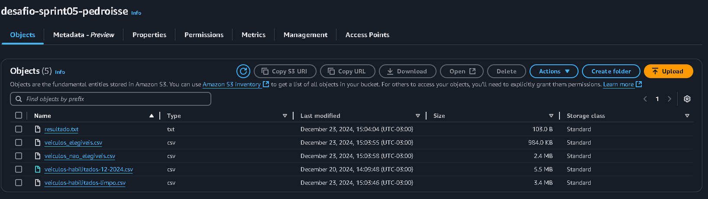
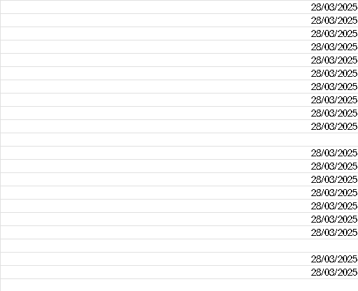
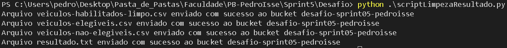
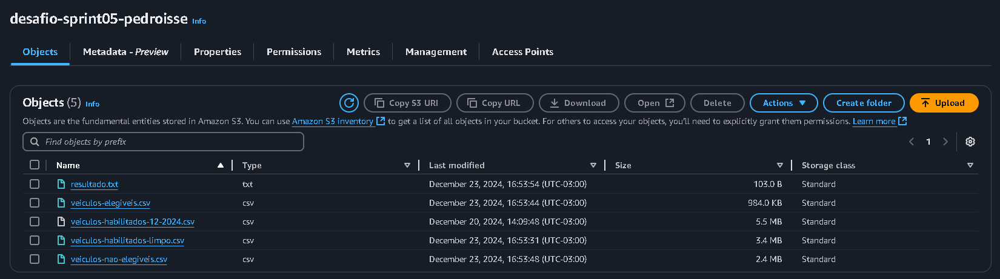

# **Resolução do Desafio: Sprint 5**

## **Entedimento sobre o Desafio**

O objetivo desta Sprint é a adaptação ao ambiente AWS e aos seus conceitos de computação em nuvem, além da reutilização de conceitos previamente trabalhados, como consultas, limpeza de dados em datasets utilizando o Pandas, criação de DataFrames, extração de informações dos DataFrames e desenvolvimento de scripts em Python. O desafio consiste em selecionar um dataset, realizar sua limpeza, criar um DataFrame, extrair informações relevantes, e, por fim, armazenar todo o material gerado em um bucket S3.

## **Criando Bucket e Enviando o Dataset (original)**

O dataset escolhido foi o [*veiculos-habilitados-12-2024*](./veiculos-habilitados-12-2024.csv) que contém 33626 linhas. O dataset consiste em informações detalhadas sobre veículos e suas características relacionadas ao serviço de transporte. Analisando ele, decide que a pergunta seria: 

*Mostrar a placa do veículo que pode agir como Ônibus Escolar (serviço fretado ou serviço fretado e semiurbano) até as férias de meio de ano (09/07/2025), desempate pela placa do veículo. Mostre poderiam ser elegidos para se tornerem ônibus escolares e quantos não poderiam.*

Com o dataset escolhido, eu fui atrás de entender formas de criar meu bucket e fazer o envio de arquivos, tudo via script, mesmo que a criação não tenha sido pedida por script, eu achei que seria interessante esse aprendizado. Portanto, encontrei o ***Single Sign-On*** no ***AWS CLI***, que permite que eu faça uma autenticação e permite o acesso a minha conta e as funções dela, temporariamente. 

Então, comecei a configuração para que eu possa ter acesso aos serviços AWS. No terminal:

```markdown
# Ao utilizar esse comando algumas informações da sua conta devem ser inseridas, para que você crie seu perfil SSO e ter acesso aos serviços sem ser diretamente no AWS Console (Temporariamente)

aws configure sso

# Após a criação do meu bucket, eu posso verificar via terminal, que ele foi criado no meu perfil SSO, caso outro nome seja inserido irá dar erro, ou apresentará, OUTROS buckets, no caso, de outro usuário

aws s3 ls --profile pedroisse
```

Prova dê que tanto o perfil SSO foi criado, e meus Buckets ativos (Bucket do Exercício de Lab AWS e do Desafio):



Com isso em mente, o script utilizado para a criação do bucket e upload do dataset foi o [*scriptCriacaoUpload*](./scriptCriacaoUpload.py):

```Python
import boto3
from botocore.exceptions import ClientError

# Nome do perfil configurado com o AWS SSO
perfil_sso = 'pedroisse'

# Informações do Bucket e Dataset
nome_bucket = 'desafio-sprint05-pedroisse'
dataset = 'veiculos-habilitados-12-2024.csv'
caminho_dataset = './veiculos-habilitados-12-2024.csv'

# Inicializa a sessão com o perfil SSO
sessao = boto3.Session(profile_name=perfil_sso)

# Inicializa o cliente S3 usando a sessão SSO
cliente_s3 = sessao.client(
    "s3",
    region_name="us-east-1"
)

# Criando o bucket
try:
    resposta = cliente_s3.create_bucket(
        Bucket=nome_bucket
    )

    # Confirmação de que o Bucket foi criado com sucesso
    print(f"Bucket {nome_bucket} criado com sucesso!")
except ClientError as e:
    
    # Caso não tenha dado certo, ele devolve o erro 
    print(f"Erro ao criar o bucket: {e}")

# Fazendo Upload no Dataset original
try:
    cliente_s3.upload_file(caminho_dataset, nome_bucket, dataset)

    # Confirmação de que o dataset foi enviado
    print(f'Arquivo {dataset} enviado com sucesso ao bucket {nome_bucket}')
except Exception as e:

    # Caso não tenha dado certo, ele devolve o erro
    print(f'Erro ao enviar o arquivo: {e}')
```

Com isso o Bucket nomeado de *desafio-sprint05-pedroisse* foi criado no AWS Console:



E o dataset foi enviado com sucesso:



## **Limpando Dataset, Criando Dataframes e Resposta Final:**

Agora, com o bucket criado e dataset escolhido, eu comecei a limpeza dele, primeiramente, utilizando algumas boas práticas, tirando linhas duplicadas e placas de carros duplicados, pois **não existem carros com placas iguais**. O que foi alterado:

- **Linhas duplicadas**

- **Carros *"duplicados"***

- **Retirando espaço vazio:** 

    

- **Colocando a codificação correta (ISO-8859-1)**

Com isso cocluído também, a pergunta já pode ser respondida, para isso eu criei dois dataframes, um com veículos que podereriam agir como ônibus escolares até as férias de meio de ano, e outro com os veículos que não poderiam. São eles [*veiculos-elegiveis.csv*](./veiculos-elegiveis.csv) e [*veiculos-nao-elegiveis.csv*](./veiculos-nao-elegiveis.csv). A partir deles posso fazer a análise da pergunta: 

***Mostrar a placa do veículo que pode agir como Ônibus Escolar (serviço fretado ou serviço fretado e semiurbano) até as férias de meio de ano (09/07/2025), desempate pela placa do veículo.***

```Python
import boto3
import pandas as pd
from io import StringIO

# Nome do perfil configurado com o AWS SSO
perfil_sso = 'pedroisse'

# Inicializa a sessão com o perfil SSO
sessao = boto3.Session(profile_name=perfil_sso)

# Configura o cliente s3
cliente_s3 = sessao.client(
    's3', 
    region_name='us-east-1'
)

# Nome do bucket e arquivo procurado
nome_bucket = 'desafio-sprint05-pedroisse'
arquivo_procurado = 'veiculos-habilitados-12-2024.csv'

# Baixa o arquivo diretamente do S3 e decodifica
response = cliente_s3.get_object(Bucket=nome_bucket, Key=arquivo_procurado)
conteudo_arquivo = response['Body'].read().decode('ISO-8859-1')

# Lê o conteúdo do arquivo e armazenar na variável dataset
dataset = pd.read_csv(StringIO(conteudo_arquivo), sep=';')

dataframe = dataset.drop_duplicates()  # Elimina duplicatas gerais
dataframe = dataframe.drop_duplicates(subset='placa')  # Elimina duplicatas por placa
dataframe.dropna(inplace=True)  # Remove linhas com valores NaN

# Salvar o arquivo tratado no formato CSV
dataframe.to_csv('veiculos-habilitados-limpo.csv', index=False, encoding="ISO-8859-1", sep=';')

# Informações do Dataset limpo
caminho_dataset = './veiculos-habilitados-limpo.csv'
nome_dataframe = 'veiculos-habilitados-limpo.csv'

# Fazendo Upload no Dataset limpo
try:
    cliente_s3.upload_file(caminho_dataset, nome_bucket, nome_dataframe)

    # Confirmação de que o dataset foi enviado
    print(f'Arquivo {nome_dataframe} enviado com sucesso ao bucket {nome_bucket}')
except Exception as e:

    # Caso não tenha dado certo, ele devolve o erro
    print(f'Erro ao enviar o arquivo: {e}')

# Com o Dataset limpo, agora começa o processo de criação de um Dataframe e um resultado a partir dele
dataset = pd.read_csv('veiculos-habilitados-limpo.csv', encoding="ISO-8859-1", sep=';')

# Respondendo a PERGUNTA:

dataframe = pd.DataFrame(dataset)

# Conversão de colunas para datetime (FUNÇÃO DE DATA E CONVERSÃO DE TIPO: OBJECT -> DATETIME)
dataframe['data_validade_csv'] = pd.to_datetime(dataframe['data_validade_csv'], errors='coerce', dayfirst=True)
dataframe['validade_seguro'] = pd.to_datetime(dataframe['validade_seguro'], errors='coerce', dayfirst=True)

# Filtrar veículos elegíveis (OPERADORES LÓGICOS E CONDICIONAL)
dataframe_elegiveis = dataframe[
    (dataframe['servico_fretado'] == 'Sim') &  # Serviço fretado deve ser 'Sim'
    (dataframe['servico_regular'] != 'Sim') &  # Serviço regular não pode ser 'Sim'
    (dataframe['data_validade_csv'] <= '2025-07-09') &  # CSV válido até 09/07/2025
    (dataframe['validade_seguro'] <= '2025-07-09')  # Seguro válido até 09/07/2025
]

# Veículos não elegíveis
dataframe_nao_elegiveis = dataframe.drop(dataframe_elegiveis.index)

# Transforma todas as placas em UpperCase, para que não afete a ordenação (FUNÇÃO STRING)
dataframe_elegiveis.loc[:, 'placa'] = dataframe_elegiveis['placa'].str.upper()

# Ordenar por Placa do Veículo (desempate)
dataframe_elegiveis = dataframe_elegiveis.sort_values(by='placa')

# Calcular totais (FUNÇÕES DE AGREGAÇÃO)
total_elegiveis = len(dataframe_elegiveis)
total_nao_elegiveis = len(dataframe_nao_elegiveis)

# Imprime a placa do primeiro veículo, caso não encontrar, avisa o usuário
if not dataframe_elegiveis.empty:
    veiculo_escolar = dataframe_elegiveis['placa'].iloc[0]  # Apenas a placa do primeiro veículo
else:
    veiculo_escolar = 'Nenhum veículo elegível encontrado.'

resultado = (
    f'Veículo elegível: {veiculo_escolar}\n'
    f'Total de veículos elegíveis: {total_elegiveis}\n'
    f'Total de veículos não elegíveis: {total_nao_elegiveis}\n'
)

with open('resultado.txt', 'w') as f:
    f.write(resultado)

caminho_resultado = './resultado.txt'
nome_resultado = 'resultado.txt'

dataframe_elegiveis.to_csv('veiculos-elegiveis.csv', index=False, encoding="ISO-8859-1", sep=';')
dataframe_nao_elegiveis.to_csv('veiculos-nao-elegiveis.csv', index=False, encoding="ISO-8859-1", sep=';')

caminho_dataframe_elegivel = './veiculos-elegiveis.csv'
nome_dataframe_elegivel = 'veiculos-elegiveis.csv'

caminho_dataframe_nao_elegivel = './veiculos-nao-elegiveis.csv'
nome_dataframe_nao_elegivel = 'veiculos-nao-elegiveis.csv'

try:
    cliente_s3.upload_file(caminho_dataframe_elegivel, nome_bucket, nome_dataframe_elegivel)

    # Confirmação de que o dataframe foi enviado
    print(f'Arquivo {nome_dataframe_elegivel} enviado com sucesso ao bucket {nome_bucket}')

    cliente_s3.upload_file(caminho_dataframe_nao_elegivel, nome_bucket, nome_dataframe_nao_elegivel)

    # Confirmação de que o dataframe foi enviado
    print(f'Arquivo {nome_dataframe_nao_elegivel} enviado com sucesso ao bucket {nome_bucket}')

    cliente_s3.upload_file(caminho_resultado, nome_bucket, nome_resultado)

    # Confirmação de que o resultado foi enviado
    print(f'Arquivo {nome_resultado} enviado com sucesso ao bucket {nome_bucket}')

except Exception as e:

    # Caso não tenha dado certo, ele devolve o erro
    print(f'Erro ao enviar o arquivo: {e}')
```

Após rodar o script:



Resultado no Bucket do AWS Console:



E o resultado final da pergunta está armazenado, no arquivo, [*resultado.txt*](./resultado.txt):

```
Veículo elegível: AAA-4C59
Total de veículos elegíveis: 6447
Total de veículos não elegíveis: 16425
```