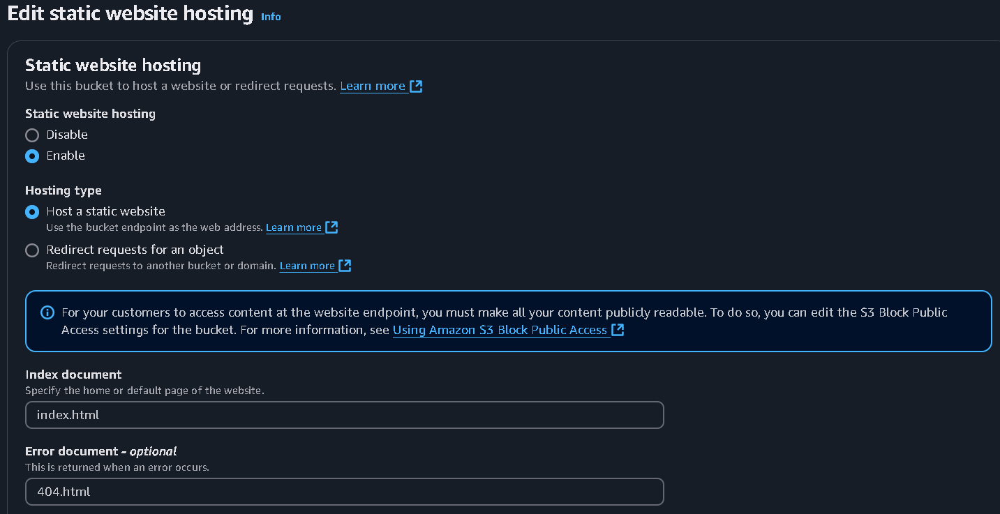

# **Resolução Exercício Laboratório AWS**

### **Exercício Proposto:**
*Explorar as capacidades do serviço AWS S3.  Nos passos que seguem, você será guiado pelas configurações necessárias para que um bucket do Amazon S3 funcione como hospedagem de conteúdo estático.*

### **Passo a Passo:**

#### **1 - Bucket Criado:**


#### **2 - Habilitado Site Estático e Acesso Público:** 




#### **3 - Política de Bucket:** 

Concede a permissão de ***leitura de objetos armazenados no bucket S3*** para qualquer pessoa que está utilizando o site criado.

```JSON
{
    "Version": "2012-10-17",
    "Statement": [
        {
            "Sid": "PublicReadGetObject",
            "Effect": "Allow",
            "Principal": "*",
            "Action": "s3:GetObject",
            "Resource": "arn:aws:s3:::lab-aws-s3-pedro/*"
        }
    ]
}
```

#### **4 - Configurar Arquivos Utilizados:**

Os arquivos utilizados foram o [*index.html*](./index.html):

```Html
<html xmlns="http://www.w3.org/1999/xhtml" >
<head>
    <title>Home Page do meu WebSite - Tutorial de S3</title>
</head>
<body>
  <h1>Bem-vindo ao meu website</h1>
  <p>Agora hospedado em Amazon S3!</p>
  <a href="https://lab-aws-s3-pedro.s3.amazonaws.com/dados/nomes.csv" download>Download CSV File</a>
</body>
</html>
```

Isso estrutura o formato do site estático. O usuário irá clicar em um link que irá fazer com que ele instale o arquivo [*nome.csv*](./dados/nomes.csv). Um erro que poderia acontecer é o usuário tentar acessar algum objeto que não está armazenado no bucket ou ocorre um erro ao tentar acessar um recurso, assim, ele será redirecionado ao arquivo [*404.html*](./404.html).


#### **5 - Conclusão:** 

Após todas essas etapas, só falta acessar o [*site estático*](http://lab-aws-s3-pedro.s3-website-us-east-1.amazonaws.com) que está sendo hospedado pelo S3:

