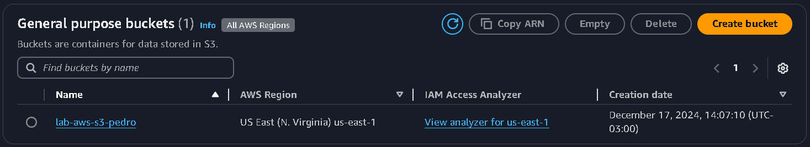

# **Resumo**

### **Continuando... AWS Technical Essentials**

- **Tipos de armazenamento (Storage Types):**

    - **Armazenamento de Arquivos (File Storage):** Soluções para armazenamento de arquivos em um formato hierárquico, como em um sistema de arquivos tradicional. A AWS oferece serviços que permitem armazenar, acessar e gerenciar arquivos de maneira escalável, segura e com alta disponibilidade.

        - **Amazon Elastic File System (EFS):** Armazenamento de arquivos escalável e gerenciado para uso de instâncias EC2 e outros serviços. Também oferece alta durabilidade, disponibilidade, *pay as you go* só que apenas para o que for armazenado, além de diferentes tipos de armazenamento.

        - **Amazon FSx:** São serviços especializados para sistemas de arquivos como **FSx for Windows File Server**, para aplicações que exigem sistemas de arquivos compatíveis com o Windows, e **FXs for Lustre** que é otimizado para cargas de trabalho de alto desempenho, como machine learning, High Performance Computing e processamento de mídia.

    - **Armazenamento de Blocos (Block Storage):** efere-se a um tipo de armazenamento em blocos que fornece volumes de dados altamente performáticos e gerenciados, adequados para uso em servidores e aplicações que exigem baixa latência, como bancos de dados, sistemas de arquivos, e aplicações transacionais. Muito interessante para mudar pequenos pedaços de um arquivo, uma vez que são dividos em pequenos blocos.

        - **Amazon Elastic Block Store (Amazon EBS):** Serviço de armazenamento em blocos projetado para uso com instâncias EC2. Fornece volumes persistentes que podem ser formatados e utilizados como discos. **Desacoplar** de uma instância EC2 e **Acoplar** a outra instância EC2 na mesma availbility zone. Um EBS tem um tamanho limitado de armazenamento e na maioria dos casos só pode se conectar a uma instância por vez, mas uma instância pode ser conectada a mais de um EBS. Pode gerar Snapshots, que são basicamente **backups** dos dados armazenados no EBS.

    - **Armazenamento de Objetos (Object Storage):**  refere-se a uma solução de armazenamento orientada a objetos, ideal para armazenar grandes quantidades de dados não estruturados, como backups, arquivos de mídia, logs, e dados de aplicações modernas.

        - **Amazon Simple Storage Service (Amazon S3):** É um serviço de armazenamento em nuvem altamente escalável, seguro e durável. É projetado para armazenar e acessar qualquer quantidade de dados, de qualquer lugar na internet, e é amplamente utilizado para diversas finalidades, como backup, arquivamento, distribuição de conteúdo e análise de big data.

            **Buckets** são o ponto principal do Amazon S3, sem ele não é possível fazer um upload de objeto, nem mesmo uma única foto. O usuário cria o Bucket, nele precisa de no mínimo duas informações nome ***universal daquele bucket específico*** e a região AWS em que ele irá residir. Tudo que ocorre no S3 por default, é **privado** para que os dados do utilizador não sejam expostos sem querer.

- **Banco de Dados em AWS:**

    - **Amazon Relational Database Service (Amazon RDS):** é um serviço gerenciado da AWS para configurar, operar e escalar bancos de dados relacionais na nuvem. Ele elimina tarefas complexas e demoradas, como provisionamento de hardware, instalação de software, aplicação de patches e backup de banco de dados, permitindo que você foque em desenvolver aplicações.

    - **Purpose-built databases:** efere-se à estratégia de usar diferentes tipos de bancos de dados, projetados especificamente para resolver problemas ou atender requisitos específicos, em vez de depender de uma única solução genérica. A Amazon Web Services (AWS) adota esse modelo oferecendo uma ampla gama de bancos de dados, cada um otimizado para diferentes casos de uso.

        - **Amazon DynamoDB:** Banco de dados NoSQL de chave-valor, altamente escalável e com baixa latência, ideal para catálogos, aplicativos móveis e IoT.

        - **Amazon ElastiCache:** Solução de cache in-memory para acelerar aplicações, com suporte a Redis e Memcached, usado para caching e sessões de usuário.

        - **Amazon MemoryDB for Redis:** Banco de dados in-memory compatível com Redis, projetado para alta disponibilidade e persistência de dados, ideal para cargas críticas.

        - **Amazon DocumentDB (with MongoDB compatibility):** Banco de dados gerenciado orientado a documentos, otimizado para JSON, usado em sistemas de gerenciamento de conteúdo e aplicativos modernos.

        - **Amazon Keyspaces (for Apache Cassandra):** Serviço gerenciado de Cassandra, oferece um banco NoSQL altamente escalável para cargas intensivas de leitura e gravação.

        - **Amazon Neptune:** Banco de dados gráfico gerenciado, ideal para redes sociais, mecanismos de recomendação e detecção de fraudes.

        - **Amazon TimeStream:** Banco de dados otimizado para séries temporais, usado para monitoramento de IoT, métricas operacionais e dados de sensores.

        - **Amazon Quantum Ledger Database (Amazon QLDB):** Banco de dados contábil imutável e verificável, ideal para aplicações financeiras e registros de transações confiáveis.

    - **Amazon DynamoDB:**

        - **Componentes:** Tabela (Coleção de dados); Itens (Grupo de atributos são **únicos** em relação aos outros itens); Atributos (O dado armazenado: ***PersonID: 1001***)

        - **Casos de Uso:** Como o DynamoDB é um serviço totalmente gerenciado que cuida dos trabalhos operacionais, assim os trabalhos administrativos são encerrados, praticamente.

            - **Problemas de escalabilidade com outros tipos de bancos de dados**

            - **Desenvolvendo um aplicativo ou serviço ativamente**

            - **Trabalhando com OLTPs**

            - **Uma aplicação que deve estar disponível todo momento**

            - **Uma aplicação que precisa de um alto nível de durabilidade de dados**

        - **Segurança:** Uma infraestrutura de armazenamento altamente durável. Dados é armazenada de forma redundante em diversas máquinas em muitos locais (DynamoDB Regions). Todas os dados de usuário são criptografados. Permite alteração de autenticação e autorização com administradores IAM.

- **Monitor Aplicação:** Fornece ideias e/ou informações que podem ajudar a detectar, investigar e evitar problemas ou possíveis problemas de forma mais rápida.

- **Amazon CloudWatch:** É um serviço AWS para facilitar o monitoramento de aplicações, gerando análises utilizando metricas (gráficos, porcentagens, **VISUAL**) ou utilizando logs que são mais **DESCRITIVAS**. Com isso o analista pode chegar numa métrica *"razoável"* para a aplicação, assim podendo criar avisos quando algo sair dessa métrica pré-estabelecida.

- **Load Balancers:** são dispositivos ou serviços que distribuem o tráfego de rede ou de aplicações entre múltiplos servidores ou recursos para garantir alta disponibilidade, desempenho, e escalabilidade. Eles ajudam a evitar sobrecarga em um único servidor, melhorando a experiência do usuário e otimizando o uso dos recursos.

    - **Elastic Load Balancing:** distribui automaticamente o tráfego de entrada de aplicações em várias instâncias, contêineres ou serviços dentro de uma região AWS. Ele é projetado para fornecer alta disponibilidade, escalabilidade automática e tolerância a falhas.

        - **Health Checks:** são processos usados para monitorar e avaliar continuamente o estado de saúde de recursos, como servidores ou instâncias, em um sistema distribuído.

        - **Componentes:** 

            - **Rule:** As rules determinam como as solicitações são roteadas com base em condições específicas

            - **Listener:** Um listener é um componente que define a porta e o protocolo em que o load balancer escuta as solicitações de entrada. Ele também especifica como essas solicitações devem ser encaminhadas aos destinos configurados.

            - **Target Groups:** Um target group é um conjunto de destinos para onde o tráfego será encaminhado.

        - **Tipos de Load Balancer:**

            - **Aplication Load Balancer:** Refere-se a protocolos de comunicação operando na camada de aplicação do modelo OSI (como HTTP, HTTPS, FTP, etc.).

            - **Network Load Balancer:** Está relacionado à camada de rede no modelo OSI, lidando com endereçamento e roteamento de pacotes (como IPv4, IPv6, TCP, UDP).

            - **Gateway Load Balancer:** Trabalha como intermediário para integração com dispositivos virtuais de rede, como firewalls e IDS/IPS.

    - **Auto Escalonamento (EC2 Auto Scaling):** De acordo com uma necessidade pré-estabelecida (frequentemente utilizando o CloudWatch para gerar alertas), o EC2 Auto Scaling criará novas instâncias para atender à demanda atual da aplicação e, quando essas instâncias adicionais não forem mais necessárias, elas serão removidas automaticamente.

- **AWS Cloud Adoption Framework (AWS CAF):** é um conjunto de diretrizes e práticas que pertence à Amazon Web Services (AWS) e serve para ajudar as organizações a planejar, implementar e gerenciar eficientemente sua jornada de migração para a nuvem.

    - **Concepção:** Essa fase foca em alinhar os objetivos estratégicos da organização com as possibilidades que a nuvem oferece. Inclui a definição de metas de negócios, identificação de desafios, e o desenvolvimento de uma visão clara de como a nuvem pode impulsionar a inovação, reduzir custos ou aumentar a agilidade operacional.

    - **Alinhamento:** Envolve preparar as pessoas, processos e tecnologia da organização para adotar a nuvem. Isso inclui capacitar as equipes, ajustar políticas internas, e garantir que os recursos estejam preparados para suportar a transição de forma eficiente e segura.

    - **Lançamento:** Nesta etapa, a organização começa a implementar as mudanças planejadas, migrando aplicações, dados e processos para a nuvem. O foco é em adotar práticas ágeis, testar soluções e garantir a governança adequada, alinhando-se aos padrões de segurança e compliance.

    - **Dimensionar:** Após o lançamento inicial, essa fase trata de otimizar e expandir o uso da nuvem para obter maiores benefícios. Inclui a automação de processos, a adoção de arquiteturas escaláveis, e o monitoramento contínuo para garantir desempenho, custo-eficiência e alinhamento estratégico.

- **AWS Well-Architected Framework:** é um conjunto de diretrizes e boas práticas desenvolvido pela Amazon Web Services (AWS) para ajudar arquitetos e equipes de desenvolvimento a projetar, implementar e operar sistemas na nuvem que sejam seguros, confiáveis, eficientes, sustentáveis e de custo-efetivo. Os seus pilares são:

    - **Excelência Operacional**

    - **Segurança** 

    - **Confiabilidade**

    - **Eficiência de Desempenho**

    - **Otimização de Custos**

    - **Sustentabilidade**

# **Exercícios:**

[**Exercício Laboratório AWS:**](./Exercicios/README.md) *Explorar as capacidades do serviço AWS S3.  Nos passos que seguem, você será guiado pelas configurações necessárias para que um bucket do Amazon S3 funcione como hospedagem de conteúdo estático.*

# **Evidências:**

#### **1 - Bucket Criado:**



#### **2 - Habilitado Site Estático e Acesso Público:** 


#### **3 - Política de Bucket:** 

Concede a permissão de ***leitura de objetos armazenados no bucket S3*** para qualquer pessoa que está utilizando o site criado.


#### **4 - Configurar Arquivos Utilizados:**

Os arquivos utilizados foram o [*index.html*](./Exercicios/index.html):

```Html
<html xmlns="http://www.w3.org/1999/xhtml" >
<head>
    <title>Home Page do meu WebSite - Tutorial de S3</title>
</head>
<body>
  <h1>Bem-vindo ao meu website</h1>
  <p>Agora hospedado em Amazon S3!</p>
  <a href="https://lab-aws-s3-pedro.s3.amazonaws.com/dados/nomes.csv" download>Download CSV File</a>
</body>
</html>
```

Isso estrutura o formato do site estático. O usuário irá clicar em um link que irá fazer com que ele instale o arquivo [*nome.csv*](./Exercicios/dados/nomes.csv). Um erro que poderia acontecer é o usuário tentar acessar algum objeto que não está armazenado no bucket ou ocorre um erro ao tentar acessar um recurso, assim, ele será redirecionado ao arquivo [*404.html*](./Exercicios/404.html).


#### **5 - Conclusão:** 

Após todas essas etapas, só falta acessar o [*site estático*](http://lab-aws-s3-pedro.s3-website-us-east-1.amazonaws.com) que está sendo hospedado pelo S3:


# **Certificados:**

[**AWS Cloud Quest: Cloud Practitioner**](https://www.credly.com/badges/e06a693f-3d61-4ccc-811f-a2c6e0fa381d/public_url)


**Exam Prep Standart Course: AWS Certified Cloud Praticioner (CLF-C02 - Portuguese)**

