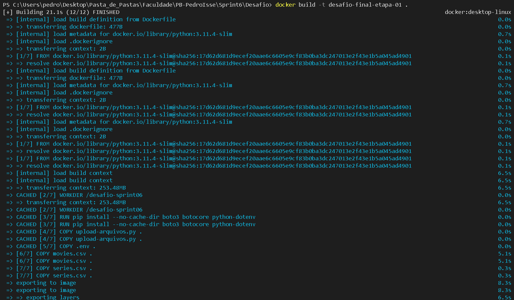
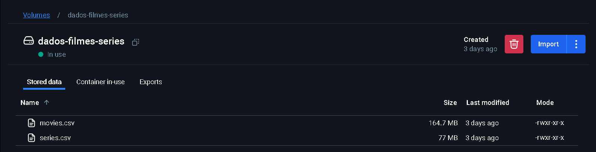
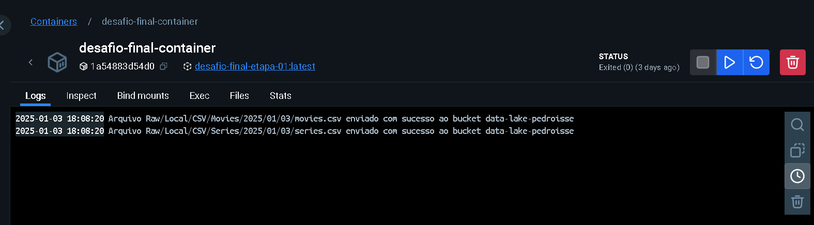
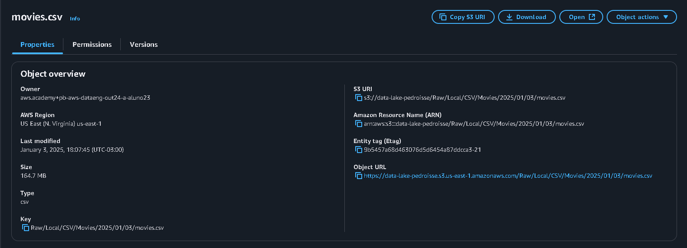

# **Resolução do Desafio: Sprint 6**

## **Entedimento sobre o Desafio Final - Entrega 1**

Finalmente iremos iniciar o Desafio Final, que se trata da criação de um Data Lake separados em algumas etapas, para que assim, ele tome forma até o final do programa de bolsas. Para a primeira entrega do desafio precisamos utilizar um script python que é executado em um container docker, para que assim possamos ter os arquivos [*movies.csv*](./movies.csv) e [*series.csv*](./series.csv) disponibilizados na nuvem. 

O tema que minha squad irá trabalhar é ***Terror/Mistério***, então analisei os arquivos fornecidos com base nisso e elaborei as seguintes pergutas:

## **Perguntas para realização do Desafio Final:**

As perguntas serão com base em alguns dos principais filmes de terror, mais especificamente, do gênero slasher. Os filmes são Sexta Feira 13, Halloween, Massacre da Serra Elétrica, A Hora do Pesadelo, Pânico e Jogos Mortais. 

Foram escolhidos esses filmes, pois a trajetória dos filmes slasher é interessante, tendo altas a partir da década de 70 e tendo uma *"baixa"* e algumas das franquias acima estão voltando, assim abrindo portas para outras voltarem. 

**1 - Qual o sucesso dos filmes de slasher em diferentes décadas e como elas se relacionam com o sucesso do gênero slasher ao longo do tempo? Principais décadas para o gênero.**

**2 - Qual é a receita de bilheteira de cada filme da franquia e como ela se compara ao orçamento de produção?**

**3 - Quais atores mais se destacaram em papéis principais ou recorrentes em filmes de slasher das franquias mencionadas?**

**4 - Quais foram os filmes de slasher que mais tiveram mudanças de elenco principal entre sequências e como isso afetou a percepção do público?**

**5 - A mudança na produção das franquias mudou sua bilheteria? A nota do público?**

## **Resolução do Desafio - Envio dos arquivos CSV por script python via container docker**

### **Etapa 1 - Script para o Upload:**

**Script Python:** [upload-arquivos.py](./upload-arquivos.py)

```Python
import os
import boto3
from botocore.exceptions import ClientError
from datetime import datetime
from dotenv import load_dotenv

# Carrega as variáveis de ambiente do arquivo .env
load_dotenv()

# Verifica se as variáveis de ambiente foram configuradas corretamente
aws_access_key_id = os.getenv('AWS_ACCESS_KEY_ID')
aws_secret_access_key = os.getenv('AWS_SECRET_ACCESS_KEY')
aws_session_token = os.getenv('AWS_SESSION_TOKEN')

# Nome do bucket e informações do dataset
nome_bucket = 'data-lake-pedroisse'
caminho_movies = './movies.csv'
caminho_series = './series.csv'

# Obtém a data atual
data_hoje = datetime.now()
ano = data_hoje.strftime('%Y')
mes = data_hoje.strftime('%m')
dia = data_hoje.strftime('%d')

dataset_movies = f'Raw/Local/CSV/Movies/{ano}/{mes}/{dia}/movies.csv'
dataset_series = f'Raw/Local/CSV/Series/{ano}/{mes}/{dia}/series.csv'

# Inicializa a sessão com o perfil SSO
sessao = boto3.Session(
    aws_access_key_id=aws_access_key_id,
    aws_secret_access_key=aws_secret_access_key,
    aws_session_token=aws_session_token
)

# Inicializa o cliente S3 usando a sessão SSO
cliente_s3 = sessao.client(
    "s3",
    region_name="us-east-1"
)

# Fazendo Upload no Dataset original
try:
    cliente_s3.upload_file(caminho_movies, nome_bucket, dataset_movies)

    # Confirmação de que o dataset foi enviado
    print(f'Arquivo {dataset_movies} enviado com sucesso ao bucket {nome_bucket}')

    cliente_s3.upload_file(caminho_series, nome_bucket, dataset_series)

    # Confirmação de que o dataset foi enviado
    print(f'Arquivo {dataset_series} enviado com sucesso ao bucket {nome_bucket}')

except Exception as e:
    # Caso não tenha dado certo, ele devolve o erro
    print(f'Erro ao enviar o arquivo: {e}')

```

**Explicação:** Primeiramente, deparei-me com um problema: como o script seria executado em um contêiner Docker, não seria possível utilizar o método de login na AWS via *Single Sign-On (SSO).* Por isso, procurei uma alternativa para utilizar minhas credenciais de acesso sem que elas ficassem diretamente no código. Para resolver essa questão, utilizei variáveis de ambiente em um arquivo .env (ou envfile). Com isso definido, configurei os nomes dos datasets de maneira que, visualmente, dessem a impressão de um sistema de arquivos dentro do Bucket S3.

Exemplo: 

    s3://Raw/Local/CSV/Movies/{ano}/{mes}/{dia}/movies.csv

### **Etapa 2 - Criando Dockerfile e rodando container:**

**Arquivo:** [Dockerfile](./Dockerfile)

```Docker
# A versão "slim" é uma variante minimalista, reduzindo o tamanho da imagem ao remover componentes não essenciais
FROM python:3.11.4-slim

# Define o diretório de trabalho no container
WORKDIR /desafio-sprint06

# Instala boto3, botocore e python-dotenv
RUN pip install --no-cache-dir boto3 botocore python-dotenv

# Copia o script, o envfile e os datasets para o diretório de trabalho no container
COPY upload-arquivos.py .
COPY .env .
COPY movies.csv .
COPY series.csv .

# Comando para executar o script
CMD ["python", "upload-arquivos.py"]
```

Com o Dockerfile criado, pode-se concluir o seguinte:

- Utiliza o Python 3.11.4 *slim* para que o tamanho da imagem seja reduziado, uma vez que os componentes não essencias do python não serão utilizados, assim garantindo maior eficiência. 

- Será criado um diretório de trabalho no container chamado de *desafio-sprint06*.

- No diretório de trabalho será armazenado o script python, o envfile e os datasets.

- Serão instaladas as bibliotecas *boto3*, *botocore* e *python-dotenv*, pois além de algumas bibliotecas padrões do python 3, outras também são necessárias no script.

- Por fim será executado o script python, que irá enviar os datasets ao meu bucket s3, utilizando as credências armazenadas no envfile, para maior segurança.

**Criando a imagem:**

**Comando:**

```
docker build -t desafio-final-etapa-01 .
```



**Criando volume:**

Para a criação do volume usei o comando:

```
docker volume create dados-series-filmes
```

Para armazenar os datasets no volume eu usei os seguintes comandos:

```
docker run --rm -v dados-filmes-series:/dados-filmes-series -v "C:/Users/pedro/Desktop/Pasta_de_Pastas/Faculdade/PB-PedroIsse/Sprint6/Desafio:/csv" alpine cp /csv/movies.csv /dados-filmes-series/

docker run --rm -v dados-filmes-series:/dados-filmes-series -v "C:/Users/pedro/Desktop/Pasta_de_Pastas/Faculdade/PB-PedroIsse/Sprint6/Desafio:/csv" alpine cp /csv/series.csv /dados-filmes-series/
```

**Explicação:** Crio e executo um container *temporário*, ou seja, que é removido após sua execução. Monto um volume em um diretório chamado *dados-filmes-series* dentro do container e um diretório com base no caminho do meu desafio da sprint 06 para que assim eu consiga copiar os dataset ao meu volume *dados-filmes-series*



**Criando e rodando container:**

**Comando**:

```
docker run --name desafio-final-container --env-file .env -v dados-filmes-series:/desafio-sprint06/dados-filmes-series desafio-final-etapa-01
```

**Explicação**: Crio e nomeio um container de *desafio-final-container* baseado na imagem *desafio-final-etapa-01* e construido com base no [*Dockerfile*](./Dockerfile). Deixo especificado qual envfile será carregado no container e monto o volume *dados-filmes-series* dentro do diretório de trabalho *desafio-sprint06* do container.




**Objetos (Datasets) no S3:**



