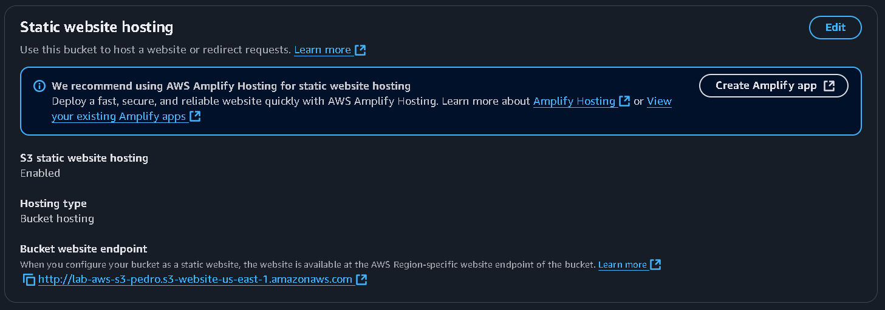

# **Exercícios Laboratórios AWS - Sprint 06**

### **Lab AWS S3:**
*Explorar as capacidades do serviço AWS S3.  Nos passos que seguem, você será guiado pelas configurações necessárias para que um bucket do Amazon S3 funcione como hospedagem de conteúdo estático.*

### **Passo a Passo:**

#### **1 - Bucket Criado:**


#### **2 - Habilitado Site Estático e Acesso Público:** 




#### **3 - Política de Bucket:** 

Concede a permissão de ***leitura de objetos armazenados no bucket S3*** para qualquer pessoa que está utilizando o site criado.

```JSON
{
    "Version": "2012-10-17",
    "Statement": [
        {
            "Sid": "PublicReadGetObject",
            "Effect": "Allow",
            "Principal": "*",
            "Action": "s3:GetObject",
            "Resource": "arn:aws:s3:::lab-aws-s3-pedro/*"
        }
    ]
}
```

#### **4 - Configurar Arquivos Utilizados:**

Os arquivos utilizados foram o [*index.html*](../../Sprint5/Exercicios/index.html):

```Html
<html xmlns="http://www.w3.org/1999/xhtml" >
<head>
    <title>Home Page do meu WebSite - Tutorial de S3</title>
</head>
<body>
  <h1>Bem-vindo ao meu website</h1>
  <p>Agora hospedado em Amazon S3!</p>
  <a href="https://lab-aws-s3-pedro.s3.amazonaws.com/dados/nomes.csv" download>Download CSV File</a>
</body>
</html>
```

Isso estrutura o formato do site estático. O usuário irá clicar em um link que irá fazer com que ele instale o arquivo [*nome.csv*](../../Sprint5/Exercicios/dados/nomes.csv). Um erro que poderia acontecer é o usuário tentar acessar algum objeto que não está armazenado no bucket ou ocorre um erro ao tentar acessar um recurso, assim, ele será redirecionado ao arquivo [*404.html*](../../Sprint5/Exercicios/404.html).

```Html
<!DOCTYPE html>
<html lang="pt-br">
<head>
    <meta charset="UTF-8">
    <title>Erro</title>
</head>
<body>
    <h1>Ops! Ocorreu um erro inesperado. Por favor, tente novamente mais tarde.</h1>
</body>
</html>
```

#### **5 - Conclusão:** 

Após todas essas etapas, só falta acessar o [*site estático*](http://lab-aws-s3-pedro.s3-website-us-east-1.amazonaws.com) que está sendo hospedado pelo S3:


### **Lab AWS Athena:**

### **Passo a Passo:**

#### **1 - Configurar Athena:**


#### **2 - Criar Banco de Dados:**


```SQL
CREATE DATABASE meubanco
```

#### **3 - Criar Tabela**


```SQL
CREATE EXTERNAL TABLE IF NOT EXISTS meubanco.nomes ( 
    Nome STRING, 
    Sexo STRING, 
    Total INT, 
    Ano INT 
) 
ROW FORMAT SERDE 'org.apache.hadoop.hive.serde2.lazy.LazySimpleSerDe' 
WITH SERDEPROPERTIES (
    'serialization.format' = ',',
    'field.delim' = ',' 
    ) 
LOCATION 's3://lab-aws-s3-pedro/dados/'
```

**Testando Tabela:** Para saber se a tabela foi criado com sucesso, faço um query simples, que deve me devolver os 15 nomes mais utiliados no ano de 1999, em ordem crescente


```SQL
SELECT Nome 
FROM meubanco.nomes 
WHERE Ano = 1999 
ORDER BY Total 
LIMIT 15
```

**Resultado:** O resultado está armazenado no arquivo [*quinze-nomes-1999.csv*](./quinze-nomes-1999.csv).

#### **Testar dados com exercício proposto:** 

*Teste os dados com a seguinte consulta, substituindo o nome dos campos, banco de dados e tabela pelos nomes que você criou anteriormente:*


```SQL
WITH RankNomes AS (
    SELECT 
        CASE 
            WHEN Ano BETWEEN 1950 AND 1959 THEN '1950s'
            WHEN Ano BETWEEN 1960 AND 1969 THEN '1960s'
            WHEN Ano BETWEEN 1970 AND 1979 THEN '1970s'
            WHEN Ano BETWEEN 1980 AND 1989 THEN '1980s'
            WHEN Ano BETWEEN 1990 AND 1999 THEN '1990s'
            WHEN Ano BETWEEN 2000 AND 2009 THEN '2000s'
            WHEN Ano BETWEEN 2010 AND 2019 THEN '2010s'
            ELSE '2020s'
        END AS Decada,
        Nome,
        SUM(Total) AS Total_Nome,
        ROW_NUMBER() OVER (
            PARTITION BY 
                CASE 
                   WHEN Ano BETWEEN 1950 AND 1959 THEN '1950s'
                   WHEN Ano BETWEEN 1960 AND 1969 THEN '1960s'
                   WHEN Ano BETWEEN 1970 AND 1979 THEN '1970s'
                   WHEN Ano BETWEEN 1980 AND 1989 THEN '1980s'
                   WHEN Ano BETWEEN 1990 AND 1999 THEN '1990s'
                   WHEN Ano BETWEEN 2000 AND 2009 THEN '2000s'
                   WHEN Ano BETWEEN 2010 AND 2019 THEN '2010s'
                   ELSE '2020s'
                END
            ORDER BY SUM(Total) DESC
        ) AS Rank
    FROM meubanco.nomes
    GROUP BY 
        CASE 
            WHEN Ano BETWEEN 1950 AND 1959 THEN '1950s'
            WHEN Ano BETWEEN 1960 AND 1969 THEN '1960s'
            WHEN Ano BETWEEN 1970 AND 1979 THEN '1970s'
            WHEN Ano BETWEEN 1980 AND 1989 THEN '1980s'
            WHEN Ano BETWEEN 1990 AND 1999 THEN '1990s'
            WHEN Ano BETWEEN 2000 AND 2009 THEN '2000s'
            WHEN Ano BETWEEN 2010 AND 2019 THEN '2010s'
            ELSE '2020s'
        END,
        Nome
)

SELECT Decada, Nome, Total_Nome
FROM RankNomes
WHERE Rank <= 3
ORDER BY Decada, Rank
```

**Resultado:** O resultado está armazenado no arquivo [*nomes-populares-decada.csv*](./nomes-populares-decada.csv)

### **Lab AWS Lambda**

#### **1 - Criar Função Lambda:** 


#### **2 - Construir Código:**


```Python 
import json
import pandas
import boto3
 
 
def lambda_handler(event, context):
    s3_client = boto3.client('s3')
 
    bucket_name = 'lab-aws-s3-pedro'
    s3_file_name = 'dados/nomes.csv'
    objeto = s3_client.get_object(Bucket=bucket_name, Key=s3_file_name)
    df=pandas.read_csv(objeto['Body'], sep=',')
    rows = len(df.axes[0])
 
    return {
        'statusCode': 200,
        'body': f"Este arquivo tem {rows} linhas"
    }
```

#### **3 - Criando uma Layer:**

[**Dockerfile:**](./Dockerfile) 

```Docker
FROM amazonlinux:2023
RUN yum update -y
RUN yum install -y \
python3-pip \
zip
RUN yum -y clean all
```

**Criando Imagem:**


    docker build -t amazonlinuxpython39 .

**Rodando Container e Comandos:**


    docker run -it amazonlinuxpython39 bash

    cd ~
    mkdir layer_dir
    cd layer_dir
    mkdir python 
    cd python/
    pwd

    pip3 install pandas -t .

    cd ..
    zip -r minha-camada-pandas.zip .

**Comandos para recuperar o arquivo zip do container:** [*minha-camada-pandas.zip*](./minha-camada-pandas.zip)

    docker container ls

    docker cp <id container>:/root/layer_dir/minha-camada-pandas.zip ./

**Upload no S3:** 


**Criando e Configurando Layer:**


#### **Utilizando Layer:**


Para que não houvesse problema ao rodar o utilizar o layer, foi necessário alterar o tempo limite e tamanho da memória da Lambda:

