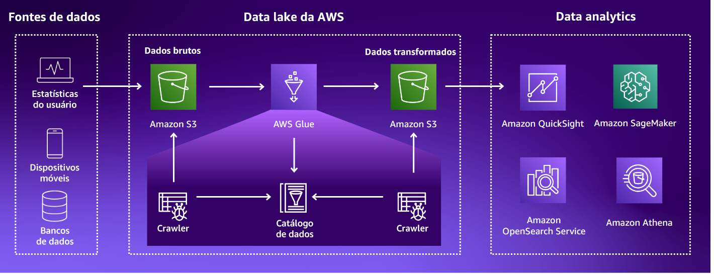

# **Resumo**

### **Noções Básicas de Analytics na AWS - Parte 1**

**Analytics X Análise de dados**

- Analytics é o processo de usar técnicas e ferramentas especializadas para encontrar um novo valor de dados brutos

- Análise de dados é a prática de interpretar dados que levam á tomada de decisões significativas

**Benefícios de Analytics**

O uso de Analytics ajuda empresas a decidir onde e quando lançar novos produtos, quando oferecer descontos e quando expandir para novos mercados. Sem as informações fornecidas por Analytics, muitas decisões seriam tomadas com base na intuição e pura sorte.

**Tipos de Analytics**

- **Analytics descritiva:** Ajuda a responder o que aconteceu, usando técnicas de visualização de dados, como gráficos (pizza, barras, linhas e outros), tabelas e narrativas geradas.

- **Analytics diagnóstica:** Ajuda a responder o por quê algo aconteceu. Ela usa técnicas como:

    - **Detalhamento:** Visão geral dos dados até obter uma visão detalhada no mesmo conjunto de dados.

    - **Descoberta de Dados:** Um processo para coletar, catalogar e classificar dados de diferentes bancos de dados para fins de analytics.

    - **Mineração de Dados:** O uso de analytics em um grande conjunto de dados para descobrir informações significativas.

    - **Correlação:** Uma medida entre duas variáveis que mostra o quão intimamente relacionadas elas estão sem declarar uma relação de causa e efeito.

- **Analytics preditiva:** Ajuda a responder o que pode acontecer no futuro. Usando técnicas como machine learning, previsão, correspondência de padrões e modelagem preditiva. 

- **Analytics prescritiva:** Recomenda ações para o resultado previsto. Utiliza a análise de gráficos, simulações, redes neurais, processamento de eventos complexos e mecanismos de recomendação.

**Machine Learning**

Machine Learning (ML) é um subconjunto da Inteligência Artificial (IA). Os computadores utilizam o Machine Learning para aprender com os dados e fazer previsões baseadas neles, assim podendo gerar ***analytics preditivas*** e ***analytics prescritivas***. Essses modelos podem se tornar mais preciosos e poderosos por meio de processos chamados de treinamento, onde os dados são executados repetidas vezes usando regras e restrições, assim refinando a capacidade da IA.

Com os serviços de IA e ML da AWS, pode-se obter informações mais detalhadas dos dados e, ao mesmo tempo, reduzir custos. Com os serviços de IA e ML da AWS, os desenvolvedores podem adicionar inteligência às aplicações mais facilmente, sem que precisem ter experiência em ML. Podendo usar os serviços de IA pré-treinados da AWS para automatizar a extração e análise de dados, personalizar a experiência do cliente, detectar atividades on-line fraudulentas e muito mais. A Amazon tem duas décadas de experiência em desenvolvimento de aplicações de IA e ML do mundo real. Grande parte dessa tecnologia acumulada foi empacotada para uso pelo cliente como um conjunto de serviços.

Ao criar uma carga de trabalho baseada em ML na AWS, você pode escolher entre três níveis diferentes de serviços de ML:

- **Serviços de IA da AWS:** Fornecem aos desenvolvedores inteligência de IA pronta para integração com aplicações e fluxos de trabalho. Os serviços de IA usam a mesma tecnologia de aprendizado profundo que alimenta os serviços da Amazon.com e de ML da Amazon, para que você obtenha qualidade e precisão de APIs em contínuo processo de aprendizagem.

- **Serviços de Machine Learning:** Com os serviços de ML, qualquer desenvolvedor pode facilmente acelerar a inovação de ML com ferramentas de ML com propósito específico, otimizadas para aplicações de ML.

- **Frameworks e infraestrutura de Machine Learning:** Os profissionais de ML podem criar suas próprias ferramentas e fluxos de trabalho para criar, treinar, ajustar e implantar modelos.

**IA generativa na AWS**

A IA generativa é um tipo de modelo de ML que cria novos conteúdos e ideias a partir das solicitações do usuário. Além de dados, a IA generativa também gera conteúdo como conversas, histórias, imagens, vídeos e músicas.

O que ela faz: A IA generativa aprende com os dados existentes e depois usa esse conhecimento para criar conteúdos novos e originais. Isso é feito por meio de um tipo de ML chamado aprendizado profundo, que utiliza algoritmos para imitar a estrutura do cérebro humano. Esses algoritmos, chamados de redes neurais artificiais, são inspirados nos neurônios biológicos do cérebro humano e são capazes de aprender padrões complexos a partir de dados.

**Amazon Q Developer**

O Amazon Q Developer é um serviço de geração de código que analisa seu código e comentários enquanto você escreve código no ambiente de desenvolvimento integrado (IDE). A solução vai além do preenchimento de código ao usar o processamento de linguagem natural para entender os comentários no código.

**Big Data - Os 5 Vs**

Big data são grandes volumes de dados de várias fontes que são armazenados rapidamente e que são complicados de proteger, analisar e obter informações valiosas por parte das organizações.

- **Volume:** O tamanho dos dados armazenados por uma organização pode variar muito. Isso dificulta o gerenciamento eficiente por parte dos sistemas de armazenamento tradicionais. A infraestrutura de cada organização **precisa** suportar grandes qunatidades de armazenamento de dados escalável e durável, além de ser capaz de coletar esses dados de diversas fontes. Toda empresa com dados precisa de uma grande quantidade de capacidade de computação e armazenamento. 

    - **Dados transacionais:** Informações do cliente, compras de produtos on-line e contratos de serviços

    - **Dados temporários:** Movimentação em um jogo on-line, cache do navegador de internet, entre outros

    - **Objetos:** Imagens, arquivos de texto, mensagens de e-mail, vídeos, entre outros

- **Variedade:** Um fonte de dados pode ser uma pasta em um servidor de arquivos, um banco de dados, páginas na web e até mesmo um relógio. Ou seja, as fonte de dados podem vir de diversas formas. dentro ou fora de uma organização. Logo a variedade de dados diz respeito à forma como a fonte de dados organiza vários tipos de dados.

    - **Dados estruturados:** Sistema de Gerenciamento do relacionamento com o cliente (CRM), formulários on-line, registros de rede, entre outros (Armazenados em SGBDs)

    - **Dados semiestruturados:** Arquivos no formato JSON, CSV, XML, entre outros (Armazenados em SGBDs, normalmente NoSQL)

    - **Dados não estruturados:** Fotos, vídeos, PDFs, e-mails, entre outros (Armazenados em Data Lakes)

- **Velocidade:** A velocidade com que os dados estão sendo gerados e processados não tem precedentes. Durante lançamentos de programas populares, por exemplo, o sistema fica sobrecarregado pelo pico de usuários simultâneos fazendo streaming de conteúdo. Isso prejudica o desempenho e afeta negativamente a experiência do usuário.

    - **Agendado:** O processamento agendado em lote representa os dados que são processados em um volume muito grande com agendamento regular. Por exemplo, uma vez por semana ou uma vez por dia. Geralmente, é a mesma quantidade de dados com cada carga, tornando esses workloads previsíveis.

    - **Periódico:** O processamento periódico em lote é um lote de dados processados em momentos irregulares. Esses workloads geralmente são executados quando determinada quantidade de dados é coletada. Isso pode torná-los imprevisíveis e difíceis de planejar.

    - **Quase em tempo real:** O processamento quase em tempo real representa dados de streaming que são processados em pequenos lotes individuais. Os lotes são constantemente coletados e processados em minutos após a geração dos dados.

    - **Em tempo real:** O processamento em tempo real representa dados de streaming que são processados em lotes individuais muito pequenos. Os lotes são constantemente coletados e processados em milissegundos após a geração dos dados.

- **Veracidade:** Os dados mudam com o passar do tempo. À medida que são transferidos de um processo para outro, e por meio de um sistema para outro, existe uma chance de que a integridade dos dados seja afetada negativamente.

    Deve-se garantir que manterá um alto nível de rigor em relação à confiabilidade dos dados que está analisando. A veracidade dos dados depende da integridade dos dados. A integridade dos dados implica em assegurar que os dados sejam confiáveis. Precisa-se garantir que eles tenham integridade e que toda a cadeia de dados esteja segura e não comprometida. Entender o ciclo de vida completo dos seus dados e saber como protegê-los com eficácia reforçará significativamente a integridade deles.

- **Valor:**  É importante extrair valor dos dados. O processo de extração, filtragem e personalização dos dados pode ser realizado criando consultas. O valor pode ser derivado dos dados consultando os dados e gerando relatórios significativos. 

    Os relatórios analíticos são usados para transformar dados em informações úteis que capacitam as organizações a tomar decisões informadas, otimizar processos e alcançar objetivos estratégicos. Criar um relatório sólido, que fornecerá aos consumidores o que eles precisam para tomar decisões críticas.

    - **Relatórios estáticos:** Esses tipos de relatórios são encontrados na forma de PDFs e slides do PowerPoint e geralmente podem ser acessados em portais da web e interfaces de software.

    - **Relatórios interativos:** Esses tipos de relatórios geralmente se enquadram em business intelligence de autoatendimento. Esses relatórios geralmente assumem um estilo de relatório baseado em impressão, mas têm a vantagem de permitir aos consumidores aplicar filtros a tabelas e gráficos, alterar as escalas e até mesmo agrupar e classificar valores dentro dos relatórios. O consumidor pode então contar sua própria história usando a base estabelecida por quem criou os relatórios.

    - **Painéis:** Esse tipo de visualização é outra ferramenta de geração de relatórios muito popular. Os painéis podem ser interativos, dependendo do software usado. Painéis oferecem mais benefícios quando permitem que os consumidores se concentram em conjuntos de alto nível de fatores-chave para os negócios.

**Serviços da AWS para os 5 Vs**

- **Volumes:**

    - **Amazon S3:** Armazene qualquer quantidade de objetos com escalabilidade, disponibilidade e segurança.

    - **Amazon Lake Formation:** Construa, gerencie e proteja data lakes de forma mais rápida e fácil.
    
    - **Amazon Redshift:** Utilize data warehousing na nuvem com o melhor custo-benefício.

- **Variedade:**

    - **Amazon Relational Database Service (Amazon RDS):** Banco de dados relacional baseado na nuvem para fácil configuração, operação e escalabilidade

    - **Amazon DynamoDB:** Banco de dados NoSQL rápido, flexível e totalmente gerenciado para alto desempenho em qualquer escala

    - **Amazon Redshift:** Melhor relação preço/desempenho para armazenamento de dados na nuvem

    - **Amazon OpenSearch Service:** Pesquisa, monitoramento e análise em tempo real de dados empresariais e operacionais

- **Velocidade:**

    - **Amazon EMR:** Solução de big data para processamento de dados em escala de petabytes, análise interativa e ML.

    - **Amazon Managed Streaming for Apache Kafka (Amazon MSK):** Serviço Apache Kafka totalmente gerenciado e altamente disponível.

    - **Amazon Kinesis:** Serviço econômico para processar e analisar dados de streaming em qualquer escala como um serviço totalmente gerenciado.

    - **AWS Lambda:** Serviço computacional com tecnologia sem servidor e orientado por eventos, que permite que você execute o código sem provisionar ou gerenciar servidores.

- **Veracidade:**

    - **Amazon EMR:** Simplifique a coleta e o processamento de dados para workloads de big data.

    - **AWS Glue:** Prepare e integre todos os seus dados em qualquer escala.

    - **AWS Glue DataBrew:** Limpe e normalize os dados com mais rapidez e eficiência.

    - **Amazon DataZone:** Compartilhe dados em toda a organização com governança integrada.

- **Valor:**

    - **Amazon QuickSight:** Business intelligence unificado em escala de nuvem.

    - **Amazon SageMaker:** Crie, treine e implante modelos de ML para qualquer caso de uso com infraestrutura, ferramentas e fluxos de trabalho totalmente gerenciados.

    - **Amazon Bedrock:** Crie e escale aplicações de IA generativa com modelos de base.

    - **Amazon Athena:** Analise dados em escala de petabytes onde eles estiverem.

### **Fundamentos de Analytics na AWS - Parte 2**

**O que é um Data Lake?**

Um data lake é um repositório centralizado que uma organização pode usar para armazenar dados em escala, estruturados e não estruturados, em seu formato original. Os data lakes ingerem dados brutos de várias fontes, como bancos de dados, sensores, mídia social, documentos e aplicações. Antes da análise, os dados brutos podem passar por transformações, como limpeza, normalização, agregação e muito mais. Os recursos de grande escala e schema-on-read de um data lake oferecem oportunidades para as organizações obterem informações por meio de analytics de big data, machine learning e inteligência artificial (IA).

**Benefícios dos Data Lakes**

- **Escalabilidade:** Armazene grandes quantidades de dados; Aumente ou reduza verticalmente a escala do armazenamento conforme necessário; Armazene vários tipos de dados

- **Eficiência de custos:** Reduza os custos com armazenamento de baixo custo, como o Amazon Simple Storage Service (Amazon S3) ou o EMR File System (EMRFS); Desenvolva esquemas ao longo do tempo, o que reduz os custos de modelagem; Pague somente pelo armazenamento usado em comparação com a capacidade alocada 

- **Análise mais rápida:** Evite os processos de extração-transformação-carregamento (ETL) e extração-carregamento-transformação (ELT), execute e faça consultas no local para uma análise improvisada; Processe dados em tempo real e em lote

- **Flexibilidade:** Armazene dados estruturados, não estruturados e semiestruturados; Aplique esquemas posteriormente, conforme necessário, para análise; Carregue facilmente novas fontes e tipos de dados

- **Visualização centralizada:** Visualize o seu repositório de dados em uma única exibição; Consulte uma única fonte confiável em vez de sistemas diferentes; Aplique políticas comuns de governança e segurança

**Funçõe dos Data Lakes:**

- **Ingestão e Armazenamento:** Os dados são coletados de várias fontes e ingeridos na zona bruta do data lake em seu formato original. Com esse processo, pode-se escalar dados de qualquer tamanho e economizar tempo definindo antecipadamente estruturas de dados, esquemas e transformações. Os dados brutos podem então ser movidos para uma zona processada, onde passam por transformações para prepará-los para análise.

- **Catalogação e Pesquisa:** Os data lakes podem armazenar diferentes tipos de dados, incluindo dados não estruturados, semiestruturados e estruturados. A principal vantagem dos data lakes é que eles permitem que você entenda quais dados residem no lake. Atributos como crawling, catalogação e indexação ajudam a classificar o conteúdo do data lake e facilitam a localização de ativos de dados específicos para análise. Ao oferecer suporte a vários tipos de dados e catalogar dados, os data lakes fornecem um repositório centralizado para os diversos dados gerados nas organizações modernas.

- **Proteção e Segurança:** Um data lake da AWS protege e mantém a segurança dos dados por meio de controles de acesso, criptografia e auditoria. Os controles de acesso restringem usuários e sistemas apenas aos dados necessários. Os dados são criptografados em repouso e em trânsito. A atividade é registrada para auditoria de acesso.

- **Analytics e informações:** Com data lakes na AWS, diferentes funções em sua organização podem acessar dados para análise. Data scientist, desenvolvedores e analistas podem usar os serviços de analytics da AWS, como o Amazon Athena, o Amazon EMR e o Amazon Redshift. Com essas ferramentas, você pode executar SQL, machine learning e outros analytics em dados no Amazon S3 sem movê-los. Os serviços de analytics da AWS se integram às ferramentas de business intelligence. Os usuários podem criar painéis e visualizações usando suas ferramentas preferidas. 

**Noções básicas de arquitetura de Data lake**

Uma arquitetura de data lake da AWS geralmente consiste no Amazon S3 como o armazenamento de dados principal, onde os dados de várias fontes são coletados e armazenados em seu formato original. Você pode usar o AWS Glue para fazer crawling, catalogar e extrair esquemas dos diversos dados. Use serviços adicionais da AWS, como AWS Lambda, Amazon Kinesis e Amazon EMR, para processar, transformar e analisar os dados no data lake. Ao usar essa arquitetura, você terá um repositório central para coletar e organizar grandes quantidades de dados. Esses dados podem ser estruturados, semiestruturados e não estruturados, e provenientes de várias fontes para analytics e machine learning.

Para que os dados armazenados em um data lake sejam mais úteis, os data lakes precisam de governança, catalogação e controles de acesso. 

**Desafios na construção de um Data Lake:** 

- **Governança de Dados:** É difícil gerenciar e controlar grandes volumes de diferentes dados provenientes de diferentes fontes. Estabelecer políticas, controles de acesso, rastreamento da linhagem de dados e gerenciamento de metadados é fundamental, mas desafiador.

- **Qualidade de Dados:** A ingestão de dados brutos de diversas fontes gera problemas de qualidade e integridade, inconsistências e duplicações dos dados. É difícil realizar ETL e limpeza em grandes volumes de dados.

- **Segurança:** Proteger um data lake com grandes quantidades de dados heterogêneos é um desafio. A implementação de controles de acesso, criptografia, mascaramento e auditoria em grande escala exige um planejamento cuidadoso.

**Introdução ao AWS Lake Formation:**

O Lake Formation é um serviço gerenciado que simplifica a criação, a proteção e o gerenciamento de data lakes. Ele automatiza a ingestão, catalogação, limpeza e transformação de dados de diversas fontes em um data lake no Amazon S3. O Lake Formation usa machine learning e políticas para proteger, organizar e catalogar dados automaticamente. Ele fornece um data lake governado por meio da integração com serviços da AWS, como AWS Glue, Athena, AWS Identity and Access Management (AWS IAM) e AWS CloudTrail. O Lake Formation simplifica a criação de um data lake seguro, o que reduz o tempo para obter informações.

**O que é um Data Warehouse?**

Um data warehouse é um repositório central de informações especialmente projetado para analytics. Os dados fluem para um data warehouse a partir de aplicações de negócios, bancos de dados e outras fontes. Os usuários do data warehouse acessam os dados por meio de ferramentas de business intelligence (BI), clientes SQL e outras aplicações de analytics. Um data warehouse alimenta relatórios, painéis e ferramentas de analytics, armazenando dados de forma eficiente. Ele minimiza a entrada e saída (E/S) de dados e fornece resultados rápidos de consultas a centenas e milhares de usuários simultaneamente.

**Problemas com Data Warehouse *on-premises:***

- **Altos custos inciais**

- **Problemas de escalabilidade**

- **Sobrecarga de manutenção**

- **Flexibilidade limitada**

- **Requisitos de conjunto de habilidades**

- **Falta de disponibilidade**

**Modernização de Data Warehouse: Amazon Redshift**

O Amazon Redshift ajuda as organizações a configurar e implantar um novo data warehouse em minutos. Ele foi criado para armazenar e consultar conjuntos de dados com tamanhos que variam de gigabytes a petabytes. O Amazon Redshift fornece um ambiente seguro, escalável e baseado na nuvem para seu data warehouse. Muitas organizações implantam no Amazon Redshift para melhorar o desempenho de suas consultas, reduzir a sobrecarga e diminuir o custo de analytics. Seus pontos fortes são:

- **Escalabilidade**

- **Agilidade**

- **Eficiência de Custos**

- **Desempenho**

- **Durabilidade**

- **Segurança**

- **Tecnologia serverless (sem servidor)**

- **Machine Learning**

- **Automação**

- **Compartilhamento de dados**

- **ETL *zero:*** O Amazon Redshift tem suporte integrado para ETL zero. ETL zero é um conjunto de integrações que elimina ou minimiza a necessidade de criar pipelines de dados para ETL. Processos de ETL geralmente são demorados e complexos de desenvolver, manter e escalar. Tradicionalmente, a transferência de dados de um banco de dados transacional para um data warehouse central exigia uma solução de ETL complexa. O ETL zero, por sua vez, facilita a movimentação de dados ponto a ponto sem a necessidade de criar pipelines de dados para ETL.

**Arquitetura de dados moderna**

Uma arquitetura de dados moderna remove os limites entre sistemas diferentes e integra perfeitamente o data lake, o data warehouse e os armazenamentos de banco de dados com propósito específico. Em vez de uma abordagem única, que compromete a plataforma de analytics, uma arquitetura moderna reconhece que diferentes sistemas são indicados para diferentes necessidades de dados. A verdadeira integração vai além da conexão de sistemas de dados. Ela também engloba governança unificada de dados, segurança, gerenciamento de metadados e fácil movimentação de dados entre armazenamento e processamento. As organizações podem usar essa malha unificada para consumir os dados certos no sistema certo, no momento certo, alimentando uma grande variedade de workloads.

A arquitetura de dados moderna visa fornecer informações de dados, analytics, relatórios, machine learning e IA, processando com eficiência grandes volumes de dados diversos de várias fontes. Ela usa infraestrutura de nuvem e ferramentas modernas de big data, como data lakes, processamento de stream e armazéns na nuvem para ingerir, armazenar, processar e analisar dados em escala. Ela também otimiza a velocidade, a flexibilidade e a eficiência de custos. Por conta disso, ela possui alguns pilares:
 
- **Data Lakes escaláveis:** Um data lake escalável pode lidar com quantidades crescentes de dados, usuários e workloads. À medida que os volumes aumentam, um data lake escalável pode expandir seus recursos de armazenamento e processamento sem reformulação ou interrupção significativos.

    - Amazon S3
    - AWS Lake Formation
    - AWS Glue Data Catalog

- **Serviços de analytics com propósito específico:** Embora os data lakes ofereçam suporte a consultas e analytics exploratórios, há casos de uso que exigem analytics de alto volume e alto desempenho. Os armazenamentos de dados com propósito específico fornecem ferramentas especializadas para cada trabalho e são um componente integral da arquitetura de dados moderna. Eles otimizam o desempenho, a escalabilidade e a usabilidade para casos de uso específicos. 

    - AWS QuickSight
    - Amazon OpenSearch Service
    - Amazon RedShift
    - Amazon EMR
    - Amazon RDS
    - Amazon Aurora
    - Entre outros

- **Acesso unificado a dados:** À medida que os dados em seus data lakes e armazenamentos com propósito específico continuam a crescer, talvez seja necessário mover uma parte desses dados de um armazenamento para outro. O acesso unificado a dados permite acessar os dados diretamente onde eles residem e otimiza a movimentação seletiva de dados, conforme necessário.

    - AWS Glue
    - Amazon Kinesis Data Firehose

- **Governança unificada:** Uma parte fundamental de uma arquitetura de analytics moderna é a capacidade que os clientes têm de autorizar, gerenciar e auditar o acesso aos dados. A governança unificada oferece a capacidade de gerenciar o acesso a todos os dados em seus data lakes e armazenamentos com propósito específico a partir de um único local. 

    - Amazon DataZone
    - AWS Lake Formation

- **Desempenho e relação custo-benefício:** Os serviços de analytics devem fornecer alto desempenho com o menor custo.

**Conceitos de movimentação de dados**

O gerenciamento e a análise eficientes de dados em escala exigem estratégias de arquitetura bem pensadas para evitar a movimentação desnecessária de dados, o que pode resultar em latência e custos substanciais. As plataformas de nuvem fornecem uma variedade de serviços gerenciados que se integram para criar abordagens inovadoras para mover dados somente quando necessário. Os principais conceitos incluem:

- **Minimização do trânsito**

- **Uso da gravidade dos dados**

- **Uso de fluxos de trabalho mínimo de extração-carregamento-transformação (ELT) ou ETL zero** 

- **Orquestração de pipelines**

- **Streaming para processamento contínuo de dados**

**Tipos de Movimentação de Dados**

- **De dentro para fora:** A movimentação de dados de dentro para fora mantém os dados em um repositório central, como um data lake, e move a computação para ele em vez de transferir dados entre sistemas. Essa abordagem minimiza a movimentação desnecessária de dados. Os principais facilitadores são tecnologias como funções de tecnologia sem servidor, mecanismos de consulta e ferramentas de orquestração que coletam workloads de processamento com os dados de origem. Um catálogo de dados compartilhados fornece metadados para ativar a consulta no local. Ao analisar, transformar e mover dados somente quando necessário, esse padrão reduz os custos de duplicação e movimentação e, ao mesmo tempo, otimiza o desempenho do processamento.

- **De fora para dentro:** A movimentação de dados de fora para dentro se refere ao processo de trazer dados de sistemas criados especificamente para o data lake de uma organização. Um exemplo é quando um cliente copia do data warehouse para o data lake os resultados da consulta de vendas regionais de produtos para executar algoritmos de recomendação de produtos em um conjunto de dados maior usando ML. 

- **Ao redor do perímetro:** Na movimentação ao redor do perímetro, os dados são movidos de um armazenamento de dados criado para fins específicos para outro. Um exemplo é quando um cliente copia os dados do catálogo de produtos armazenados em seu banco de dados para o serviço de pesquisa. Isso facilita a consulta ao catálogo de produtos e reduz a carga das consultas de pesquisa do banco de dados.

- **Compartilhamento:** A movimentação de dados por compartilhamento envolve a transferência contínua de dados entre diferentes aplicações. Um exemplo da movimentação de dados através do compartilhamento é o uso de uma arquitetura de malha de dados. Dados como um produto é uma meta de design central da malha de dados. Um domínio alinhado aos negócios se registra como um nó em uma malha, publica seus produtos de dados em um catálogo de governança central e descobre produtos de dados para consumir por meio de serviços de governança central. A empresa gerencia um conjunto central de serviços de governança para oferecer suporte à descoberta de dados, relatórios e auditoria em toda a organização.

### AWS Glue Getting Started

**O que o AWS Glue faz?**

AWS Glue é um serviço serverless de integração de dados no formato "pague apenas pelo uso", sem custos associados ao tempo ocioso. Cientistas de dados, analistas e desenvolvedores podem utilizá-lo para preparar e combinar dados para diversos propósitos. Com o Glue pode ser utilizada para analytics, machine learning e desenvolvimento de aplicações com muitos facilitadores.

Com o AWS Glue um grande fator facilitador é o uso de ETL que podem ser criados, executados e monitorados, claro que, sempre com o auxílio de serviços como *AWS Glue Studio* e *AWS Glue DataBrew*, por exemplo.

**Problemas que o AWS Glue resolve**

- **Provisiona e Gerencia o ciclo de vida dos recursos:** O AWS Glue provisiona os recursos solicitados, como servidores, armazenamento e ambiente de execução, necessários para os trabalhos de ETL. Também gerencia o ciclo de vida desses recursos e os remove quando não estão sendo utilizados. O AWS Glue mantém o pool de recursos de onde a capacidade solicitada é alocada.

- **Ferramentas interativas:** O AWS Glue possui ferramentas para cada persona para realizar atividades de desenvolvimento que incluem ferramentas interativas, sem código e com pouco código, reduzindo assim o tempo de desenvolvimento.

- **Auto geração de códigos:** O AWS Glue gera código automaticamente quando transformações integradas são usadas, o que é otimizado para tempo de execução e economia. Ele também fornece recursos para fazer upload de scripts para tornar a migração mais direta.

- **Conectado com centenas de *data stores*:** O AWS Glue se conecta a centenas de armazenamentos de dados, incluindo Amazon Redshift, bancos de dados relacionais, MongoDB e provedores de software como serviço (SaaS), como o Salesforce. Ele também expõe APIs para criar seus próprios conectores de maneira conveniente.

- **Cria um catálogo de dados:** O AWS Glue oferece a oportunidade de criar um catálogo de dados para diversas fontes de dados que podem ajudar a pesquisar metadados e classificar dados. O *AWS Glue Data Catalog* é usado por vários serviços de análise para trabalhar nos dados.

- **Machine Learning:** O AWS Glue ajuda a identificar dados confidenciais usando padrões de reconhecimento de ML para informações de identificação pessoal (PII). Após a identificação, você pode remediá-los redigindo por meio de string ou hash criptográfico.

- **Qualidade de dados e escalabilidade automática:** O AWS Glue oferece qualidade de dados para criar e aplicar tipos de regras integradas ou personalizadas para limpar e normalizar seus dados. O AWS Glue é dimensionado automaticamente conforme o volume de dados aumenta e é integrado ao Amazon CloudWatch para monitoramento

**Benefícios AWS Glue**

- **Rápida integração de dados**

- **Sem infraestrutura para gerenciar**

- **Criar, executar e monitorar ETL sem codificar**

- **Pagar apenas pelo que usar**

### **Amazon EMR Getting Started**

**O que o Amazon EMR faz?**

O Amazon EMR consegue processar um vasto número de dados de forma eficiente utilizando o Apache Hadoop e serviços fornecidos pela própria AWS. Amazon EMR executará *jobs* de processamento de dados distribuídos em larga escala, consultas interativas e aplicativos de aprendizado de máquina (ML) usando estruturas analíticas de código aberto.

- **Amazon EMR Serverless** A opção sem servidor do Amazon EMR ajuda analistas de dados e engenheiros a executar estruturas de análise de big data de código aberto sem configurar, gerenciar e dimensionar clusters ou servidores. Obtém todos os recursos e benefícios do Amazon EMR sem a necessidade de especialistas para planejar e gerenciar clusters.

- **Amazon EMR com Amazon EC2:** Os clusters do Amazon EMR no Amazon EC2 são adequados para clientes que precisam de máximo controle e flexibilidade na execução de seus aplicativos. Com o Amazon EMR em clusters do Amazon EC2, os clientes podem escolher o tipo de instância do EC2 para atender às necessidades de desempenho específicas da aplicação e personalizar

- **Amazon EMR com EKS:** O Amazon EMR no EKS é adequado para clientes que desejam padronizar o Amazon EKS para gerenciar clusters entre aplicativos ou usar versões diferentes de uma estrutura de código aberto no mesmo cluster.

- **Amazon EMR com AWS Outposts:** Este serviço totalmente gerenciado oferece a mesma infraestrutura e serviços da AWS, APIs e ferramentas para praticamente qualquer data center, espaço de colocalização ou instalação local para uma experiência híbrida consistente.

### **Introdução ao Amazon Redshift**

**O que o Amazon Redshift faz?**

O Amazon Redshift é um data warehouse em colunas, em nuvem e totalmente gerenciado. Você pode usá-lo para executar consultas analíticas complexas de grandes conjuntos de dados por meio da tecnologia de processamento massivamente paralelo (MPP). Conjuntos de dados podem variar de gigabytes a petabytes.

O Amazon Redshift suporta um número praticamente ilimitado de usuários simultâneos para diferentes cargas de trabalho, como relatórios de painéis, ingestão de dados e análises avulsas. A solução também monitora cargas de trabalho de usuários e usa machine learning (ML) para descobrir maneiras de aprimorar o layout físico de dados para otimizar a velocidade das consultas.

O Amazon Redshift é uma solução eficiente para lidar com o desafio de coletar, armazenar e analisar dados estruturados ou semi-estruturados. Você pode ver tendências históricas e obter novas informações em tempo real. Ele também permite executar analytics preditivas em conjuntos de dados, mesmo que sejam de terceiros, desde que você tenha permissão de acesso.

Como o Amazon Redshift é um serviço totalmente gerenciado, você não precisa se preocupar com tarefas como instalação, aplicação de patches ou atualização de software. Seus recursos podem se concentrar na geração de valor comercial ao invés da manutenção de infraestrutura.

**Benefícios do Amazon Redshift**

- **Gerenciamento de carga de trabalho**

- **Editor de consultas V2**

- **Design de tabela automatizado**

- **Consultas com suas próprias ferramentas** 

- **Simples interação com APIs**

- **Tolerantes a falhas**

- **Analytics rápidas**

- **Conectividade**

- **Suporte e segurança**

- **Desempenho em qualquer dimensionamento**

### **Amazon QuickSight - Getting Started**

**O que o Amazon Quicksight faz?**

QuickSight é um serviço de business intelligence (BI) em escala de nuvem que você pode usar para criar e publicar painéis interativos e distribuir relatórios paginados e altamente formatados. Você pode acessar esses painéis em navegadores ou dispositivos móveis. Você pode dividir dados e compartilhá-los com os usuários finais em um formato fácil de entender. Você pode incorporar painéis em seus aplicativos. O QuickSight se conecta aos seus dados na nuvem e combina dados de muitas fontes diferentes. Com o QuickSight, você também pode aproveitar as vantagens das inovações da Amazon em aprendizado de máquina (ML).

**Benefícios do Amazon Quicksight**

- **Conectidade de TODOS os dados**

- **Alta velocidade e Escalabilidade com SPICE**

- **Criação de dashboards personalizados**

- **Machine Learning**

- **Serverless e versionless**

# **Exercícios**

- **Lab AWS S3**

- **Lab AWS Athena**

- **Lab AWS Lambda**

# **Evidências**

**Todas as evidências e resuolução estão armazenadas no [***README.md***](./Exercícios/README.md) que fiz para documentação dos exercícios**

# **Certificados**

