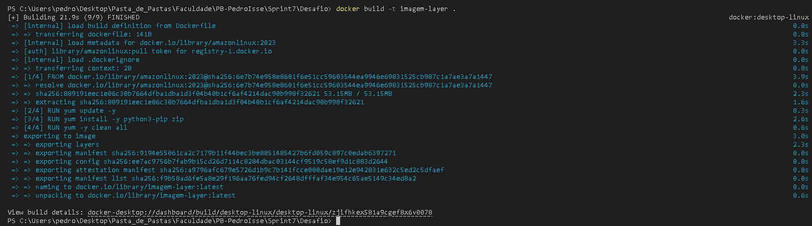
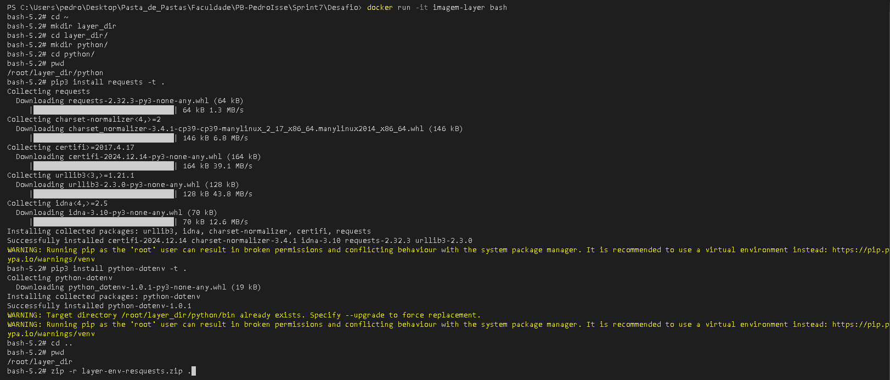
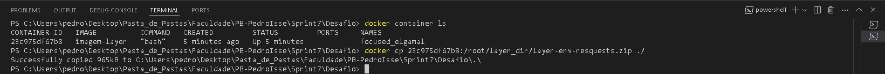
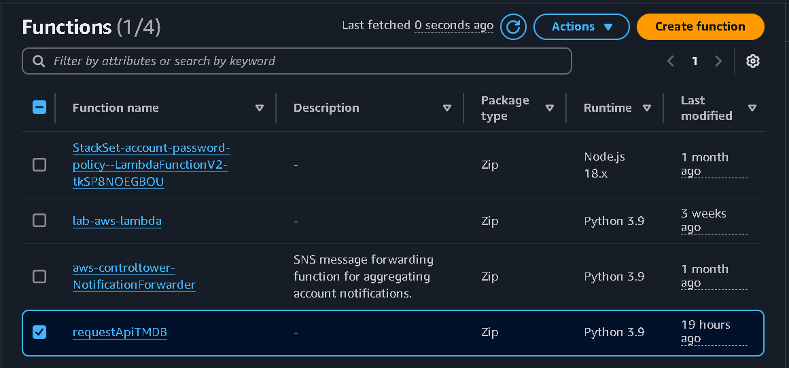
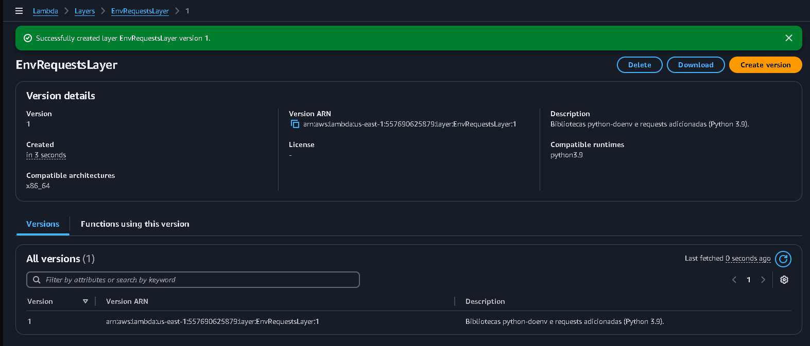
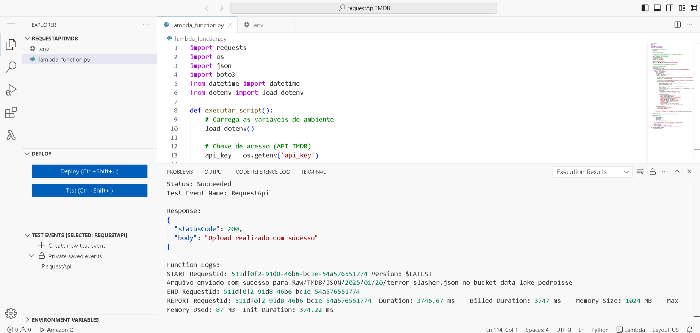
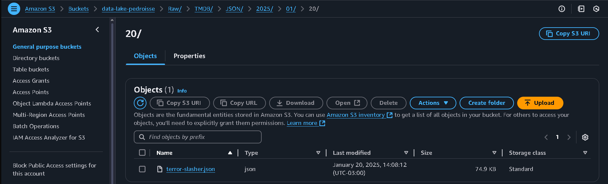

# **Resolução do Desafio: Sprint 7**

## **Entedimento sobre o Desafio Final - Entrega 2**

O tema que minha squad irá trabalhar é ***Terror/Mistério***, então analisei os arquivos fornecidos com base nisso e elaborei as seguintes pergutas:

## **Perguntas para realização do Desafio Final:**

As perguntas serão com base em alguns dos principais filmes de terror, mais especificamente, do gênero slasher. Os filmes são Sexta Feira 13, Massacre da Serra Elétrica, Pânico e Jogos Mortais. 

Foram escolhidos esses filmes, pois a trajetória dos filmes slasher é interessante, tendo altas a partir da década de 70 e tendo uma *"baixa"* e algumas das franquias acima estão voltando, assim abrindo portas para outras voltarem. 

**1 - Qual o sucesso dos filmes de slasher em diferentes décadas e como elas se relacionam com o sucesso do gênero slasher ao longo do tempo? Principais décadas para o gênero.**

**2 - Qual é a receita de bilheteira de cada filme da franquia e como ela se compara ao orçamento de produção?**

**3 - Quais foram os filmes de slasher que mais tiveram mudanças de elenco principal entre sequências e como isso afetou a percepção do público?**

**4 - A mudança na produção das franquias mudou sua bilheteria? A nota do público? Observe a partir do Diretor e Roteirista**

**Errata:** Eu retirei uma das minhas perguntas da Sprint anterior, pois achei que poderia ser muito trabalhosa, uma vez que achei ela, relativamente, abstrata.

## **Entrega 2:**

Nessa Sprint, o objetivo é utilizar a API do TMDB para obter dados relativos a análise decidida na Sprint 06. Para isso, utilizaremos o Lambda para executar um script python que irá armazenar os dados no formato JSON no Bucket S3 criado, também, na Sprint 06.

### **Análise:** 

Nessa Sprint eu realizei algumas análises do CSV de filmes fornecidos e uma análise da API do TMDB, a partir disso, tirei algumas conclusões:

[**ID de Filme:**](./Scripts-Analise/individual-id.py) Com esse Script, eu consegui um ID individual de cada uma das franquias de filmes que eu irei analisar, mas somente o ID de um filme de cada, pois descobri que existe algo chamado *coleções* na API do TMDB, então com base no ID do filme eu consegui pesquisar as coleções de filmes: Scream, Saw, Friday the 13th e The Texas Chain Saw Massacre.

```Python
import requests
import pandas as pd
from IPython.display import display
import os
from dotenv import load_dotenv

# Carrega as variáveis de ambiente do arquivo .env
load_dotenv()

api_key = os.getenv("api_key")

# Nome do filme para buscar
movie_name = "Nome do Filme"

# URL para pesquisar o filme pelo nome
search_url = f"https://api.themoviedb.org/3/search/movie?api_key={api_key}&query={movie_name}&language=pt-BR"

response = requests.get(search_url)
if response.status_code == 200:
    results = response.json().get("results", [])
    if results:
        movie_id = results[0]["id"]
        print(f"Filme encontrado: {results[0]["title"]} (ID: {movie_id})")
    else:
        print("Nenhum filme encontrado.")
else:
    print(f"Erro na requisição: {response.status_code}")

```

[**ID de Coleção:**](./Scripts-Analise/colecao-id.py) Baseado no ID obtido no script anterior, eu usava este script para obter os IDs das coleções, facilitando a obtenção dos filmes das franquias.

```Python
import requests
import pandas as pd
from IPython.display import display
import os
from dotenv import load_dotenv

# Carrega as variáveis de ambiente do arquivo .env
load_dotenv()

api_key = os.getenv("api_key")

movie_id = "ID do Filme"

url = f"https://api.themoviedb.org/3/movie/{movie_id}?api_key={api_key}&language=pt-BR"

# Fazendo a requisição HTTP
response = requests.get(url)

# Verificando se a resposta foi bem-sucedida
if response.status_code == 200:
    movie_data = response.json()  # Convertendo a resposta para JSON

    # Verificando se o filme pertence a uma coleção (franquia)
    if "belongs_to_collection" in movie_data and movie_data["belongs_to_collection"]:
        collection_id = movie_data["belongs_to_collection"]["id"]
        collection_name = movie_data["belongs_to_collection"]["name"]
        print(f"O filme pertence à coleção: {collection_name} (ID: {collection_id})")
    else:
        print("Este filme não pertence a nenhuma coleção.")
else:
    print(f"Erro na requisição: {response.status_code}")

```

[**Filmes contidos nas coleções:**](./Scripts-Analise/nome-filmes.py) Com as coleções já obtidas, eu fiz um pequeno Script para descobrir quais eram os filmes contidos em cada coleção de filmes: [**filmes.txt**](./Scripts-Analise/filmes.txt).

```Python 
import requests
import os
from dotenv import load_dotenv

# Carrega as variáveis de ambiente do arquivo .env
load_dotenv()

# Chave da API do TMDb
api_key = os.getenv('api_key')

# Lista de IDs das coleções que você quer buscar
colecoes = {
    "Scream": 2602,
    "Friday the 13th": 9735,
    "Saw": 656,
    "The Texas Chain Saw Massacre": 111751
}

# Nome do arquivo de saída
output_file = "filmes.txt"

# Abre o arquivo para escrita
with open(output_file, "w", encoding="utf-8") as f:
    for nome_colecao, colecao_id in colecoes.items():
        # URL para buscar os filmes da coleção
        url = f"https://api.themoviedb.org/3/collection/{colecao_id}?api_key={api_key}&language=en-US"

        response = requests.get(url)

        if response.status_code == 200:
            data = response.json()
            filmes = data.get("parts", [])

            for filme in filmes:
                titulo = filme.get("title", "Título Desconhecido")
                f.write(f'{titulo},')

            f.write("\n")  # Adiciona uma linha em branco entre coleções
        else:
            print(f"Erro ao buscar a coleção {nome_colecao}: {response.status_code}")

print(f"Os títulos dos filmes foram salvos em {output_file} com sucesso!")

```

[**Filmes NÃO contidos no CSV:**](./Scripts-Analise/buscar-csv.py) Por fim, decidi observar se existia alguns filmes que não estavam contidos no CSV, mas que estavam na API: [**filmes-no-csv.txt**](./Scripts-Analise/filmes-no-csv.txt). Com isso eu percebi que existiam 4 filmes relevantes que não estavam no CSV, outros presentes ainda não haviam sido lançados.

```Python
import pandas as pd

# Arquivos
filmes_txt = "filmes.txt"
movies_csv = "movies.csv"

# Carrega o CSV
df = pd.read_csv(movies_csv, sep="|")

# Converte as colunas de título para um conjunto para busca eficiente
titulos_csv = set(df["tituloPincipal"].dropna()) | set(df["tituloOriginal"].dropna())

# Lê os títulos do TXT e separa corretamente
with open(filmes_txt, "r", encoding="utf-8") as f:
    filmes_lista = f.read().replace("\n", "").split(",")

with open('filmes-no-csv.txt', 'w', encoding="utf-8") as saida:
    # Verifica quais filmes estão no CSV
    for titulo in filmes_lista:
        titulo = titulo.strip()  # Remove espaços em branco extras
        if titulo in titulos_csv:
            saida.write(f"O filme '{titulo}' está no CSV!\n")
        else:
            saida.write(f"O filme '{titulo}' NÃO está no CSV!\n")

```

### **Desafio Sprint 07** 

**Criando Imagem:** Para criar uma Layer no Lambda eu preciso baixar algumas bibliotecas e compactar elas no Docker.



[**Dockerfile:**](./Dockerfile)

```Docker
FROM amazonlinux:2023
RUN yum update -y
RUN yum install -y \
python3-pip \
zip
RUN yum -y clean all
```

**Rodando Container:** Inicia o container de forma interativa para que eu possa baixar as bibliotecas que foram utilizadas no meu Script Python, no caso, foram: *python-dotenv* e *requests*.



**Bibliotecas compactadas e copiadas para minha máquina:**

[**Bibliotecas.zip**](./layer-env-resquests.zip)



**Função Lambda criada:**



**Layer Criado:**



[**Script utilizado:**](./dados-api.py)

```Python 
import requests
import os
import json
from dotenv import load_dotenv

# Carrega as variáveis de ambiente
load_dotenv()

# Chave de acesso
api_key = os.getenv('api_key')

# IDs das coleções (Scream, Friday the 13th, Saw, The Texas Chain Saw Massacre)
colecoes_ids = [2602, 9735, 656, 111751]

dados_colecoes = {}

for colecao_id in colecoes_ids:
    url = f"https://api.themoviedb.org/3/collection/{colecao_id}?api_key={api_key}&language=pt-BR"
    resposta = requests.get(url)

    if resposta.status_code == 200:
        dados = resposta.json()

        filmes_detalhados = []

        for filme in dados.get('parts', []):
            filme_id = filme['id']
            
            # Busca detalhes do filme
            url_filme = f"https://api.themoviedb.org/3/movie/{filme_id}?api_key={api_key}&language=pt-BR"
            resposta_filme = requests.get(url_filme)
            
            # Busca créditos do filme (elenco e equipe técnica)
            url_creditos = f"https://api.themoviedb.org/3/movie/{filme_id}/credits?api_key={api_key}&language=pt-BR"
            resposta_creditos = requests.get(url_creditos)

            if resposta_filme.status_code == 200 and resposta_creditos.status_code == 200:
                detalhes_filme = resposta_filme.json()
                creditos = resposta_creditos.json()
                
                top_20_atores = sorted(creditos.get('cast', []), key=lambda x: x['order'])[:20]

                # Busca diretor(es)
                diretores = [pessoa['name'] for pessoa in creditos.get('crew', []) if pessoa['job'] == 'Director']

                # Busca roteirista(s) (Screenplay, Writer, Story)
                roteiristas = [
                    pessoa['name'] for pessoa in creditos.get('crew', [])
                    if pessoa['job'] in ['Writer', 'Screenplay', 'Story']
                ]

                filmes_detalhados.append({
                    "id": detalhes_filme.get('id'),
                    "imdb_id": detalhes_filme.get('imdb_id'),
                    "title": detalhes_filme.get('title'),
                    "original_title": detalhes_filme.get('original_title'),
                    "release_date": detalhes_filme.get('release_date'),
                    "revenue": detalhes_filme.get('revenue'),
                    "budget": detalhes_filme.get('budget'),
                    "vote_average": detalhes_filme.get('vote_average'),
                    "vote_count": detalhes_filme.get('vote_count'),
                    "director": diretores,  # Lista de diretores
                    "writers": roteiristas,  # Lista de roteiristas
                    "cast": [ator['name'] for ator in top_20_atores],  # Nomes dos 20 primeiros atores
                    "characters": [ator['character'] for ator in top_20_atores]  # Personagens interpretados
                })

        dados_colecoes[colecao_id] = {
            "collection_name": dados.get('name'),
            "collection_description": dados.get('overview'),
            "filmes": filmes_detalhados
        }
    
    else:
        print(f"Erro ao buscar dados para a coleção {colecao_id}. Status Code: {resposta.status_code}")

# Salva os dados no arquivo 'dados_colecoes.json'
with open('dados_colecoes.json', 'w', encoding='utf-8') as f:
    json.dump(dados_colecoes, f, ensure_ascii=False, indent=4)

print("Dados das coleções salvos com sucesso!")

```

[**Resultado:**](./dados_colecoes.json)



**S3 URI:** s3://data-lake-pedroisse/Raw/TMDB/JSON/2025/01/20/terror-slasher.json

