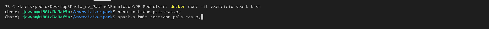

# **Exercícios Sprint 7**

## **Resolução: Apache Spark - Contador de Palavras**

### **Entendimento:** 

O exercício é uma forma de fazer com que o conteúdo visto no curso fornecido na Sprint 7 seja fixado. Ele consiste em utilizar o um container Docker para rodar comandos ***pyspark*** para que contém quantas palavras forma utilizadas no README do repositório do GitHub.

### **Dificuldades e Soluções:**

O primeiro problema que encontrei foi o fato que nas instruções do exercício recebemos uma dica de como pegar uma página da internet para seu container, entretanto, como meu repositório no github é privado, isso não foi possível. Como solução, criei um [Dockerfile](./Dockerfile) que contém a imagem que deve ser utilizada no exercício, além de copiar o conteúdo do [README.md](../../Sprint6/README.md) da Sprint 6. 

**Dockerfile:**

```Docker
FROM jupyter/all-spark-notebook

WORKDIR /exercicio-spark

# Copiar o arquivo README.md para o contêiner
COPY Sprint6/README.md /exercicio-spark/README.md
```

Outra dificuldade que tive, ao tentar executar o *pyspark* comando por comando tive um problema com minha lógica, que utiliza um ***loop for***, mas quando eu ia adicionar ele ele dizia que eu estava usando de forma incorreta. Mesmo procurando algumas soluções, não funcionava. Por isso fiz diferente, peguei os comandos que utilizei no terminal *pyspark* e coloquei em um script python e usei o ***spark-submit*** para executar.


**Download da Imagem:** 


**Adicionando o README ao Container:**


**Rodando o container:**


**Fazendo o teste interativamente:**

- [**Script Utilizado:**](./contador-palavras.py)

    ```Python
    from pyspark import SparkContext

    sc = SparkContext(appName="ContagemPalavras")

    path = 'README.md'

    rdd = sc.textFile(path)

    palavras = rdd.flatMap(lambda line: line.split())

    palavras_sep = palavras.collect()

    frequencia = {}

    for palavra in palavras_sep:

        palavra = palavra.lower()

        if palavra in frequencia.keys():
            frequencia[palavra] += 1
        else:
            frequencia[palavra] = 1

    for palavra, aparicoes in frequencia.items():
        print(f'{palavra}: {aparicoes}')
    ```

- **Iteração com o Container:**

    

- **Script no Nano:**

    

- **Resultado:**

    

## **Resolução: TMDB**

### **Entendimento:** 

Uma vez que utilizaremos a API do TMDB para coletar dados para a análise final do desafio, é importe que tenhamos uma ideia de como a API funciona. Então para isso iremos fazer um *request* para a API com o título, data de lançamento, visão geral, votos e média de votos dos ***filmes*** que estão presentes no banco de dados do tmdb.

[**Script Utilizado:**](./conexao-api.py)

```Python
import requests
import pandas as pd
from IPython.display import display
import os
from dotenv import load_dotenv

# Carrega a variável de ambiente do arquivo .env (API Key)
load_dotenv()

api_key = os.getenv('api_key')

url = f'https://api.themoviedb.org/3/movie/top_rated?api_key={api_key}&language=pt-BR'

response = requests.get(url)

data = response.json()
filmes = []

for movie in data['results']:
    df = {
        'Titulo': movie['title'],
        'Data de Lançamento': movie['release_date'],
        'Visão geral': movie['overview'],
        'Votos': movie['vote_count'],
        'Média de votos': movie['vote_average']
    }
    filmes.append(df)

# Cria o DataFrame
df = pd.DataFrame(filmes)
display(df)
```

**Resultado de execução:**


## **Resolução: Lab AWS Glue**

### **Entendimento:** 

Praticar o uso do AWS Glue, uma vez que ele também será utilizado para a realização do Desafio Final do Programa de Bolsas. O exercício consiste em praticar um pouco do uso de **dataframes** com *pyspark* juntamente do serviço **AWS Glue**. Nos dando uma série de exercícios a serem realizados. 

**Criada IAM Role:**


**Database *glue-lab* criado:**


**Job criado:** 


**Caminhos para Bucket:**


**--S3_INPUT_PATH:** s3://bucket-pedroisse/lab-glue/input/nomes.csv

**--S3_TARGET_PATH:** s3://bucket-pedroisse/lab-glue/frequencia_registro_nomes_eua/

**Script Python:** 

[pyspark-dataframes.py](./pyspark-dataframes.py)

```Python
import sys
from awsglue.transforms import *
from awsglue.utils import getResolvedOptions
from pyspark.context import SparkContext
from awsglue.context import GlueContext
from awsglue.job import Job
from pyspark.sql.functions import col, upper, desc, count, sum

# Parâmetros do job: Nome, caminho de entrada e saída no S3
args = getResolvedOptions(sys.argv, ['JOB_NAME', 'S3_INPUT_PATH', 'S3_TARGET_PATH'])

sc = SparkContext()
glueContext = GlueContext(sc)
spark = glueContext.spark_session
job = Job(glueContext)
job.init(args['JOB_NAME'], args)

# Ler o arquivo CSV do S3
s3_input_path = args['S3_INPUT_PATH']
df = spark.read.format("csv").option("header", "true").option("inferSchema", "true").load(s3_input_path)

# Imprimir o schema do DataFrame
df.printSchema()

# Alterar valores da coluna "nome" para maiúsculo
df = df.withColumn("nome", upper(col("nome")))

# Imprimir a contagem de linhas presentes no DataFrame
print(f"Total de linhas no DataFrame: {df.count()}")

# Contagem de nomes agrupados por "ano" e "sexo", ordenados pelo ano mais recente
df_agrupado = df.groupBy("ano", "sexo").agg(count("nome").alias("total_nomes"))
df_agrupado.orderBy(desc("ano")).show()

# Nome feminino com mais registros e o ano
fem_maximo = df.filter(col("sexo") == "F").orderBy(desc("total")).select("nome", "ano", "total")
fem_maximo.show(1)

# Nome masculino com mais registros e o ano
masc_maximo = df.filter(col("sexo") == "M").orderBy(desc("total")).select("nome", "ano", "total")
masc_maximo.show(1)

# Total de registros por ano (primeiras 10 linhas, ordenadas pelo ano de forma crescente)
df_total_registros = df.groupBy("ano").agg(sum("total").alias("total_ano"))
df_total_registros.orderBy("ano").limit(10).show()

# Salvar os dados no S3 em formato JSON, particionando por sexo e ano
s3_target_path = args['S3_TARGET_PATH']
df.write.mode("overwrite").partitionBy("sexo", "ano").json(s3_target_path)

# Commit do job
job.commit()

```

**Execução do Job:**


Foram executadas 3 vezes, todas com sucesso, mas por engano meu a primeira execução não havia salvo o Script então o job não fez nada. No segundo Job que foi rodado eu me confundi com as instruções e criei o JSON de forma errada. Por fim, o último Job deu 100% certo.

**Output Logs:**


**Particionado por sexo no Bucket:**


**Particionando por ano no Bucket:**


**Crawler criado e executado:**


**Tabela criada e executada:**


