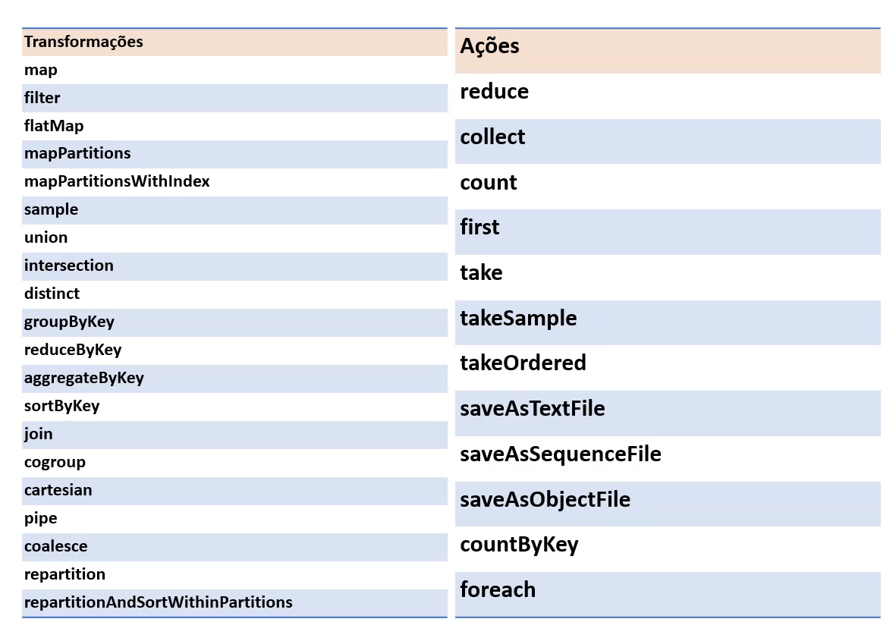

# **Resumo**

### **Formação Spark com Pyspark: o Curso Completo**

**O que é o Spark?**

- Ferramenta de Processamento de Dados

- Distribuido em Cluster (Rede de Computadores fazendo **a mesma coisa**)

- Replicação e tolerante a falha

- Em memória

- Veloz

- Escalável

- Dados em HDFS ou Cloud

- Suporte a Particionamento

**Arquitetura e Componentes**

- **Componentes:**
    
    - Machine Learning

    - SQL (Spark SQL)

    - Processamento Streaming 

    - Processamento de Grafos

        - Job: Tarefa

        - Stage: Divisão do Job

        - Task: Menor unidade de trabalho. Uma por núcleo e por partição

- **Estrutura:**

    - Driver inicializa SparkSession, solicita recursos computacionais do Cluster Manager, transforma as operações em DAGs, distribui estas pelos executers

    - Manager gerencia os recursos do cluster. Quatro possíveis: built-in standalone, YARN, Mesos e Kubernetes

    - Executer roda em cada nó do cluster executando tarefas

- **Transformações e Ações:**

    - Um data frame é imutável: traz tolerância a falha

    - Uma transformação gera um novo data frame

    - O processamente de transformação de fato só ocorre quando há um **Ação**: Lazy Evaluation 

    - Transformação Narrow: Os dados necessários estão em uma mesma partição

    - Transformação Wide: Os dados necessários estão em mais de uma partição

    

**Formatos de Big Data**

- **Formatos Proprietários**

- **Formatos Abertos:** Armazéns de dados modernos tendem a armazenar dados em formatos "desacoplados" de ferramentas e abertos. São em formatos binários, compactados, suportam schemas e podem ser particionados entre discos: **Paralelismo** e **Redundância**

    - **Parquet:** Colunar, padrão Spark (Menos atributos e mais leitura)
    - **ORC:** Colunar, padrão Hive (Menos atributos e mais leitura)
    - **Avro:** Linha (Muitos atributos e mais escrita)

**DataFrames e RDDs** 

- **Resilient Distributed Datasets (RDD):** É a abstração fundamental do Spark para trabalhar com dados distribuídos.

    - **Imutável**

    - **Tolerante a falhas**

    - **Opera em baixo nível**

    - **Não possui *schema***

- **DataFrames:** Uma abstração de alto nível que representa dados organizados em colunas, como uma tabela em um banco de dados.

    - **Melhor desempenho**

    - **Compátivel com várias linguagens**

    - **Pode ser criado a partir de RDDs, CSVs, JSONs e Banco de Dados**

    - **APIs expressivas para manipulação de dados, similares às de SQL**

- **DataSets:** Combina a robustez dos RDDs com as otimizações baseadas em esquema dos DataFrames.

    - **Fortemente tipado (Scala e Java)**

    - **Melhor desempenho**

    - **Pode ser convertido para RDDs e DataFrames**

**Tabelas e Views**

- **Tabela:** É um estrutura física que armazena dados diretamente no Banco de Dados. Contém linhas e colunas, com dados persistentes e que podem ser modificados (inseridos, atualizados ou removidos). Pode ter chaves primárias, estrangeiras, índices e restrição de integridade para garantir consistência dos dados.

    - Armazenar dados de forma estruturada e organizada

    - Base para consultas e operações de manipulação de dados

    - **Gerenciadas:** O sistema gerencia completamente os dados armazenados, que por padrão são armazenados no diretório da sessão Spark ou Hive. Se excluir a tabela, os dados também **serão excluídos**

    - **Não-Gerenciada ou Externa:** Os dados são armazenados em um local externo e o sistema não controla diretamente os dados. O esquema da tabela é armazenado no metastore, mas o local dos dados é especificado manualmente. Se a tabela for excluída, os dados **não serão excluídos**

- **Views:** É um estrutura lógica que não armazena dados diretamente; ela representa uma consulta salva que retorna dados de uma ou mais tabelas. Os dados exibidos em uma view são dinâmicos, ou seja, refletem as alterações feitas nas tabelas subjacentes. Podem ser utilizadas para simplificar consultas complexas ou para restringir acesso a certos dados.

    - Facilitar acesso e compreensão de dados

    - Restringir acesso a informações sensíveis, permitindo que os usuários vejam apenas os dados relevantes

    - Simplificar consultas frequentes e complexas

# **Exercícios:**

**Os exercícios foram resolvidos e documentados no [README.md](./Exercicios/README.md).**

# **Evidências:**

**Todas as evidências dos exercícios estão documentadas no [README.md](./Exercicios/README.md).**

# **Certificados:**

**Nessa sprint não foi obtido nenhum certificado externo à Udemy.**