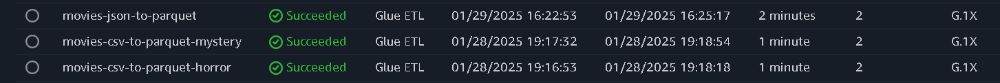
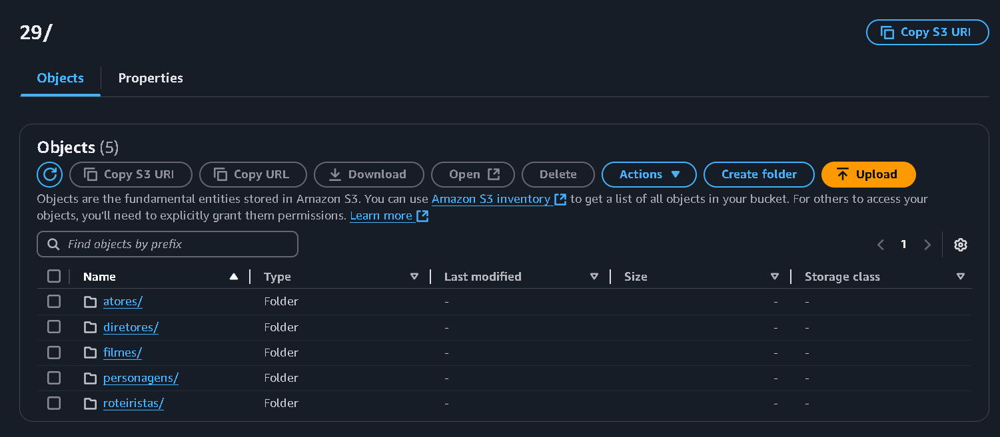

# **Resolução do Desafio: Sprint 8**

## **Entedimento sobre o Desafio Final - Entrega 3**

A Entrega 3 consiste na padronização e limpeza dos dados da camada RAW para a camada Trusted, ainda contendo um grande volume de informações, mas não necessariamente os dados que serão utilizados na análise final. Basicamente, utilizaremos o AWS Glue para realizar o ETL dos dados armazenados na camada RAW do S3 e, após o tratamento, usaremos o Crawler para a criação de tabelas no Amazon Athena.

O tema que minha squad irá trabalhar é ***Terror/Mistério***, então analisei os arquivos fornecidos com base nisso e elaborei as seguintes pergutas:

## **Perguntas para realização do Desafio Final:**

As perguntas serão com base em alguns dos principais filmes de terror, mais especificamente, do gênero slasher. Os filmes são Sexta Feira 13, Massacre da Serra Elétrica, Pânico e Jogos Mortais. 

Foram escolhidos esses filmes, pois a trajetória dos filmes slasher é interessante, tendo altas a partir da década de 70 e tendo uma *"baixa"* e algumas das franquias acima estão voltando, assim abrindo portas para outras voltarem. 

**1 - Qual o sucesso dos filmes de slasher em diferentes décadas e como elas se relacionam com o sucesso do gênero slasher ao longo do tempo? Principais décadas para o gênero.**

**2 - Qual é a receita de bilheteira de cada filme da franquia e como ela se compara ao orçamento de produção?**

**3 - Quais foram os filmes de slasher que mais tiveram mudanças de elenco principal entre sequências e como isso afetou a percepção do público?**

**4 - A mudança na produção das franquias mudou sua bilheteria? A nota do público? Observe a partir do Diretor e Roteirista**

**Errata:** Em relação à Sprint 7, na qual extraímos os dados da API para a futura análise final, inicialmente coletei informações muito específicas sobre as quatro franquias de filmes que pretendo analisar. No entanto, após conversar com o monitor, chegamos à conclusão de que seria mais interessante ter uma camada RAW do TMDB mais abrangente. Por isso, fiz alterações no meu script no Lambda para ampliar a coleta de dados. Foram gerados 242 JSONs na camada RAW do TMDB.

**Novo Script: Request API TMDB:**

```Python
import requests
import os
import json
import boto3
from datetime import datetime
from dotenv import load_dotenv

def obter_filmes_por_genero(api_key, genero_id, pagina=1, limite_registros=100):
    url = f"https://api.themoviedb.org/3/discover/movie?api_key={api_key}&with_genres={genero_id}&language=pt-BR&page={pagina}"
    resposta = requests.get(url)

    if resposta.status_code == 200:
        dados = resposta.json()
        filmes = dados.get('results', [])
        return filmes
    else:
        print(f"Erro ao buscar filmes do gênero {genero_id}: {resposta.status_code}")
        return []

def obter_detalhes_filme(api_key, filme_id):
    url_filme = f"https://api.themoviedb.org/3/movie/{filme_id}?api_key={api_key}&language=pt-BR"
    url_creditos = f"https://api.themoviedb.org/3/movie/{filme_id}/credits?api_key={api_key}&language=pt-BR"

    resposta_filme = requests.get(url_filme)
    resposta_creditos = requests.get(url_creditos)

    if resposta_filme.status_code == 200 and resposta_creditos.status_code == 200:
        detalhes = resposta_filme.json()
        creditos = resposta_creditos.json()

        diretores = [pessoa['name'] for pessoa in creditos.get('crew', []) if pessoa['job'] == 'Director']
        roteiristas = [pessoa['name'] for pessoa in creditos.get('crew', []) if pessoa['job'] in ['Writer', 'Screenplay', 'Story']]
        top_20_atores = sorted(creditos.get('cast', []), key=lambda x: x['order'])[:20]

        # Verificação para evitar erro de NoneType
        pertence_a_colecao = detalhes.get('belongs_to_collection')
        id_colecao = pertence_a_colecao['id'] if pertence_a_colecao else "N/A"
        nome_colecao = pertence_a_colecao['name'] if pertence_a_colecao else "N/A"

        return {
            "id": detalhes.get('id'),
            "imdb_id": detalhes.get('imdb_id'),
            "titulo_original": detalhes.get('original_title'),
            "id_colecao": id_colecao,
            "nome_colecao": nome_colecao,
            "data_lancamento": detalhes.get('release_date'),
            "receita": detalhes.get('revenue'),
            "orcamento": detalhes.get('budget'),
            "diretores": diretores,
            "roteiristas": roteiristas,
            "elenco": [ator['name'] for ator in top_20_atores],
            "personagens": [ator['character'] for ator in top_20_atores]
        }
    else:
        print(f"Erro ao buscar detalhes do filme {filme_id}")
        return None

def salvar_arquivos_s3(arquivo, bucket, caminho_base, genero, indice):
    s3_client = boto3.client('s3', region_name="us-east-1")

    caminho_s3 = f"{caminho_base}/movies_{genero}_{datetime.now().strftime('movie-%Y%m%d')}_{indice+1}.json"
    json_data = json.dumps(arquivo, ensure_ascii=False, indent=4)

    try:
        # Enviar o arquivo para o S3 com a codificação UTF-8 explícita
        s3_client.put_object(
            Bucket=bucket,
            Key=caminho_s3,
            Body=bytes(json_data, 'utf-8'),  # Converter o JSON para bytes com UTF-8
            ContentType="application/json; charset=utf-8"  # Especificar charset UTF-8 no header
        )
        print(f"Arquivo enviado: {caminho_s3}")
    except Exception as e:
        print(f"Erro ao enviar para o S3: {e}")


def executar_script():
    load_dotenv()
    api_key = os.getenv('api_key')

    # IDs dos gêneros (27 = Horror, 9648 = Mistério)
    generos = {"terror": 27, "misterio": 9648}

    # Nome do bucket e caminho
    bucket = 'data-lake-pedroisse'
    data_hoje = datetime.now().strftime('%Y/%m/%d')
    caminho_base = f'Raw/TMDB/JSON/{data_hoje}'

    for genero, genero_id in generos.items():
        pagina = 1  # Inicia na primeira página
        filmes_processados = []  # Reinicia a lista para cada gênero
        contador_arquivos = 0  # Contador de arquivos enviados

        while True:
            filmes = obter_filmes_por_genero(api_key, genero_id, pagina)
            
            if not filmes:
                break  # Se não houver filmes, sai do loop

            for filme in filmes:
                # Verificar se o voto é maior que 500 antes de buscar os detalhes
                if filme.get('vote_count', 0) > 500:
                    detalhes = obter_detalhes_filme(api_key, filme['id'])
                    if detalhes:
                        filmes_processados.append(detalhes)

            # Enviar em blocos de 100 filmes para o S3
            while filmes_processados:
                arquivo = filmes_processados[:100]  # Pega os primeiros 100 filmes
                filmes_processados = filmes_processados[100:]  # Remove os 100 filmes enviados
                salvar_arquivos_s3(arquivo, bucket, caminho_base, genero, contador_arquivos)
                contador_arquivos += 1  # Incrementa o contador de arquivos

            pagina += 1  # Vai para a próxima página se houver mais filmes

    return {"statusCode": 200, "body": "Upload concluído"}

def lambda_handler(event, context):
    return executar_script()

```

## **Criando a Trusted: CSV para Parquet**

Como o objetivo da camada Trusted é garantir dados confiáveis para que outros analistas, por exemplo, possam acessar informações limpas para suas análises, separei os dados em dois arquivos CSV: um para filmes de terror e outro para filmes de mistério. Dessa forma, caso haja algum problema ou seja necessário buscar mais dados, terei um grande volume de informações à disposição.

### **Criando Horror Trusted:**

[**Filmes Terror:**](./filmes-terror.py)

```Python
import sys
import boto3
from awsglue.utils import getResolvedOptions
from awsglue.context import GlueContext
from pyspark.context import SparkContext
from pyspark.sql import SparkSession
from pyspark.sql.functions import col
from datetime import datetime

# Definir argumentos de entrada para o script
args = getResolvedOptions(sys.argv, ['JOB_NAME', 'S3_INPUT_PATH', 'S3_OUTPUT_PATH'])

# Criar a sessão do Spark
sc = SparkContext()
glueContext = GlueContext(sc)
spark = glueContext.spark_session

# Caminhos para o S3 (raw e trusted)
source_path = args['S3_INPUT_PATH']
dest_base_path = args['S3_OUTPUT_PATH']

# Obter data atual para estrutura de diretórios
now = datetime.now()
ano, mes, dia = now.year, now.month, now.day

# Caminho final com nome do arquivo
dest_path = f"{dest_base_path}/Trusted/Local/Parquet/movies/{ano}/{mes}/{dia}/filmes_terror"

# Carregar o arquivo CSV do S3 com inferência automática de tipos
df = spark.read.csv(source_path, sep="|", inferSchema=True, header=True)

# Corrigir nome das colunas erradas
df = df.withColumnRenamed("tituloPincipal", "tituloPrincipal").withColumnRenamed("id", "imdb_id")

# Criar a tabela temporária
df.createOrReplaceGlobalTempView("filmesTerror")

# Realizar a consulta e filtro
df = spark.sql("""
    SELECT imdb_id, tituloPrincipal, tituloOriginal, anoLancamento, genero, notaMedia, numeroVotos
    FROM global_temp.filmesTerror
    WHERE genero LIKE '%Horror%'
""")

# Remover duplicatas
df = df.dropDuplicates()

# Remover linhas com valores nulos
df = df.dropna()

# Garantir que o arquivo seja salvo como um único Parquet
df.repartition(1).write.mode("overwrite").parquet(dest_path)

# INPUT = s3://data-lake-pedroisse/Raw/Local/CSV/Movies/2025/01/03/
# OUTPUT = s3://data-lake-pedroisse/

```

**Resultado de execução:**

**Job:** *movies-csv-to-parquet-horror*




s3://data-lake-pedroisse/Trusted/Local/Parquet/movies/2025/1/28/filmes_terror/

### **Criando Mystery Trusted:**

[**Filmes Mistério:**](./filmes-misterio.py)

```Python
import sys
import boto3
from awsglue.utils import getResolvedOptions
from awsglue.context import GlueContext
from pyspark.context import SparkContext
from pyspark.sql import SparkSession
from pyspark.sql.functions import col
from datetime import datetime

# Definir argumentos de entrada para o script
args = getResolvedOptions(sys.argv, ['JOB_NAME', 'S3_INPUT_PATH', 'S3_OUTPUT_PATH'])

# Criar a sessão do Spark
sc = SparkContext()
glueContext = GlueContext(sc)
spark = glueContext.spark_session

# Caminhos para o S3 (raw e trusted)
source_path = args['S3_INPUT_PATH']
dest_base_path = args['S3_OUTPUT_PATH']

# Obter data atual para estrutura de diretórios
now = datetime.now()
ano, mes, dia = now.year, now.month, now.day

# Caminho final com nome do arquivo
dest_path = f"{dest_base_path}/Trusted/Local/Parquet/movies/{ano}/{mes}/{dia}/filmes_misterio"

# Carregar o arquivo CSV do S3 com inferência automática de tipos
df = spark.read.csv(source_path, sep="|", inferSchema=True, header=True)

# Corrigir nome das colunas erradas
df = df.withColumnRenamed("tituloPincipal", "tituloPrincipal").withColumnRenamed("id", "imdb_id")

# Criar a tabela temporária
df.createOrReplaceGlobalTempView("filmesMystery")

# Realizar a consulta e filtro
df = spark.sql("""
    SELECT imdb_id, tituloPrincipal, tituloOriginal, anoLancamento, genero, notaMedia, numeroVotos
    FROM global_temp.filmesMystery
    WHERE genero LIKE '%Mystery%'
""")

# Remover duplicatas
df = df.dropDuplicates()

# Remover linhas com valores nulos
df = df.dropna()

# Garantir que o arquivo seja salvo como um único Parquet
df.repartition(1).write.mode("overwrite").parquet(dest_path)

# INPUT = s3://data-lake-pedroisse/Raw/Local/CSV/Movies/2025/01/03/
# OUTPUT = s3://data-lake-pedroisse/

```

**Resultado de execução:**

**Job:** *movies-csv-to-parquet-mystery*


s3://data-lake-pedroisse/Trusted/Local/Parquet/movies/2025/1/28/filmes_misterio/

## **Criando a Trusted: JSON para Parquet**

Após a nova ingestão de dados na camada RAW do TMDB, optei por criar arquivos Parquet, pois considerei mais coerente para minha análise ter tabelas separadas para *Atores*, *Diretores*, *Personagens* e *Roteiristas*. Além disso, criei IDs individuais para cada pessoa envolvida nas produções dos filmes, garantindo uma estrutura mais organizada e facilitando futuras consultas e integrações.

### **Criando a Trusted: TMDB**

[**Filmes Json para Parquet:**](./filmes-json.py)

```Python
import sys
import boto3
from awsglue.utils import getResolvedOptions
from awsglue.context import GlueContext
from pyspark.context import SparkContext
from pyspark.sql import SparkSession
from pyspark.sql.functions import explode
from pyspark.sql.types import *
from pyspark.sql.functions import monotonically_increasing_id
from datetime import datetime

# Definir argumentos de entrada para o script
args = getResolvedOptions(sys.argv, ['JOB_NAME', 'S3_INPUT_PATH', 'S3_OUTPUT_PATH'])

# Criar a sessão do Spark
sc = SparkContext()
glueContext = GlueContext(sc)
spark = glueContext.spark_session

# Caminhos para o S3 (raw e trusted)
source_path = args['S3_INPUT_PATH']
dest_base_path = args['S3_OUTPUT_PATH']

# Obter data atual para estrutura de diretórios
now = datetime.now()
ano, mes, dia = now.year, now.month, now.day

filmes_path = f"{dest_base_path}/Trusted/TMDB/Parquet/movies/{ano}/{mes}/{dia}/filmes/"
personagens_path = f"{dest_base_path}/Trusted/TMDB/Parquet/movies/{ano}/{mes}/{dia}/personagens/"
atores_path = f"{dest_base_path}/Trusted/TMDB/Parquet/movies/{ano}/{mes}/{dia}/atores/"
diretores_path =  f"{dest_base_path}/Trusted/TMDB/Parquet/movies/{ano}/{mes}/{dia}/diretores/"
roteiristas_path = f"{dest_base_path}/Trusted/TMDB/Parquet/movies/{ano}/{mes}/{dia}/roteiristas/"

# Definir schema correto (mantendo elenco como ArrayType)
schema = StructType([
    StructField("id", LongType(), True),
    StructField("imdb_id", StringType(), True),
    StructField("titulo_original", StringType(), True),
    StructField("data_lancamento", StringType(), True),
    StructField("receita", DoubleType(), True),
    StructField("orcamento", DoubleType(), True),
    StructField("diretores", ArrayType(StringType()), True),
    StructField("roteiristas", ArrayType(StringType()), True),
    StructField("elenco", ArrayType(StringType()), True),
    StructField("personagens", ArrayType(StringType()), True),
    StructField("id_colecao", StringType(), True),
    StructField("nome_colecao", StringType(), True),
])

dados = spark.read.schema(schema).json(source_path, mode='PERMISSIVE', multiLine=True)

# Explodir a coluna "elenco" para transformar cada ator em uma linha separada e adicionar um ID único
atores = dados.select(
    "id", "imdb_id", explode("elenco").alias("ator")
).withColumn("id_ator", monotonically_increasing_id() + 1)

atores.dropna().dropDuplicates()

atores.write.mode("overwrite").parquet(atores_path)

personagens = dados.select(
    "id", "imdb_id", explode("personagens").alias("personagem")
).withColumn("id_personagem", monotonically_increasing_id() + 1)

personagens.dropna().dropDuplicates()

personagens.write.mode("overwrite").parquet(personagens_path)

diretores = dados.select(
    "id", "imdb_id", explode("diretores").alias("diretor")
).withColumn("id_diretor", monotonically_increasing_id() + 1)

diretores.dropna().dropDuplicates()

diretores.write.mode("overwrite").parquet(diretores_path)

roteiristas = dados.select(
    "id", "imdb_id", explode("roteiristas").alias("roteiristas")
).withColumn("id_roteirista", monotonically_increasing_id() + 1)

roteiristas.dropna().dropDuplicates()

roteiristas.write.mode("overwrite").parquet(roteiristas_path)

# Remover as colunas 'roteiristas', 'diretores', 'personagens' e 'elenco' do dataframe principal
dados_principal = dados.drop("roteiristas", "diretores", "personagens", "elenco")

dados_principal.dropna().dropDuplicates()

dados_principal.write.mode("overwrite").parquet(filmes_path)

```

**Resultado de execução:**

**Job:** *movies-json-to-parquet*




**atores:** s3://data-lake-pedroisse/Trusted/TMDB/Parquet/movies/2025/1/28/atores/

**diretores:** s3://data-lake-pedroisse/Trusted/TMDB/Parquet/movies/2025/1/28/diretores/

**filmes** s3://data-lake-pedroisse/Trusted/TMDB/Parquet/movies/2025/1/28/filmes/

**personagens:** s3://data-lake-pedroisse/Trusted/TMDB/Parquet/movies/2025/1/28/personagens/

**roteiristas:** s3://data-lake-pedroisse/Trusted/TMDB/Parquet/movies/2025/1/28/roteiristas/

### **Criando Tabelas: Crawler**

Como o grande objetivo do *Desafio Final* é a criação de um dashboard que irá consultar tabelas, nesta Sprint já criamos as primeiras tabelas que serão utilizadas para a modelagem e, eventualmente, para a análise. Isso garante uma base estruturada para futuras consultas e visualizações.

**Crawlers criados e funcionando:** 


### **Tabelas:**

**Atores:**


**Personagens:**


**Diretores:**


**Roteiristas:**


**Filmes:**


**Filmes Terror (CSV):**


**Filmes Mistério (CSV):**

