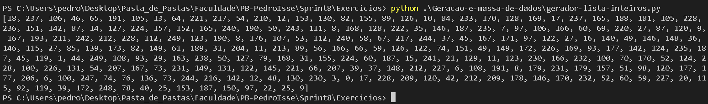
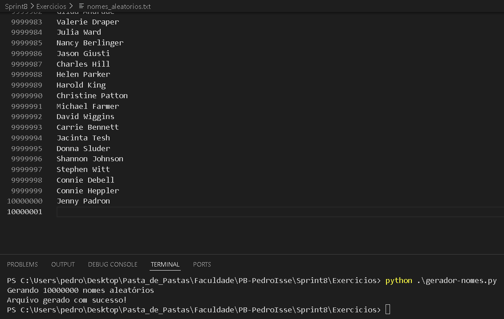

# **Resolução: Exercícios - Geração e massa de dados**

### **Etapa 1: Em Python, declare e inicialize uma lista contendo 250 inteiros obtidos de forma aleatória. Após, aplicar o método reverse sobre o conteúdo da lista e imprimir o resultado**

[**Gerador Lista de Inteiros:**](./gerador-lista-inteiros.py)

```Python
import random

num_int = []

# Gerar 250 números aleatórios entre 0 e 250
for _ in range(250):
    num_int.append(random.randint(0, 250))

# Inverter a lista
num_int.reverse()

# Exibir a lista invertida
print(num_int)
```



### **Etapa 2: Em Python, declare e inicialize uma lista contendo o nome de 20 animais. Ordene-os em ordem crescente e itere sobre os itens, imprimindo um a um. Na sequência, armazene o conteúdo da lista em um arquivo de texto, um item em cada linha, no formato CSV.**

[**Gerador de CSV Lista de Animais:**](./gerar-csv-animias.py)

```Python
animais = [
    "Leão", "Tigre", "Elefante", "Girafa", "Zebra",
    "Cachorro", "Gato", "Coelho", "Cavalo", "Lobo",
    "Panda", "Águia", "Tubarão", "Golfinho", "Urso",
    "Cobra", "Jacaré", "Canguru", "Rinoceronte", "Coruja"
]

animais.sort()

with open("animais.csv", "w", encoding="utf-8") as saida:
    [saida.write(animal + "\n") for animal in animais]
```

**Resultado:** [animais.csv](./animais.csv)

### **Etapa 3: Elaborar um código Python para gerar um dataset de nomes de pessoas.**

[**Gerador de Nomes:**](./gerador-nomes.py)

```Python
import names
import random

random.seed(40)

qtd_nomes_unicos = 3000
qtd_nomes_aleatorio = 10000000

# Gerando 3000 nomes únicos
aux = [names.get_full_name() for _ in range(qtd_nomes_unicos)]

print(f'Gerando {qtd_nomes_aleatorio} nomes aleatórios')

# Gerando 10 milhões de nomes aleatórios
dados = [random.choice(aux) for _ in range(qtd_nomes_aleatorio)]

# Escrevendo os nomes corretamente no arquivo
with open("nomes_aleatorios.txt", "w", encoding="utf-8") as saida:
    for nome in dados:
        saida.write(f'{nome}\n')

print("Arquivo gerado com sucesso!")
```

**Resultado:** Como o arquivo é **muito** grande para ser enviado ao GitHub, aqui está um print.

