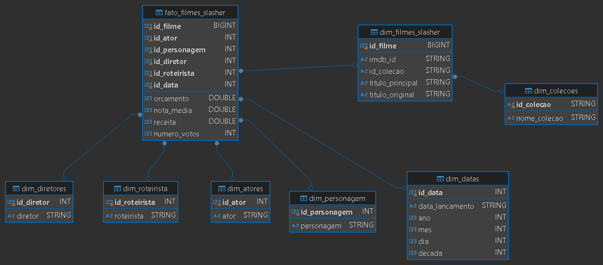

# **Resolução do Desafio: Sprint 9**

## **Entedimento sobre o Desafio Final - Entrega 4**

A Entrega 4 consiste na criação da camada *Refined*, que contém as tabelas modeladas dimensionalmente com base nos dados extraídos das camadas anteriores. Isso permitirá que, na próxima e última Sprint, o Dashboard seja desenvolvido.

O tema que minha squad irá trabalhar é ***Terror/Mistério***, então analisei os arquivos fornecidos com base nisso e elaborei as seguintes pergutas:

## **Perguntas para realização do Desafio Final:**

As perguntas serão com base em alguns dos principais filmes de terror, mais especificamente, do gênero slasher. Os filmes são Sexta Feira 13, Massacre da Serra Elétrica, Pânico e Jogos Mortais. 

Foram escolhidos esses filmes, pois a trajetória dos filmes slasher é interessante, tendo altas a partir da década de 70 e tendo uma *"baixa"* e algumas das franquias acima estão voltando, assim abrindo portas para outras voltarem. 

**1 - Qual o sucesso dos filmes de slasher em diferentes décadas e como elas se relacionam com o sucesso do gênero slasher ao longo do tempo? Principais décadas para o gênero.**

**2 - Qual é a receita de bilheteira de cada filme da franquia e como ela se compara ao orçamento de produção?**

**3 - Quais foram os filmes de slasher que mais tiveram mudanças de elenco principal entre sequências e como isso afetou a percepção do público?**

**4 - A mudança na produção das franquias mudou sua bilheteria? A nota do público? Observe a partir do Diretor e Roteirista**

**Errata:** Após realizar o Job no AWS Glue, utilizei o Crawler para verificar a integridade dos dados no Amazon Athena. No entanto, durante a produção da camada **Trusted**, descobri que a falta de uma relação entre **Atores** e **Personagens** resultou em uma tabela fato inconsistente. Em vez de dados coesos, obtive uma grande tabela com diferentes combinações de atores, personagens e diretores que não condiziam com a realidade dos filmes.  

Por conta disso, precisei dar um passo para trás e resolver o problema da relação **ator-personagem** na **Trusted**.  

Para isso, utilizei a função **arrays_zip**, que juntou os dados de atores com os de personagens para cada filme.  

O objetivo era combinar os arrays de **elenco** e **personagens**, garantindo que cada ator ficasse pareado com seu respectivo personagem (essa associação é feita automaticamente pela API do TMDB). Em seguida, explodi o array de pares, criando uma nova linha para cada ator e personagem no seguinte formato:  

```json
[
  {"elenco": "Ator A", "personagens": "Personagem X"}, 
  {"elenco": "Ator B", "personagens": "Personagem Y"}
]
```

### **Consertando relação personagem-ator na Trusted e Refined:**

[**Consertando relação personagem-ator**](./consertando-personagem-ator.py)

```Python
import sys
import boto3
from awsglue.utils import getResolvedOptions
from awsglue.context import GlueContext
from pyspark.context import SparkContext
from pyspark.sql import SparkSession
from pyspark.sql.functions import explode, monotonically_increasing_id, col, arrays_zip, row_number
from pyspark.sql.window import Window
from pyspark.sql.types import *
from datetime import datetime

# Definir argumentos de entrada para o script
args = getResolvedOptions(sys.argv, ['JOB_NAME', 'S3_INPUT_PATH', 'S3_OUTPUT_PATH'])

# Criar a sessão do Spark
sc = SparkContext()
glueContext = GlueContext(sc)
spark = glueContext.spark_session

# Caminhos para o S3 (raw e trusted)
source_path = args['S3_INPUT_PATH']
dest_base_path = args['S3_OUTPUT_PATH']

# Obter data atual para estrutura de diretórios

filmes_path = f"{dest_base_path}/Trusted/TMDB/Parquet/movies/2025/1/29/filmes/"
personagens_path = f"{dest_base_path}/Trusted/TMDB/Parquet/movies/2025/1/29/personagens/"
atores_path = f"{dest_base_path}/Trusted/TMDB/Parquet/movies/2025/1/29/atores/"
diretores_path = f"{dest_base_path}/Trusted/TMDB/Parquet/movies/2025/1/29/diretores/"
roteiristas_path = f"{dest_base_path}/Trusted/TMDB/Parquet/movies/2025/1/29/roteiristas/"

# Definir schema correto (mantendo elenco como ArrayType)
schema = StructType([
    StructField("id", LongType(), True),
    StructField("imdb_id", StringType(), True),
    StructField("titulo_original", StringType(), True),
    StructField("data_lancamento", StringType(), True),
    StructField("receita", DoubleType(), True),
    StructField("orcamento", DoubleType(), True),
    StructField("diretores", ArrayType(StringType()), True),
    StructField("roteiristas", ArrayType(StringType()), True),
    StructField("elenco", ArrayType(StringType()), True),
    StructField("personagens", ArrayType(StringType()), True),
    StructField("id_colecao", StringType(), True),
    StructField("nome_colecao", StringType(), True),
])

# Ler os dados JSON
dados = spark.read.schema(schema).json(source_path, mode='PERMISSIVE', multiLine=True)

# Função para criar IDs únicos
def create_unique_ids(dataframe, column_name, id_column_name):
    unique_items = dataframe.select(column_name).distinct()
    window_spec = Window.orderBy(column_name)
    unique_items = unique_items.withColumn(id_column_name, row_number().over(window_spec))
    dataframe_with_ids = dataframe.join(unique_items, column_name, "left")
    return dataframe_with_ids

# Explodir e adicionar IDs para atores e personagens juntos
atores_personagens = dados.select(
    "id", 
    "imdb_id",
    "id_colecao",
    explode(arrays_zip(col("elenco"), col("personagens"))).alias("ator_personagem")
)

# Separar atores e personagens
atores_personagens = atores_personagens.select(
    "id",
    "imdb_id",
    "id_colecao",
    col("ator_personagem.elenco").alias("ator"),
    col("ator_personagem.personagens").alias("personagem")
)

# Criar IDs únicos para atores e personagens
atores_personagens = create_unique_ids(atores_personagens, "ator", "id_ator")
atores_personagens = create_unique_ids(atores_personagens, "personagem", "id_personagem")

atores_personagens.write.mode("overwrite").parquet(f"{dest_base_path}/Trusted/TMDB/Parquet/movies/2025/1/29/atores_personagens/")

# Explodir e adicionar IDs para diretores
diretores = dados.select("id", "imdb_id","id_colecao", explode("diretores").alias("diretor"))
diretores = create_unique_ids(diretores, "diretor", "id_diretor")
diretores.dropna().dropDuplicates()
diretores.write.mode("overwrite").parquet(diretores_path)

# Explodir e adicionar IDs para roteiristas
roteiristas = dados.select("id", "imdb_id", "id_colecao", explode("roteiristas").alias("roteirista"))
roteiristas = create_unique_ids(roteiristas, "roteirista", "id_roteirista")
roteiristas.dropna().dropDuplicates()
roteiristas.write.mode("overwrite").parquet(roteiristas_path)

# Remover as colunas 'roteiristas', 'diretores', 'personagens' e 'elenco' do dataframe principal
dados_principal = dados.drop("roteiristas", "diretores", "personagens", "elenco")
dados_principal.dropna().dropDuplicates()
dados_principal.write.mode("overwrite").parquet(filmes_path)
```

## **Modelagem Dimensional:**

Para a criação da modelagem, primeiro pensei em qual seria a abordagem mais adequada para desenvolver meu Dashboard. Durante minhas pesquisas, entendi que a *modelagem dimensional* é mais indicada para análises de negócios e ***BI***, ou seja, para a criação de Dashboards, que é o objetivo do Desafio Final.

Com a modelagem escolhida, revisei os conceitos do modelo dimensional, considerando a tabela *fato*, que contém valores numéricos representando *IDs* e eventos de medição, e as tabelas *dimensão*, que armazenam atributos descritivos das entidades envolvidas, evitando a repetição de informações. Portanto, baseado nos dados coletados e cheguei na seguinte estrutura de tabelas:



### **Script utilizado para a modelagem:**

[**Modelagem Dimensional: Filmes Slasher**](./modelagem-dimensional.py)

```Python
import sys
import boto3
from awsglue.utils import getResolvedOptions
from awsglue.context import GlueContext
from pyspark.context import SparkContext
from pyspark.sql import SparkSession
from pyspark.sql.functions import col, year, month, dayofmonth, monotonically_increasing_id, expr, row_number
from datetime import datetime
from pyspark.sql.types import StructType, StructField, StringType, IntegerType
from pyspark.sql.window import Window

# Função para criar IDs únicos
def create_unique_ids(dataframe, column_name, id_column_name):
    unique_items = dataframe.select(column_name).distinct()
    window_spec = Window.orderBy(column_name)  # Garante que os IDs sejam ordenados
    unique_items = unique_items.withColumn(id_column_name, row_number().over(window_spec))
    dataframe_with_ids = dataframe.join(unique_items, column_name, "left")
    return dataframe_with_ids


# Definir argumentos de entrada para o script
args = getResolvedOptions(sys.argv, 
['JOB_NAME', 'S3_FILMES_TMDB', 'S3_FILMES_TERROR', 'S3_DIRETORES', 'S3_ROTEIRISTAS', 'S3_ATORES_PERSONAGENS','S3_OUTPUT_PATH']
)

# Criar a sessão do Spark
sc = SparkContext()
glueContext = GlueContext(sc)
spark = glueContext.spark_session

# INPUT dos Dados
filmes_tmdb_path = args['S3_FILMES_TMDB']  # s3://data-lake-pedroisse/Trusted/TMDB/Parquet/movies/2025/1/29/filmes/
filmes_terror_path = args['S3_FILMES_TERROR']  # s3://data-lake-pedroisse/Trusted/Local/Parquet/movies/2025/1/28/filmes_terror/
s3_diretores = args['S3_DIRETORES'] # s3://data-lake-pedroisse/Trusted/TMDB/Parquet/movies/2025/1/29/diretores/
s3_roteiristas = args['S3_ROTEIRISTAS'] # s3://data-lake-pedroisse/Trusted/TMDB/Parquet/movies/2025/1/29/roteiristas/
s3_atores_personagens = args['S3_ATORES_PERSONAGENS'] # s3://data-lake-pedroisse/Trusted/TMDB/Parquet/movies/2025/1/29/atores_personagens/
dest_base_path = args['S3_OUTPUT_PATH'] # s3://data-lake-pedroisse/

# Caminho Final (Criando Tabelas)
atores_path = f"{dest_base_path}/Refined/DimAtores/Dim-Atores/"
personagens_path = f"{dest_base_path}/Refined/DimPersonagens/Dim-Personagens/"
diretores_path = f"{dest_base_path}/Refined/DimDiretores/Dim-Diretores/"
roteiristas_path = f"{dest_base_path}/Refined/DimRoteiristas/Dim-Roteiristas/"
filmes_path = f"{dest_base_path}/Refined/DimFilmes/Dim-Filmes-Slasher/"
colecao_path = f"{dest_base_path}/Refined/DimColecoes/Dim-Colecoes/"
datas_path = f"{dest_base_path}/Refined/DimDatas/Dim-Datas/"
fato_path = f"{dest_base_path}/Refined/FatoFilmes/Fato-Filmes-Slasher/"

# Lista de ID de coleções que queremos filtrar
colecoes_ids = [2602, 9735, 656, 111751]

# Ler a tabela atores_personagens
atores_personagens = spark.read.parquet(s3_atores_personagens)

# Filtrar atores e personagens por id_colecao
atores_personagens = atores_personagens.filter(col("id_colecao").isin(colecoes_ids))

# Criando Tabela dos Atores
dim_atores = atores_personagens.select("id_ator", "ator").distinct()

# Criando Tabela dos Personagens
dim_personagens = atores_personagens.select("id_personagem", "personagem").distinct()

# Criando Tabela dos Diretores
dim_diretores = spark.read.parquet(s3_diretores).filter(col("id_colecao").isin(colecoes_ids))
dim_diretores = dim_diretores.select("id_diretor", "diretor", "id_colecao")

# Criando Tabela dos Roteiristas
dim_roteiristas = spark.read.parquet(s3_roteiristas).filter(col("id_colecao").isin(colecoes_ids))
dim_roteiristas = dim_roteiristas.select("id_roteirista", "roteirista", "id_colecao")

dados_tmdb = spark.read.parquet(filmes_tmdb_path)
dados_local = spark.read.parquet(filmes_terror_path)

dados_tmdb = dados_tmdb.dropDuplicates(["imdb_id"])
dados_local = dados_local.dropDuplicates(["imdb_id"])

# Realizar o join entre os DataFrames
dados_filmes = dados_tmdb.join(dados_local, on="imdb_id", how="inner")

# Remover duplicatas novamente após o join
dados_filmes = dados_filmes.dropDuplicates(["imdb_id"])

# Escolhendo as Colunas entre as tabelas
dados_filmes = dados_filmes.select(
    col("imdb_id"),
    col("id").alias("id_filme"),
    col("tituloprincipal").alias("titulo_principal"),
    col("titulo_original"),
    col("id_colecao"),
    col("nome_colecao"),
    col("data_lancamento"),
    col("receita"),
    col("orcamento"),
    col("genero"),
    col("notamedia").alias("nota_media"),
    col("numerovotos").alias("numero_votos")
).where(col("id_colecao").isin(colecoes_ids))

# Criando a Tabela dos Filmes (Dimensional)
dim_filme = dados_filmes.select(
    col("id_filme"),
    col("imdb_id"),
    col("id_colecao"),
    col("titulo_principal"),
    col("titulo_original")
)

# Criando a Tabela das Coleções
dim_colecao = dados_filmes.select(
    col("id_colecao"),
    col("nome_colecao")
)

dim_datas = dados_filmes.select(col("data_lancamento"))

# Criar a Tabela de Datas
dim_datas = dim_datas.withColumn("ano", year("data_lancamento")) \
    .withColumn("mes", month("data_lancamento")) \
    .withColumn("dia", dayofmonth("data_lancamento")) \
    .withColumn("decada", (year("data_lancamento") / 10).cast("int") * 10)

# Gerar ID único para cada data
dim_datas = create_unique_ids(dim_datas, "data_lancamento", "id_data")

# Criar a Tabela de Fatos com a relação entre atores e personagens
fato_filmes = dados_filmes \
    .join(atores_personagens, "id_colecao", "left") \
    .join(dim_diretores, "id_colecao", "left") \
    .join(dim_roteiristas, "id_colecao", "left") \
    .join(dim_datas, "data_lancamento", "left")

fato_filmes = fato_filmes.select(
    col("id_filme"),
    col("id_ator"),
    col("id_personagem"),
    col("id_diretor"),
    col("id_roteirista"),
    col("id_data"),
    col("orcamento"),
    col("receita"),
    col("nota_media"),
    col("numero_votos")
)

# Enviando os parquets para o bucket S3

# Dimensional Atores
dim_atores = dim_atores.dropDuplicates()
dim_atores.write.mode("overwrite").parquet(atores_path)

# Dimensional Personagens
dim_personagens = dim_personagens.dropDuplicates()
dim_personagens.write.mode("overwrite").parquet(personagens_path)

# Dimensional Diretores
dim_diretores = dim_diretores.select("id_diretor", "diretor")
dim_diretores = dim_diretores.dropDuplicates()
dim_diretores.write.mode("overwrite").parquet(diretores_path)

# Dimensional Roteiristas
dim_roteiristas = dim_roteiristas.select("id_roteirista", "roteirista")
dim_roteiristas = dim_roteiristas.dropDuplicates()
dim_roteiristas.write.mode("overwrite").parquet(roteiristas_path)

# Dimensional Datas
dim_datas = dim_datas.dropDuplicates()
dim_datas.write.mode("overwrite").parquet(datas_path)

# Dimensional Filmes
dim_filme = dim_filme.dropDuplicates()
dim_filme.write.mode("overwrite").parquet(filmes_path)

# Dimensional Coleções
dim_colecao = dim_colecao.dropDuplicates()
dim_colecao.write.mode("overwrite").parquet(colecao_path)

# Fato Filmes
fato_filmes = fato_filmes.dropDuplicates()
fato_filmes.write.mode("overwrite").parquet(fato_path)
```

### **Dimensões: Elenco**  

Neste trecho, utilizo o *Spark* para ler arquivos *Parquet* contendo dados de atores, personagens, diretores e roteiristas na camada *Trusted*. Como minha análise é focada nos filmes **Sexta-Feira 13, O Massacre da Serra Elétrica, Pânico e Jogos Mortais**, foi necessário filtrar apenas os indivíduos que participaram de pelo menos um desses filmes. Para isso, utilizei o *ID da coleção*, que agrupa os filmes pertencentes a uma mesma franquia.  

Além disso, criei colunas de *IDs únicos*, na Trusted, para cada entidade (atores, personagens, diretores e roteiristas), garantindo a eliminação de duplicidades e facilitando a modelagem dimensional. Por fim, removi colunas desnecessárias para otimizar o modelo.  

Foram criadas as dimensões:  
- `dim_atores`  
- `dim_personagens`  
- `dim_diretores`  
- `dim_roteiristas`  

### **Código**

```python
# Lista de IDs das coleções a serem filtradas
colecoes_ids = [2602, 9735, 656, 111751]

# Ler a tabela de atores e personagens
atores_personagens = spark.read.parquet(s3_atores_personagens)

# Filtrar atores e personagens pelos IDs das coleções
atores_personagens = atores_personagens.filter(col("id_colecao").isin(colecoes_ids))

# Criar a dimensão de Atores
dim_atores = atores_personagens.select("id_ator", "ator").distinct()

# Criar a dimensão de Personagens
dim_personagens = atores_personagens.select("id_personagem", "personagem").distinct()

# Criar a dimensão de Diretores
dim_diretores = spark.read.parquet(s3_diretores).filter(col("id_colecao").isin(colecoes_ids))
dim_diretores = dim_diretores.select("id_diretor", "diretor", "id_colecao")

# Criar a dimensão de Roteiristas
dim_roteiristas = spark.read.parquet(s3_roteiristas).filter(col("id_colecao").isin(colecoes_ids))
dim_roteiristas = dim_roteiristas.select("id_roteirista", "roteirista", "id_colecao")
```

### **Processamento dos Dados de Filmes**  

Neste trecho, utilizo o *Spark* para ler os arquivos *Parquet* contendo dados de filmes de terror, obtidos a partir do *TMDB* e de um *CSV*. Para garantir a integridade dos dados, removo possíveis duplicatas nos dois *DataFrames* antes de realizar um *join* entre eles, utilizando o campo **imdb_id** como chave. Após o *inner join*, para que apenas dados com o mesmo **imdb_id** sejam selecionados, elimino duplicatas novamente para evitar inconsistências.  

Em seguida, seleciono as colunas mais relevantes para a análise, renomeando algumas para tornar os dados mais claros e padronizados. As informações escolhidas incluem:  
- **Título**,  
- **Coleção**,  
- **Data de lançamento**,  
- **Receita**,  
- **Orçamento**,  
- **Gênero**,  
- **Nota média** e  
- **Número de votos**.  

Essa estrutura facilita a criação das dimensões.  

Com isso, crio o *DataFrame* `dados_filmes`, que servirá como base para a construção das dimensões. A primeira delas, `dim_filme`, contém apenas os atributos essenciais para identificação dos filmes no modelo dimensional.  

### **Código**
```python
# Leitura dos arquivos Parquet
dados_tmdb = spark.read.parquet(filmes_tmdb_path)
dados_local = spark.read.parquet(filmes_terror_path)

# Remover duplicatas nos DataFrames antes do join
dados_tmdb = dados_tmdb.dropDuplicates(["imdb_id"])
dados_local = dados_local.dropDuplicates(["imdb_id"])

# Realizar o join entre os DataFrames utilizando "imdb_id" como chave
dados_filmes = dados_tmdb.join(dados_local, on="imdb_id", how="inner")

# Remover duplicatas novamente após o join
dados_filmes = dados_filmes.dropDuplicates(["imdb_id"])

# Selecionar e renomear colunas para padronização
dados_filmes = dados_filmes.select(
    col("imdb_id"),
    col("id").alias("id_filme"),
    col("tituloprincipal").alias("titulo_principal"),
    col("titulo_original"),
    col("id_colecao"),
    col("nome_colecao"),
    col("data_lancamento"),
    col("receita"),
    col("orcamento"),
    col("genero"),
    col("notamedia").alias("nota_media"),
    col("numerovotos").alias("numero_votos")
).where(col("id_colecao").isin(colecoes_ids))

# Criar a Tabela Dimensional dos Filmes
dim_filme = dados_filmes.select(
    col("id_filme"),
    col("imdb_id"),
    col("id_colecao"),
    col("titulo_principal"),
    col("titulo_original")
)
```

### **Dimensão Coleções:**

Seguindo a mesma lógica que antes, uso o `dados_filmes` para obter as colunas relacionadas as 4 coleções de filmes ou seja, as franquias.

```Python
# Criando a Tabela das Coleções
dim_colecao = dados_filmes.select(
    col("id_colecao"),
    col("nome_colecao")
)
```

### **Dimensão Datas**  

Para essa dimensão, extraio a coluna **data_lancamento** do *DataFrame* `dados_filmes` e utilizo funções do *PySpark* para derivar informações temporais, como:  
- **Ano**,  
- **Mês**,  
- **Dia** e  
- **Década**.  

Além disso, crio um **ID único** para cada data de lançamento, garantindo que cada registro seja identificado de forma individual.  

Essa estrutura facilita análises temporais dentro do modelo dimensional, permitindo a agregação de métricas ao longo do tempo. Assim, é formada a dimensão `dim_data`.  

### **Código**
```python
# Selecionar a coluna de data de lançamento
dim_datas = dados_filmes.select(col("data_lancamento"))

# Criar colunas derivadas de tempo
dim_datas = dim_datas.withColumn("ano", year("data_lancamento")) \
    .withColumn("mes", month("data_lancamento")) \
    .withColumn("dia", dayofmonth("data_lancamento")) \
    .withColumn("decada", (year("data_lancamento") / 10).cast("int") * 10)

# Gerar ID único para cada data
dim_datas = create_unique_ids(dim_datas, "data_lancamento", "id_data")
```

### **Fato Filmes**  

Neste caso, realizamos um `join` entre a tabela fato e as tabelas de dimensões, usando os **IDs únicos** para garantir a ligação entre elas. Após isso, selecionamos apenas os **IDs** e as **métricas** relevantes para a tabela `fato_filmes`.  

### **Código**
```python
# Criar a Tabela de Fatos com a relação entre atores e personagens
fato_filmes = dados_filmes \
    .join(atores_personagens, "id_colecao", "left") \
    .join(dim_diretores, "id_colecao", "left") \
    .join(dim_roteiristas, "id_colecao", "left") \
    .join(dim_datas, "data_lancamento", "left")

# Selecionar apenas IDs e métricas relevantes
fato_filmes = fato_filmes.select(
    col("id_filme"),
    col("id_ator"),
    col("id_personagem"),
    col("id_diretor"),
    col("id_roteirista"),
    col("id_data"),
    col("orcamento"),
    col("receita"),
    col("nota_media"),
    col("numero_votos")
)
```

### **Envio das Tabelas para a Camada *Refined*:**

Removendo as possíveis duplicatas e selecionando apenas as colunas necessárias para a análise. Após esse processo, os dados são enviados para a camada *Refined* do Bucket S3.


```Python
# Enviando os parquets para o bucket S3

# Dimensional Atores
dim_atores = dim_atores.dropDuplicates()
dim_atores.write.mode("overwrite").parquet(atores_path)

# Dimensional Personagens
dim_personagens = dim_personagens.dropDuplicates()
dim_personagens.write.mode("overwrite").parquet(personagens_path)

# Dimensional Diretores
dim_diretores = dim_diretores.select("id_diretor", "diretor")
dim_diretores = dim_diretores.dropDuplicates()
dim_diretores.write.mode("overwrite").parquet(diretores_path)

# Dimensional Roteiristas
dim_roteiristas = dim_roteiristas.select("id_roteirista", "roteirista")
dim_roteiristas = dim_roteiristas.dropDuplicates()
dim_roteiristas.write.mode("overwrite").parquet(roteiristas_path)

# Dimensional Datas
dim_datas = dim_datas.dropDuplicates()
dim_datas.write.mode("overwrite").parquet(datas_path)

# Dimensional Filmes
dim_filme = dim_filme.dropDuplicates()
dim_filme.write.mode("overwrite").parquet(filmes_path)

# Dimensional Coleções
dim_colecao = dim_colecao.dropDuplicates()
dim_colecao.write.mode("overwrite").parquet(colecao_path)

# Fato Filmes
fato_filmes = fato_filmes.dropDuplicates()
fato_filmes.write.mode("overwrite").parquet(fato_path)
```

### **Job no Glue executado com sucesso:**


### **Verificando Integridade dos Dados com Crawler:**

**Crawlers criados:**


**Tabelas criadas com sucesso:**


**Fato Filmes Slasher:**


**Dimensão Atores:**


**Dimensão Coleções:**


**Dimensão Datas:**


**Dimensão Diretores:**


**Dimensão Filmes Slasher:**


**Dimensão Personagens:**


**Dimensão Roteiristas:** 

